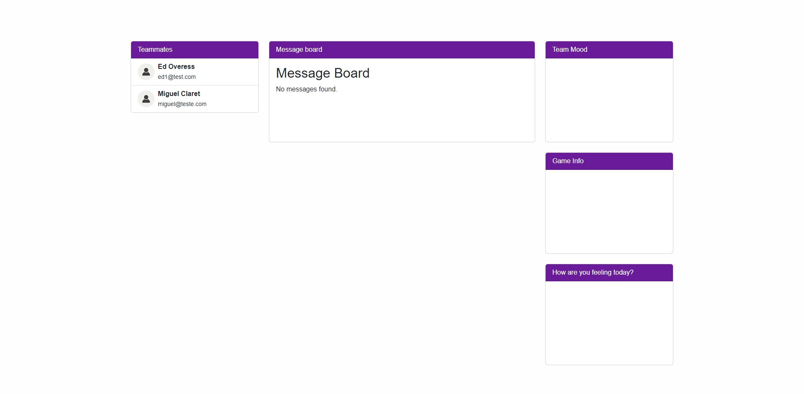

# WAD - Web Application Document - Module 2 - Inteli


## C³ - Code Conecting Cultures

#### Members:

- <a href="https://www.linkedin.com/in/felipe-elgenneni">Felipe de Melo Elgenneni</a>
- <a href="https://www.linkedin.com/in/joao-carbone">João Pedro Ferreira Carbone</a>
- <a href="https://www.linkedin.com/in/lucca-henrique-pereira/">Lucca Henrique Pereira</a>
- <a href="https://www.linkedin.com/in/miguelclaret">Miguel da Silva Claret</a>
- <a href="https://www.linkedin.com/in/otavio-vasc/">Otávio de Carvalho Vasconcelos</a>
- <a href="https://www.linkedin.com/in/raphaelfelipesilva/">Raphael Felipe da Silva</a>
- <a href="https://www.linkedin.com/in/vitor-balbo/">Vítor Margarido Balbo</a>

## Sumarry:

[1. Introduction](#c1)

[2. Web Application Overview](#c2)

[2.1 Project Scope](#c21)

[2.1.1 Industry Context](#c211)

[2.1.2 Porter's 5 Forces Model](#c212)

[2.1.3 SWOT Analysis](#c213)

[2.1.4 Solution](#c214)

[2.1.5 Value Proposition](#c215)

[2.1.6 Risk Matrix](#c216)

[2.2 Personas](#c22)

[2.3 User Stories](#c23)

[3. Web Application Technical Project](#c3)

[3.1 Architecture](#c31)

[3.2 Wireframes](#c32)

[3.3 Style Guide](#c33)

[3.3.1 Colors](#c331)

[3.3.2 Typography](#c332)

[3.3.3 Icons & Images](#c333)

[3.4 High-Fidelity Prototype](#c34)

[3.5 Database Modeling](#c35)

[3.5.1 Relational Model](#c351)

[3.5.2 SQL queries and propositional logic](#c352)

[3.6 WebAPI and endpoints](#c36)

[4. Web Application Development](#c4)

[4.1 First version of the web application](#c41)

[4.2 Second version of the web application](#c42)

[4.3 Final version of the web application](#c43)

[5. Web Application Testing](#c5)

[5.1 Automated testing report](#c51)

[5.2 Usability testing](#c52)

[5.2.1 Test Records and Improvements](#c521)

[6. Conclusions and future work](#c6)

[7. References](#c7)

[Attachments](#c8)

<br>

Here is the translation of the lists of figures and tables into English:

# <a id="c1"></a> List of Figures
- Porter's Five Forces Analysis Model
- SWOT Analysis
- Value Proposition Canvas
- Risk Matrix
- Gabriela Santos Persona
- Friedrich Weber Persona
- Olivia Huamaní Persona
- MVC Architecture
- Wireframe
- Student 1 UserFlow
- Student 2 UserFlow
- Advisor UserFlow
- Color Style Guide
- Typography Style Guide
- Iconography Style Guide
- UserFlow for High-Fidelity Prototype of UserStory1
- UserFlow for High-Fidelity Prototype of UserStory2
- UserFlow for High-Fidelity Prototype of UserStory3
- UserFlow for High-Fidelity Prototype of UserStory4
- UserFlow for High-Fidelity Prototype of UserStory5
- UserFlow for High-Fidelity Prototype of UserStory6
- High-Fidelity Prototype Flowchart
- Relational Model of the Database
- Login Page Print
- First Registration Page Print
- Second Registration Page Print
- Rudimentary Home Page Print
- Admin Dashboard - Create Games Print
- Admin Dashboard - Create Universes and Rounds Print
- Admin Dashboard - Create Groups Print
- Feedback Page Print
- Rudimentary Home Page v2.0 Print
- Self Evaluation Page Print
- Self Evaluation Page Results Print
- Team Page Print
- Final Version of Team Page Print
- Admin Dashboard Game List Print
- Admin Dashboard Game and Round Creation Print
- Admin Dashboard Universe List Print
- Admin Dashboard Team List in a Universe Print
- Admin Dashboard Team Creation Print
- Final Version of Team Page Print
- Forgot Password Page Print
- Feedback Page Print
- Open Sidebar Print
- Task Table 1
- Task Table 2
- Task Table 3
- Task Graph 1
- Task Graph 2
- Task Graph 3

# <a id="c1"></a> List of Tables
- Student 1 User Stories Table
- Student 2 User Stories Table
- Student 3 User Stories Table
- Student 4 User Stories Table
- Student 5 User Stories Table
- Student 6 User Stories Table
- Email Check in UserController Table
- ID Check in UserController Table
- User Type Check in GroupController Table
- Game Check in AdminController Table
- ID Check in helper is-admin Table
- ID Verification in Feedback Controller Table
- Feedback Creation in Feedback Controller Table
- Student Team Verification in Feedback Controller Table
- Group ID Verification in Feedback Controller Table
- User ID Verification in Feedback Controller Table
- ID Verification in Feedback Controller Table
- User ID Verification in Feedback Controller Table
- Game Timestamp Verification in Game Helper Table
- Game Timestamp Verification in Current Round Helper Table
- Current Round Helper Check Last Game Table
- Existing Games Check in Game Controller Table
- Game Creation in Game Controller Table
- Last Game Check in Game Controller Table
- Round Creation in Game Controller Table
- Game ID Verification in Game Controller Table
- Game ID Verification in Universe in Game Controller Table
- Group Creation in Group Controller Table
- Student Team Creation in Group Controller Table
- Universe ID Verification in Group Controller Table
- User Type Verification in Group Controller Table
- Country ID Verification in Group Controller Table

<br>

# <a id="c1"></a>1. Introduction

&nbsp;&nbsp;&nbsp;&nbsp;The opportunity to enhance students' intercultural awareness is a distinctive feature of the IBSM program at Zuyd University. In a global educational setting, such as the Cesim business simulation, students have the chance to collaborate in diverse teams with members from different cultural backgrounds. However, some students may initially overlook the rich cultural differences present and may assume that everyone shares the same thoughts and behaviors. This can lead to misunderstandings and surprises, underscoring the need for improvement in the effectiveness of intercultural education and teamwork. Therefore, the relevance of a tool that can guide students to understand and appreciate these cultural differences is necessary.

&nbsp;&nbsp;&nbsp;&nbsp;To address this challenge, from Zuyd University and its IBSM program, we have developed an interactive and user-friendly web application. This site offers various functionalities, including student profile creation, self-assessment and peer evaluation, feedback reception, and group interaction, as well as for a tutor view. Through this system, students can gain a deeper understanding of cultural diversities, enhance their intercultural interaction skills, and learn to operate effectively in a multicultural context. Thus, this online software serves as a valuable tool to assist IBSM program students in their intercultural learning journey, empowering them to become business professionals with an international focus.

# <a id="c2"></a>2. Web Application Overview

&nbsp;&nbsp;&nbsp;&nbsp;The web application overview provides a comprehensive overview of our project, outlining its purpose and functionalities.

## <a id="c21"></a>2.1. Project Scope

&nbsp;&nbsp;&nbsp;&nbsp;The scope of the project is defined by its main mission: to create a website for international students taking part in a college game, allowing them to establish closer connections with members of their groups and people from other countries.

### <a id="c211"></a>2.1.1. Industry context

&nbsp;&nbsp;&nbsp;&nbsp;Zuyd University is an applied higher education institution located in the heart of Europe, with campuses in Heerlen, Sittard, and Maastricht in the southeastern Netherlands. It offers a small-scale learning environment and is known for its strong job market orientation and excellent employment prospects. In terms of growth, Zuyd University has approximately 14,600 enrolled students, with about 3,500 new students enrolling each year. The university offers 37 bachelor's programs and 11 master's programs. Additionally, the university has 33 research centers where associate professors, professors, and students conduct practice-oriented and socially relevant research.

&nbsp;&nbsp;&nbsp;&nbsp;Zuyd stands out for its business model centered on quality education, applied research, internationalization, and strategic partnerships with companies and institutions. The university is geared towards integrating practical experiences into curricula and preparing students for the job market, with various internship opportunities.

&nbsp;&nbsp;&nbsp;&nbsp;In terms of trends, Zuyd adopts hybrid education, focuses on practical skills, promotes sustainability and social innovation, and offers personalized teaching to meet current job market demands.

&nbsp;&nbsp;&nbsp;&nbsp;Competing with Maastricht University, Zuyd also faces institutions such as Eindhoven University of Technology, Utrecht University, and the University of Twente, each with its specializations in technology, fundamental research, and innovation. Zuyd's strategic location near Germany and Belgium provides ample opportunities for international collaborations and employment, reinforcing its position as a university oriented towards the job market and practical partnerships.

&nbsp;&nbsp;&nbsp;&nbsp;In conclusion, Zuyd University has a strong focus on the job market and practical collaborations, distinct from its competitors, offering a range of academic courses and internship opportunities. Its location creates job opportunities with regional companies, enhancing its appeal as a market-oriented institution.

### <a id="c212"></a>2.1.2. Porter's 5 Forces Model

&nbsp;&nbsp;&nbsp;&nbsp;In the context of the market in which Zuyd University operates, one can observe a highly competitive scenario, characterized by intense rivalry among established educational institutions. Like a red ocean, this market is saturated with competitors vying for market share, as well as value and popularity. In this challenging context, understanding the competitive forces shaping the environment is crucial for formulating effective strategies that can drive Zuyd's success.

&nbsp;&nbsp;&nbsp;&nbsp;Therefore, it is notable that the university faces a highly competitive market, underscoring the importance of deeply understanding the dynamics governing its operational environment. In this challenging context, an analysis of Porter's Five Forces emerges as a fundamental strategic tool. Developed by Michael Porter, this methodology examines five key aspects shaping the competitive environment, offering valuable insights for addressing intense rivalry, cost pressures, and the continuous pursuit of differentiation and innovation. By exploring these elements, the university can identify opportunities and threats shaping its particular red ocean, informing strategies aimed at improving its competitive position and sustaining long-term success.

<div align="center">
<sub>Figure 1 - Porter's 5 Forces Analysis</sub>

<sup>Source: Material produced by the authors (2024)</sup>
</div>

&nbsp;&nbsp;&nbsp;&nbsp;Considering competitors as higher education institutions that offer teaching proposals similar to Zuyd's, and are classified as international-level, it is evident that the university operates in a landscape marked by strong rivalry among existing competitors. This is due to the large number of players in the defined market, who are also highly diversified. Additionally, the industry in which the institution operates is expanding, growing at a moderate pace, with an increasing number of new entrants joining the global trend of higher education. The cost of innovation and, consequently, differentiation, is considerably high in this context, as investments in research and development of new technologies are required to stand out among competitors, limiting the options each player has to improve in terms of value innovation.

&nbsp;&nbsp;&nbsp;&nbsp;The threat posed by new entrants—such as new higher education institutions seeking to offer a similar final delivery to market competitors—on Zuyd, in an economic sense, is increasing. However, the market in this area, considered a red ocean, already has several barriers that prevent the advancement of these new challengers, even though this comes at some cost to existing players in this scenario. A significant monetary investment is required in various areas—such as establishing a quality campus structure, hiring a high-quality technical team, creating infrastructure to support necessary dynamics, among others—to enter this market, even though there is considerable difficulty in obtaining investments that compensate for this high initial expenditure. Another barrier is the existence of strong government regulation regarding the bureaucracy necessary to start a business in this field. Additionally, new entrants face a lack of information regarding the administration of a complex business like those in the international higher education sphere compared to competitors already present in this scenario, who hold much of this knowledge. Another point about new entrants is the difficulty in gaining popularity in a market that already has the presence of major players, with a vast repertoire and a wide range of opportunities for their customers, as is the case with Zuyd.

&nbsp;&nbsp;&nbsp;&nbsp;Regarding the bargaining power of customers in this market—being students, potential students, and partner companies—it is observed a high level of influence on their part, giving them greater freedom of choice among the services and products offered by competitors and making competition among them more intense. In this market, there is a very high number of consumers, which makes demand exceed the supply of services. This means that, although the scenario is one of a market marked by very fierce competition, it is still far from becoming a saturated market. It also means that quality products, like those offered by market players, have no difficulty in finding customers. This is also largely due to the low acceptance rate at these universities known for their excellence, which is still a method of market control. Consumers also have considerable price sensitivity, especially regarding international students and scholarship recipients as customers. They also have great access to information in this scenario, which allows them even greater choice.

&nbsp;&nbsp;&nbsp;&nbsp;The bargaining power of suppliers—such as professionals working in the institution, providers of educational materials, and partner companies—is high. Since there is a large number of established competitors in the market for a moderate amount of suppliers, they can choose the player that benefits them the most, making competition even more intense. The products offered by suppliers in this scenario also have a certain level of differentiation, further increasing their bargaining power.

&nbsp;&nbsp;&nbsp;&nbsp;Finally, substitutes for already offered services and/or products—such as professional courses offered by companies and self-study—are plentiful in the market. They also become a threat in the sense that they are very accessible to customers in this market. There is a wide variety in prices, allowing for a very large degree of choice by the consumer. Additionally, these substitutes generally have a moderate level of differentiation, meaning that, although they do not offer greater value than the services offered by competitors, they are more accessible and add considerable value in the end delivery, which can keep the consumer satisfied.

&nbsp;&nbsp;&nbsp;&nbsp;Therefore, it is concluded that the market in which Zuyd operates, according to the analysis based on Porter's Five Forces, is extremely vast in terms of opportunities, allowing for significant bargaining power for both suppliers and customers. However, this market also features the presence of major competitors with a high level of differentiation, ensuring that there is constant competition and demand for the services offered.

### <a id="c213"></a>2.1.3. SWOT Analysis

&nbsp;&nbsp;&nbsp;&nbsp;The SWOT analysis is a strategic management tool used to assess the Strengths, Weaknesses, Opportunities, and Threats involved in a project or in an organization. The term SWOT is an acronym derived from the words Strengths, Weaknesses, Opportunities, and Threats. This analysis is crucial for any organization that aims to improve its market position or refine its strategic objectives.

&nbsp;&nbsp;&nbsp;&nbsp;Applying the SWOT concept to Zuyd University of Applied Sciences, we can explore how this institution excels in its educational context and the challenges it faces. Located in Maastricht, a vibrant and historically rich city at the heart of Europe, Zuyd attracts both local and international students, partly due to its strategic location and commitment to cultural diversity and internationalization.

&nbsp;&nbsp;&nbsp;&nbsp;In this context, the SWOT analysis of Zuyd University of Applied Sciences highlights key points about how the university leverages its unique strengths, such as a variety of exchange programs and the availability of courses in English, while also addressing challenges like language barriers and the integration of international students. This analysis not only points out areas for potential growth and development for Zuyd but also underscores the importance of its position as an institution that truly values and promotes a global educational environment.

<div align="center">
<sub>Figure 2 - SWOT Analysis</sub>

<sup>Source: Material produced by the authors (2024)</sup>
</div>

&nbsp;&nbsp;&nbsp;&nbsp;The SWOT analysis, when applied to Zuyd University of Applied Sciences, proves to be an invaluable tool for a detailed understanding of the institution's competitive advantages and challenges. Based on the analysis conducted, it is clear that the university possesses a robust set of strengths that favorably position it in the global educational landscape, such as its strategic location and the diversity of its programs. However, it is also crucial to recognize and address the weaknesses and threats that could impact its trajectory of success, such as language barriers and the integration of international students.

&nbsp;&nbsp;&nbsp;&nbsp;Deepening the SWOT analysis will allow Zuyd not only to consolidate and expand its strengths but also to develop effective strategies to mitigate its weaknesses and transform potential threats into opportunities for growth. Thus, the university can enhance its educational offerings and strengthen its reputation as a center of excellence that truly celebrates and fosters cultural and academic diversity. Therefore, the continuous and meticulous application of the SWOT analysis is essential for Zuyd University of Applied Sciences to continue to advance and adapt in an increasingly dynamic and competitive educational environment.

### <a id="c214"></a>2.1.4. Solution :

&nbsp;&nbsp;&nbsp;&nbsp;In this section, the problem and the solution developed will be contextualized and presented, considering the topics relevant to the project carried out at Zuyd University.

&nbsp;&nbsp;&nbsp;&nbsp;In the first instance, the university promotes an international business game where different teams face global business challenges. After a few editions, they found that difficulties had arisen beyond the jurisdiction of the organizers and tutors, such as cultural problems, time zone differences and communication between group members. Based on this, the first stage of development was to identify the existence of the problem. C³ - Code Connecting Cultures approached tutors and former participants to validate the partner's information and found that many students faced similar problems in their groups. Two examples are cultural differences, where full communication was impossible due to religious restrictions, and different time zones, causing unexpected changes in team strategy. Faced with the problem, the C³ members, together with the teachers, instructor and partner, came to the conclusion that a web platform would be the best option to solve the problem. On the site, there is information considered relevant to the fundamentals of knowledge and communication during the game, such as self-descriptions of the user and country, time zones, location by contry, feedback tabs and group members.

&nbsp;&nbsp;&nbsp;&nbsp;Therefore, the proposed solution is a web platform, which will be used to manage cultural problems, time zone differences and communication between the members of the groups in the game. Through the inclusion of the aforementioned tools. Through the use of the website, some of the benefits of this solution include more efficient and inclusive communication between group members, a better understanding of the different cultures involved and more effective time management, considering the different time zones. In addition, the platform can contribute to a more collaborative and harmonious environment during the game.

&nbsp;&nbsp;&nbsp;&nbsp;The success criterion can be measured by the reduction in difficulties related to cultural problems and communication between group members, as reported by the game participants. Positive feedback and a general improvement in the gaming experience can also be indicators of the project's success.

### <a id="c215"></a>2.1.5. Value Proposition

&nbsp;&nbsp;&nbsp;&nbsp;The value proposition canvas details elements that will contribute to the project's development, focusing on including the partner's reality and offering a solution that meets *Zuyd*'s expectations. This approach involves analyzing the specific needs and challenges faced by the partner, ensuring that the proposed solution is suitable, effective, and individualized.

<div align="center">
<sub>Figure 3 - Value Proposition Canvas</sub>

<sup>Source: Material produced by the authors (2024)</sup>
</div>

&nbsp;&nbsp;&nbsp;&nbsp; **In the "Value Proposition" section, three main components are highlighted in the figure, aiming to showcase the role of the university in the business model.**

&nbsp;&nbsp;&nbsp;&nbsp; *1. Products and Services:* Introduces the idea of a "*Web Platform*", suggesting a platform for monitoring and integrating players, facilitating team management. The platform includes features such as monitoring schedules, direct communication with tutors and colleagues, and access to intercultural functionalities.

&nbsp;&nbsp;&nbsp;&nbsp; *2. Gain Creators:* Details how the *web platform* can help understand the structure of the game and the team, providing happiness indicators and evaluations of team members and individuals. This point is aimed at facilitating the adaptation of new players and making learning and cultural exchange more efficient and empathetic. The platform can offer detailed performance analysis, personalized feedback, and continuous improvement suggestions, helping players feel more confident and integrated.

&nbsp;&nbsp;&nbsp;&nbsp; *3. Pain Relievers:* Makes the experience more fluid, fun, and facilitated, alleviating the difficulty of new players in interacting with team members. By providing a supportive environment with intuitive and friendly resources, the platform reduces anxiety and the feeling of the unknown, allowing players to focus on developing their skills, building positive relationships, and interculturality.

&nbsp;&nbsp;&nbsp;&nbsp; **In the "Customer Segments" section, three main components are also highlighted in the figure, aiming to showcase the role of the customer in the business model.**

&nbsp;&nbsp;&nbsp;&nbsp; *1. Customer Jobs:* Describes the activities and tasks that the customer currently performs without the solution. This includes understanding the game, integrating with team members, and navigating cultural differences without support. Currently, game participants do not have a simple, fast, and effective way to concentrate their game-related communications in one place and rely on one or more online platforms to exchange information and knowledge, which often do not offer specific functionalities for the partner's needs.

&nbsp;&nbsp;&nbsp;&nbsp; *2. Gains:* Highlights the improvement in team relationships. With a platform that facilitates communication and collaboration, teams can work more cohesively and efficiently. This results in better overall performance, greater satisfaction among team members, and a more harmonious, productive, and fun environment.

&nbsp;&nbsp;&nbsp;&nbsp; *3. Pains:* Describes how understanding the game and team members can be an obstacle, possibly leading to difficulty for new players in getting the most out of the experience. The platform addresses these pains by offering intuitive, inviting, and friendly resources for understanding the game's progress and a system of feedback and links to help new players quickly familiarize themselves with the game's rules and team dynamics. This reduces the learning curve and increases players' confidence in their abilities.

&nbsp;&nbsp;&nbsp;&nbsp; Finally, the value proposition outlined in the canvas provides a comprehensive view of how the proposed idea will address the partner’s specific needs and challenges. Through detailed analysis and the creation of a tailored solution, the project aims not only to meet immediate requirements but also to add substantial long-term value. This approach ensures that the project’s development remains focused on practical and positive outcomes for both parties.

### <a id="c216"></a>2.1.6. Risk Matrix

&nbsp;&nbsp;&nbsp;&nbsp;The Risk Matrix is a fundamental tool used to analyze and assess the potential risks of a project. These risks are classified and organized in a matrix that considers both the probability of occurrence and the impact if they materialize, arranged on an ascending scale. Through this analysis, it is possible to identify which risks deserve greater attention and should be prioritized, based on the intersection of probability and impact, thus enabling a more effective project management.

<div align="center">
<sub>Figure 4 - Risk Matrix</sub>

<sup>Source: Material produced by the authors (2024)</sup>
</div>

Priorities:

- Low

  - Lack of commitment from team members
    - The impact of this issue would be on the website's production, resulting in an ineffective site, or even failure to create the site. We could address this difficulty with a responsibility agreement, which we have already drafted.
  - Poor communication among team members
    - The impact of this issue would be on the website's production, resulting in an ineffective site, or even failure to create the site. We could address this difficulty with agreements on how group communication will be defined, which we are already creating.
  - Front-end technical failure
    - The impact of this issue would be on the site's functionality. To mitigate this difficulty, two individuals will search for bugs on our site with each code release.

- Medium

  - Accessibility issues
    - The impact of this issue would be the exclusion of certain users. We could address this difficulty by proactively seeking ways to make the site accessible to all types of users.
  - Back-end technical failure
    - The impact of this issue would be on the site's functionality. To mitigate this difficulty, two individuals will search for bugs on our site with each code release.

- High
  - Server issues
    - The impact of this issue would be that users would be unable to access the site due to technical problems, affecting their performance in the game. To mitigate this difficulty, we are searching for the best service to host our site.
  - Language barrier between the team and the client
    - The impact of this issue would be on the project's production, as misunderstanding or misinterpreting our client's wishes could result in a website completely contrary to what our client envisions. To mitigate this difficulty, we are working on our English skills and always validating our information with the English teacher.
  - Database technical failure
    - The impact of this issue would be on data storage, also affecting the site's functionality. To mitigate this risk, we are studying appropriate data modeling for the purpose of our site.

&nbsp;&nbsp;&nbsp;&nbsp;To conclude, a complete analysis of the possible vulnerabilities that could influence the development of the web application is facilitated by the Risk Matrix. By specifying the risks based on their impact and probability of occurrence, it is possible to create an order of priority for the threats. In this way, you can adopt preventive measures that will help mitigate these risks and guarantee the success of the project.

## <a id="c22"></a>2.2. Personas

&nbsp;&nbsp;&nbsp;&nbsp;Personas, in the context of design, are fundamental tools that help developers to personify and understand the target users of a product or service. They are built from a synthesis of real data and detailed research, encompassing a variety of sources, including user interviews, analysis of demographic and behavioral data, as well as direct observation. By creating personas, designers craft fictional yet data-driven characters that represent different user archetypes, encapsulating their needs, goals, motivations, and challenges.

&nbsp;&nbsp;&nbsp;&nbsp;In the specific context of the project, which involves the development of a website to support the intercultural learning of international students, personas play a crucial role. They help designers understand not only the functional needs of the users but also their cultural identities, educational experiences, and individual expectations. For example, some personas may represent students from cultures where hierarchy is valued, while others may represent students who are more accustomed to collaborative and horizontal approaches.

&nbsp;&nbsp;&nbsp;&nbsp;By creating detailed and realistic personas that reflect this diversity of experiences and cultural perspectives, developers can ensure that the website is designed to meet the specific needs of each user group. This includes aspects such as language use, information presentation, navigation structure, and even the visual aesthetics of the site. Thus, the website can offer an interculturally inclusive and effective experience, promoting student engagement and facilitating their learning and integration into the intercultural community.

&nbsp;&nbsp;&nbsp;&nbsp;Based on the in-depth understanding of the needs and expectations of the target users, the development team responsible for the project, C3, chose to promote the creation of three distinct personas based on research conducted on the Inteli campus. These personas were elaborated to represent a variety of profiles of international students participating in the business simulation in question. Each persona captures specific nuances of cultural identities, educational experiences, and individual aspirations of the students, offering a rich and holistic representation of the potential users of the website.

&nbsp;&nbsp;&nbsp;&nbsp;By adopting a user-centered approach and creating detailed personas, the development team aims to ensure that the website is truly oriented to meet the needs and preferences of international students. This will not only enhance the usability and effectiveness of the site but also contribute to a more enriching and inclusive intercultural experience for all users. With personas as guides, the website development is firmly rooted in empathetic understanding and consideration of the diverse perspectives of students, resulting in a final product that is truly tailored to their needs and contexts.

<div align="center">
<sub>Figure 5 - Grabiela Santos Persona</sub>

<sup>Source: Material produced by the authors (2024)</sup>
</div>

&nbsp;&nbsp;&nbsp;&nbsp;The first persona is Gabriela Santos, who, being a representation of the typical profile of a Brazilian administration student, is passionate about both the business realm and the cultural diversity of Brazil. Determined, collaborative, and curious, Gabriela is one of the future players in the international business simulation promoted by Zuyd, bringing with her a spirit of seeking new challenges and learning. As a business student in training, she sees in the proposed simulation a unique opportunity to expand her horizons regarding intercultural communication, never experienced at this level of proximity by her, as well as to deepen her knowledge in the field through the simulated analyses in the game. Her participation, therefore, reflects not only her personal interests in learning and developing as a scholar but also collective interests, both from her university and from Brazil itself, regarding forming intercultural connections through effective communication.

&nbsp;&nbsp;&nbsp;&nbsp;Another opportunity that Gabriela seeks from this experience is to improve her proficiency in the English language through exercising communication in a globalized environment. Nonetheless, the student expects to face some challenges regarding technical skills, as she has in mind her potential for improvement, mainly in the sphere of problem-solving. She also hopes to establish clear and confident communication during the dynamics that occur within the team in order to maintain solid relationships among the players who are assigned to work alongside her. Overall, she also expects to contribute to the simulation environment itself as well as to represent her country regarding the intercultural connections that could be formed.

<div align="center">
<sub>Figure 6 - Friedrich Weber Persona</sub>

<sup>Source: Material produced by the authors (2024)</sup>
</div>

&nbsp;&nbsp;&nbsp;&nbsp;Friedrich Weber, 20 years old, a German business administration student at Hochschule Bonn-Rhein-Sieg (H-BRS), is dreamy, goal-oriented, and communicative. Friedrich is one of the future participants in the international business simulation promoted by Zuyd, bringing with him great determination and a strong desire for the decisions promoted by him, in the game scenario, to bring the best possible results. As a student committed to his academic and professional development, he sees in the simulation a unique opportunity to apply his theoretical knowledge in a practical and challenging environment. His participation reflects not only his pursuit of high-value professional experiences, but also his desire for continuous evolution and to establish meaningful connections with colleagues and industry professionals.

&nbsp;&nbsp;&nbsp;&nbsp;Friedrich is prepared to face the technical and interpersonal challenges that the simulation may present, as well as confident in his project organization and people management skills. He hopes not only to contribute to his team's success but also to make the most of the opportunity to learn from his colleagues and expand his network in the business world. His participation in the simulation not only represents his commitment to academic excellence, but also his determination to achieve his professional goals and establish himself as a leader in the field of business administration.

<div align="center">
<sub>Figure 7 - Olivia Huamaní Persona</sub>

<sup>Source: Material produced by the authors (2024)</sup>
</div>

&nbsp;&nbsp;&nbsp;&nbsp;Olivia Huamaní is a professor of International Business Management at Universidad César Vallejo (UCV), Peru, and a future tutor in the international business simulation promoted by Zuyd. Creative, committed, and sociable, Olivia brings with her a passion for meeting new people and cultures, thus enriching her academic and professional experience. As an educator committed to excellence and innovation, she sees the opportunity to act as a tutor in the simulation as a unique chance not only to share her knowledge and experiences, but also to learn from her students and colleagues from around the world.

&nbsp;&nbsp;&nbsp;&nbsp;Olivia seeks, above all, to find students with a spirit of innovation in the business field and environments that value new ideas and cultural connections. With exceptional skills in team and project management, as well as effective communication, she is prepared to guide and support her teams throughout the simulation process. Furthermore, her extensive experience in the field of entrepreneurship, with a focus on the international aspect, qualifies her as a mentor capable of offering valuable ideas and strategic guidance to her students. Olivia's participation as a tutor not only enriches the development of the project but also highlights the importance of involving not only students but also educators in the process of intercultural and collaborative learning.

&nbsp;&nbsp;&nbsp;&nbsp;Through the outlined analysis, it is possible to perceive that significant effort was devoted to understanding the needs and expectations of students participating in the business simulation. Conducting a qualitative interview at the Inteli campus as well as creating proto-personas (personas initially created in a project to guide further means of understanding the real pain of the client) were necessary actions for a better understanding of the project proposal. The creation of detailed personas, such as Gabriela Santos, Friedrich Weber, and Olivia Huamaní, allowed for capturing a wide range of profiles and experiences, thus enriching the understanding of the target audience. From the initial research to the presentation of the personas, each step was carefully planned and only then executed.

&nbsp;&nbsp;&nbsp;&nbsp;The creation of personas represented a strategic approach to solving the challenge of truly understanding the needs of students participating in the simulation. By identifying specific profiles and their respective motivations, skills, and aspirations, it was possible to create a more accurate and detailed representation of the target audience. This enables more precise guidance in the development of the solution, ensuring that the intercultural learning support website meets the needs and expectations of students effectively. With this user-centered approach, it is expected that the proposed solution will significantly contribute to the success of the simulation, promoting student engagement and facilitating the formation of meaningful intercultural connections among participants.

### The Interview

&nbsp;&nbsp;&nbsp;&nbsp;The interview was conducted to better understand the participants' thoughts about the game. This process was mainly focused on understanding the problems and pain those interviewed experienced, because this knowledge proved to be very important in developing a solution. This made possible a better view of what the game is really about from the participants' perspectives, the participants' general profile, as well as the participants' opinions about their group, cultural differences and the problems they had during the game. To understand this and other questions, the best way found was the development and application of a survey, specifically of the qualitative interview type. This interview was conducted on the university campus with 2 (two) students who had already participated in the simulation as players. Therefore, the interview consisted of a few main questions, all of them about the participants' views about the simulation context. Next, these questions will be presented, as well as the general responses to them.

#### How the game actually works?

&nbsp;&nbsp;&nbsp;&nbsp;According to those interviewed, the game consists of a simulation of real business cases in which a group of participants is in control of a business and is able to make decisions in different management areas of this organization (such as marketing, production or human resources). For this purpose, the simulation offers a digital platform with a large diversity of analysis tools, so it becomes possible to make decisions based on a business analysis of the data provided. Therefore, the players have to make a decision for every different area of the business in a round. When the round finishes, the results are reported to the groups so they can notice how successful their decisions were. The group with the highest profit wins the round. The game consists of 8 rounds. At all times, the focus of the game is to simulate a real environment, mainly in terms of the business area. In practice, the simulation basically consists of the analysis of a large amount of data using the tools provided for it and the decisions made from these analyses.

#### Who is the target public for the simulation?

&nbsp;&nbsp;&nbsp;&nbsp;International university students who have careers aimed at the business area is the target audience the simulation covers, according to those interviewed. However, which degree or even the number of degrees a person has doesn't seem to be a limitation for playing the simulation. An interviewer said, "one of my teammates even had already 2 degrees". It's possible to see that, in this regard, the simulation is very inclusive and covers a large group of people as a target public.

#### What was you motivation for participating in the simulation?

&nbsp;&nbsp;&nbsp;&nbsp;The interviewee reported having as their main motivation for joining the game the possibility to improve their knowledge in business and finance areas, as well as their skills in english communication. However, according to them, some misunderstandings during the game related to communication between team members and explanations about the game mechanics ended up frustrating them and preventing such learning. Both interviewees also mentioned feeling confused during the explanations about how the game worked, as well as in their first contact with the game.

#### What were the major problems you experienced during the simulation?

&nbsp;&nbsp;&nbsp;&nbsp;English proficiency was highlighted as the biggest challenge during the game, leading people with lower English levels to feel embarrassed and demotivated to participate fully, even if they aimed to improve their language skills beforehand. Also, experiences within the game vary greatly from person to person, primarily due to the dynamics and quality of relationships among teammates. Therefore, interviewees did not observe any significant patterns of behavior linked to nationality or culture; the most impactful behaviors were individual-specific. Because of that, some players' lack of engagement negatively affected the entire team's performance.

&nbsp;&nbsp;&nbsp;&nbsp;Varying time zones across participants' countries posed significant challenges in establishing beneficial collaboration. Finding suitable meeting times for group work or even partial team availability proved extremely difficult. Both interviewees cited time zone differences as the primary obstacle to the game achieving its intended purpose. One interviewee even mentioned having to "schedule meetings during sleep hours due to conflicting time zones". The data-driven nature of the game requires extensive reading, which can be tiring, especially in a non-native language. While the game's website offers official translations, they often lack accuracy, leading to further misunderstandings and decision-making conflicts.

#### What were the main problems you experienced due to cultural differences during the simulation?

&nbsp;&nbsp;&nbsp;&nbsp;While cultural differences are present and noticeable during the game, they are not the primary factors that lead to deviations from its intended purpose. The main impact lies in communication styles, as different cultures interpret communication nuances differently. One interviewee noted that the "cultures encountered through teammates [...] did not encourage the same level of personal transparency as Brazilian culture". This resulted in colleagues being less open about themselves, hindering deeper connections within the team. Another interviewee mentioned that the "German culture [they interacted with] prioritized individual interests, leading to direct and clear communication regardless of the situation", which could sometimes cause misunderstandings.

#### What were the major problems you experienced in the support provided?

&nbsp;&nbsp;&nbsp;&nbsp;According to the interviewees, "the introduction to the game is delivered in a way that leaves players confused and lacking a solid foundation to play confidently"; "the introductory video overwhelms students with excessive information and fails to effectively explain the game mechanics", these meetings introduced theoretical concepts that could be helpful during the game, but the lack of practical application at the time of introduction diminishes their perceived value to the players. Following this, when three test rounds are conducted, expecting players to apply the acquired knowledge, "this process fails due to the assumption that players have fully grasped the game's mechanics theoretically, which is often not the case", leading to further confusion.

&nbsp;&nbsp;&nbsp;&nbsp;Upon accessing the game platform, players struggle to interpret the vast amount of data provided effectively due to their inadequate preparation. The absence of practical examples during the explanation phase hinders their understanding of the game's operations, adding another layer of difficulty. The lack of in-platform support for explaining the game mechanics further exacerbates the challenge. A feature allowing players to indicate their unavailable times to the group would significantly improve team organization and coordination.

&nbsp;&nbsp;&nbsp;&nbsp;By analyzing this survey, it's possible to understand that most difficulties experienced by the participants are caused by communication issues, a lack of individual engagement, and support for the players apprenticeship. Therefore, it's possible to develop a solution that embraces all three main topics by mainly engaging participants in communication between them. This communication difficulty is often related, even if indirectly, to intercultural differences between participants. Analyzing the case from the participants' point of view is very important to ensure the project is aligned to their pains and that's why this qualitative interview, and, posteriorly, the development of qualitative personas, are so essential to the project's future decisions.

## <a id="c23"></a>2.3. User Stories

&nbsp;&nbsp;&nbsp;&nbsp;User Stories are fundamental elements of agile software development, serving as a bridge between the technical needs of the project and expectations about it. They are concise descriptions of the project's usage scenarios, considering the service from the end-user's point of view. Each User Story aims to generate value and understanding for the end users through a simple table, detailing what needs to be done, how it should be done, and why it must be done.

<div align="center">
<sub>Table 1 - User Stories Table Student 1</sub>

| Identification        | US01                                                                                                  |
| --------------------- | ----------------------------------------------------------------------------------------------------- |
| Persona               | Friedrich                                                                                               |
| User Story            | As a participant, I want to be able to<br>edit my profile to ensure my colleagues know more about me. |
| Acceptance Criteria 1 | Log in to the platform                                                                                |
| Acceptance Criteria 2 | Access the Home Page                                                                                  |
| Acceptance Criteria 3 | Go to the profile tab                                                                                 |
| Acceptance Criteria 4 | Select the option to edit the desired information                                                     |
| Acceptance Criteria 5 | Edit the information according to the criteria desired by the participant                             |

<sup>Source: Material produced by the authors (2024)</sup>

</div>

<div align="center">
<sub>Table 2 - User Stories Table Student 2</sub>

| Identification        | US02                                                                                                    |
| --------------------- | ------------------------------------------------------------------------------------------------------- |
| Persona               | Gabriela                                                                                                |
| User Story            | As a participant, I want to evaluate my peers, so that I can express my<br>perspective about the group. |
| Acceptance Criteria 1 | Log in to the platform                                                                                  |
| Acceptance Criteria 2 | Access the Home Page                                                                                    |
| Acceptance Criteria 3 | Go to the Assessment tab                                                                               |
| Acceptance Criteria 4 | Select the desired participant                                                                          |
| Acceptance Criteria 5 | Add information according to the evaluation criteria                                                    |

<sup>Source: Material produced by the authors (2024)</sup>

</div>

<div align="center">
<sub>Table 3 - User Stories Table Student 3</sub>

| Identification        | US03                                                                                                   |
| -------------------- | ------------------------------------------------------------------------------------------------------ |
| Persona              | Friedrich                                                                                              |
| User Story           | As a participant, I want to visit the profiles of the other members <br>of my group to get to know them better.     |
| Acceptance Criteria 1 | Log in to the platform                                                                             |
| Acceptance Criteria 2 | Access the Home Page                                                                                    |                                                                                 |
| Acceptance Criteria 3 | Select which member profile I want to visit                                                        |

<sup>Source: Material produced by the authors (2024)</sup>

</div>

<div align="center">
<sub>Table 4 - User Stories Table Student 4</sub>

| Identification        | US04                                                                                                   |
| -------------------- | ------------------------------------------------------------------------------------------------------ |
| Persona              | Gabriela                                                                                               |
| User Story           | As a participant, I want to access the group tab in order <br>to meet all my team members. |
| Acceptance Criteria 1 | Log in to the platform                                                                              |
| Acceptance Criteria 2 | Access the Home Page                                                                                    |
| Acceptance Criteria 3 | Go to the group tab                                                                                 |

<sup>Source: Material produced by the authors (2024)</sup>

</div>

<div align="center">
<sub>Table 5 - User Stories Table Student 5</sub>

| Identification        | US05                                                                                                   |
| -------------------- | ------------------------------------------------------------------------------------------------------ |
| Persona              | Friedrich                                                                                               |
| User Story           | As a participant, I want to be able to view the feedback  <br>related to the assessments of the other members of my group.|
| Acceptance Criteria 1 | Log in to the platform                                                                              |
| Acceptance Criteria 2 | Access the Home Page                                                                                    |
| Acceptance Criteria 3 | Go to the feedback page                                                                                |
| Acceptance Criteria 4 | View the text feedback from each group member and the<br> points from the assessment.                        |

<sup>Source: Material produced by the authors (2024)</sup>

</div>

<div align="center">
<sub>Table 6 - User Stories Guiding Table</sub>

| Identification       | US06                                                                                                                        |
| -------------------- | ----------------------------------------------------------------------------------------------------------------------------- |
| Persona              | Olivia                                                                                                                        |
| User Story           | As a tutor, I want to create a new group.                                                                                        |
| Acceptance Criteria 1 | Log in to the platform.                                                                                                     |
| Acceptance Criteria 2 | Access the Home Page.                                                                                                        |
| Acceptance Criteria 3 | Open the Sidebar and click on the create group button.                                                                        |
| Acceptance Criteria 4 | Choose the tutor and the students for this group.                                                                              |
| Acceptance Criteria 5 | Create the group.                                                                                                            |                                        |

<sup>Source: Material produced by the authors (2024)</sup>

</div>

&nbsp;&nbsp;&nbsp;&nbsp;In conclusion, User Stories play an essential role in a project by translating complete tasks into simple and easily understandable actions, aligning development efforts with user expectations. Through their implementation, they ensure understanding between end-users and development teams and establish a path for the product's value delivery.

# <a id="c3"></a>3. Web Application Technical Project

&nbsp;&nbsp;&nbsp;&nbsp;The web application project adopts a user-centered approach, seeking to offer an intuitive and efficient experience. Based on the MVC (Model-View-Controller) design pattern and the Wireframe developed, we outlined an architecture and content layout that clearly separates the responsibilities of data representation, user interaction and business logic. This structure allows for better organization of the code and facilitates the maintenance and evolution of the application over time.

## <a id="c31"></a>3.1. Architecture

&nbsp;&nbsp;&nbsp;&nbsp;The MVC structure stands for Model-View-Controller, and it's a design pattern commonly used for developing user interfaces that divides an application into three interconnected components. This is done to separate internal representations of information from the ways information is presented to and accepted from the user.

<div align="center">
<sub>Figure 8 - MVC Architecture</sub>

<sup>Source: Material produced by the authors (2024)</sup>
</div>

&nbsp;&nbsp;&nbsp;&nbsp;The MVC architecture depicted in the image 8 consists of the following elements:

### Client

- **User**: The individual interacting with the system through a browser.
- **Browser**: The software used by the user to access the system, with icons representing well-known browsers such as Google Chrome, Mozilla Firefox, Opera, Apple Safari, and Microsoft Edge.

### Server

&nbsp;&nbsp;&nbsp;&nbsp;The server is structured into three main components of the MVC pattern:

#### Views

&nbsp;&nbsp;&nbsp;&nbsp;The Views are the user interface where the output of the application is presented. They are rendered by the Sails.js framework and include:

- **Homepage**: The main page of the site.
- **navbar**: The site's navigation bar.
- **profiles**: User profiles.
- **group_members**: Group members.
- **game_info**: Information about games.
- **game_indicators**: Game indicators.
- **logo**: The application's logo.
- **Feedback**: The feedback page with the following elements:
  - **form_questions**: The feedback question form.
  - **submit**: Button to submit feedback.
  - **my_feedbacks**: Feedbacks provided by the user.
  - **logo**: The application's logo repeated.

#### Controllers
&nbsp;&nbsp;&nbsp;&nbsp;The Controllers manage the application's logic and process user input, directing it to the appropriate model or view. They include:

- **Admin Controller**: Validates if the current user is an Admin and returns the available universes on the `pages/admin` page, to which the admin user is redirected.

- **Game Controller**: Available for administrators, allows functions to create a game and view active games.
  - **Create**: Asynchronous function responsible for creating games, requiring a `body` containing the game's start and end date as a request.
  - **Show**: Asynchronous function responsible for showing currently available games.

- **Universe Controller**: This controller allows the creation and viewing of universes within a game.
  - **Create**: Asynchronous function responsible for creating universes, requiring a `body` containing a game as a request.
  - **Show**: Asynchronous function responsible for showing previously created universes.

- **Group Controller**: Available for administrators, has functions to create and view the groups of each universe in the game.
  - **Create**: Asynchronous function responsible for creating groups, requiring a `body` containing a name, a game universe, a tutor, and at least one student as a request.
  - **Show**: Asynchronous function responsible for showing existing groups in the universe.

- **User Controller**: Has functions for creating users, logging in users, viewing the active user, and updating the active user's photo.
  - **signup**: Asynchronous function responsible for creating users, requiring a `body` containing (mandatory) an email, a password, and the user "type" (can be admin, tutor, or student) and, in addition, (optional) name, gender, an "about me" description of the user, birthday, country of origin, a description of the country of origin, education, and a university.
  - **Show**: Asynchronous function responsible for showing currently available games.

- **Feedback Controller**: Has functions to render the feedback page and create new feedback. This function requires the user to be logged in to access the feedback page.
  - **create**: Asynchronous function responsible for rendering the feedback page and creating new feedback. If the request is a POST, the function extracts the feedback details from the request body, validates the necessary fields, and checks if the feedback recipient exists. Then, it fetches the current game and round using helpers, creates new feedback, and redirects the user to the feedback page. If the request is not a POST, the function fetches the details of the logged-in user, the members of the group to which they belong, and all received feedback, rendering the feedback page with this information.

- **HomepageController**: Main functions are rendering the homepage overview and updating the user's happiness meter.
  - **overview**: Asynchronous function responsible for rendering the user's homepage. It checks if the user is logged in and, if so, fetches user data, messages, the student's group, and details of the tutor and group members. The function also calculates the user's time based on the time zone and adjusts the display of messages and group information.
  - **happinessMeter**: Asynchronous function responsible for updating the user's happiness level. It checks if the user is logged in and validates the happiness value received in the request. Then, it updates the happiness meter value in the database and returns a success message or an error in case of failure.

- **MessageController**: Main functions are creating new messages and listing all messages.
  - **create**: Asynchronous function responsible for creating a new message. It checks if the user is authenticated and if the message content is provided. If so, it creates and saves the new message in the database, returning the created message as a response. Otherwise, it returns an authentication or required content error.
  - **list**: Asynchronous function responsible for listing all messages. It fetches all messages from the database, populating the user information associated with each message. Then, it renders the homepage with the retrieved messages. If an error occurs, it returns an error response.

- **QuestionController**: Main functions are handling questions of different types, such as decision-making and collaboration, as well as calculating and updating the user's profile type based on the answers.
  - **personalType**: Asynchronous function that manages decision-making-related questions. In GET requests, it fetches and renders questions of this type. In POST requests, it saves the answers provided by the users in the database and redirects to a results page.
  - **externalType**: Asynchronous function that manages collaboration questions. It checks if the user is logged in and belongs to a group. In GET requests, it fetches and renders collaboration questions along with the group members. In POST requests, it saves the answers provided by the users, including the ID of the recipient user, and redirects to the user's page.
  - **profileResult**: Asynchronous function that calculates the user's profile type based on decision-making question answers. It updates the user's personalProfileType field in the database and renders the self-assessment results page.

#### Models
&nbsp;&nbsp;&nbsp;&nbsp;The Models represent the application's data structure and the business logic related to that data. They communicate with the database server. The models include:
- **User**: Fields such as Id, userType, fullName, emailAddress, password, birthday, countryPov, aboutMe, profileType, happinessMeter, gender, lastSeenAt, photo, messages, educationId, groups, questionAnswers, and studentsTeams.
  - **id**: Primary key and unique identifier for each user (type: number).
  - **userType**: Indicates the type of user, with possible values being "student," "tutor," or "admin" (type: string).
  - **fullName**: User's full name (type: string).
  - **emailAddress**: User's email (type: string).
  - **password**: User's password (type: string).
  - **birthday**: User's birthday (type: date).
  - **countryPov**: User's personal description of their country (type: string).
  - **aboutMe**: User's personal description (type: string).
  - **profileType**: Indicator of the user's type, such as director, analyst, etc. (type: string).
  - **happinessMeter**: Meter used for the user to indicate their happiness (type: number).
  - **gender**: User's gender, selected by the user (type: string).
  - **lastSeenAt**: Indicator of the user's last access (type: date).
  - **photo**: User's photo (type: string).
  - **messages**: User's message that appears on their profile screen and the group members' homepage (type: string).
  - **educationId**: Identifier for the university where the user studies or works (type: number).
  - **groups**: Meter used for the user to indicate their happiness (type: number).
  - **questionAnswers**: User's answers to questions answered during the game (type: string).
  - **studentsTeams**: Indicator of the user's group (type: number).

- **Game**: Fields such as startDate, endDate, universes, and rounds.
  - **id**: Primary key and unique identifier for each game (type: number).
  - **startDate**: Game start date (type: date).
  - **endDate**: Game end date (type: date).
  - **universes**: Indicator of the user's group (type: number).
  - **rounds**: Indicator of the user's group (type: number).

- **Universe**: Fields such as gameId and groups.
  - **id**: Primary key and unique identifier for each universe (type: number).
  - **gameId**: Foreign key identifier for the game (type: number).
  - **groups**: Foreign key identifier for the groups that belong to the universe (type: number).

- **studentsTeam**: Fields such as gameId and groups.
  - **id**: Primary key and unique identifier for each studentsTeam (type: number).
  - **groupId**: Foreign key identifier for the universe to which the group belongs (type: number).
  - **userId**: Foreign key identifier for the users who belong to the group (type: number).

- **Group**: Fields such as gameId and groups.
  - **id**: Primary key and unique identifier for each group (type: number).
  - **universeId**: Foreign key identifier for the universe to which the group belongs (type: number).
  - **tutorId**: Foreign key identifier for the groups that belong to the universe (type: number).
  - **studentsId**: Foreign key identifier for the students who belong to the group (type: number).

- **Round**: Fields such as gameId and groups.
  - **id**: Primary key and unique identifier for each round (type: number).
  - **gameId**: Foreign key identifier for the game to which the round belongs (type: number).
  - **startDate**: Indicator of the round's start (type: timestamp).
  - **endDate**: Indicator of the round's end (type: timestamp).
  - **roundNumber**: Indicator of the round number (type: number).
  - **explanation**: Explanations about the round events and their operation (type: number).

- **Country**: Fields such as name, svgIcon, users, and universities.
  - **id**: Primary key and unique identifier for each country (type: number).
  - **name**: Country name (type: string).
  - **svgIcon**: Country SVG icon (type: string).
  - **users**: Foreign key identifier for the users who belong to the country (type: number).
  - **universities**: Foreign key identifier for the universities that belong to the country (type: number).

- **Education**: Fields such as name, educationLevel, universityId, and users.
  - **id**: Primary key and unique identifier for each education (type: number).
  - **name**: Course or education level name (type: string).
  - **educationLevel**: Education level (type: string).
  - **universityId**: Foreign key identifier for the university to which it belongs (type: number).
  - **users**: Foreign key identifier for the users who have this education (type: number).

- **Feedback**: Fields such as fromUserId, toUserId, roundId, content, and date.
  - **id**: Primary key and unique identifier for each feedback (type: number).
  - **fromUserId**: Foreign key identifier for the user who gave the feedback (type: number).
  - **toUserId**: Foreign key identifier for the user who received the feedback (type: number).
  - **roundId**: Foreign key identifier for the round to which the feedback belongs (type: number).
  - **content**: Feedback content (type: string).
  - **date**: Feedback date (type: timestamp).

- **Message**: Fields such as content, date, and userId.
  - **id**: Primary key and unique identifier for each message (type: number).
  - **content**: Message content (type: string).
  - **date**: Message creation date (type: timestamp).
  - **userId**: Foreign key identifier for the user who created the message (type: number).

- **Question**: Fields such as questionText, alternatives, questionType, and questionAnswers.
  - **id**: Primary key and unique identifier for each question (type: number).
  - **questionText**: Question text (type: string).
  - **alternatives**: Question alternatives (type: json).
  - **questionType**: Question type (type: string).
  - **questionAnswers**: Foreign key identifier for the question answers (type: number).

- **QuestionAnswer**: Fields such as userId, questionAnswer, date, and questionId.
  - **id**: Primary key and unique identifier for each question answer (type: number).
  - **userId**: Foreign key identifier for the user who answered the question (type: number).
  - **toUserId**: Foreign key identifier for the user who received the answered question (type: number).
  - **questionAnswer**: Answer to the question (type: string).
  - **date**: Answer date (type: timestamp).
  - **questionId**: Foreign key identifier for the answered question (type: number).

- **Timezone**: Fields such as name and users.
  - **id**: Primary key and unique identifier for each timezone (type: number).
  - **name**: Timezone name (type: string).
  - **users**: Foreign key identifier for the users who belong to the timezone (type: number).

- **University**: Fields such as name, countryId, and educations.
  - **id**: Primary key and unique identifier for each university (type: number).
  - **name**: University name (type: string).
  - **countryId**: Foreign key identifier for the country to which the university belongs (type: number).
  - **educations**: Foreign key identifier for the educations offered by the university (type: number).
### Database Server

- **Render**: The database host service
- **DBeaver**: Program used to visualize and manipulate the database. Can connect to Render db.

&nbsp;&nbsp;&nbsp;&nbsp;In summary, the MVC architecture adopted for the C³ - Code Connecting Cultures project ensures a clear separation of responsibilities among the Model, View, and Controller components, allowing for more organized and efficient development. By segmenting the application into distinct parts, it facilitates maintenance, scalability, and the addition of new functionalities. This structured approach not only improves the developer experience but also provides a more responsive and intuitive user interface, essential for promoting intercultural collaboration and learning among international students.

## <a id="c32"></a>3.2. Wireframes

&nbsp;&nbsp;&nbsp;&nbsp;A wireframe is a sketch used to structure and validate ideas for a website. It serves as an initial visual representation, allowing the layout of elements and navigation to be visualized, thus providing a path to the final design. Below is the wireframe for our project.

<div align="center">
<sub>Figure 9 - Wireframe</sub>

<sup>Source: Material produced by the authors (2024)</sup>
</div>

&nbsp;&nbsp;&nbsp;&nbsp;In addition, we developed a UserFlow, which represents the sequence of steps a user goes through to complete a task, achieve a goal or perform a desired action. This UserFlow was drawn up based on the personas created earlier.

<div align="center">
<sub>Figure 10 - UserFlow Student 1</sub>

<sup>Source: Material produced by the authors (2024)</sup>
</div>

<div align="center">
<sub>Figure 11 - UserFlow Student 2</sub>

<sup>Source: Material produced by the authors (2024)</sup>
</div>

<div align="center">
<sub>Figure 12 - UserFlow Tutor</sub>

<sup>Source: Material produced by the authors (2024)</sup>
</div>

&nbsp;&nbsp;&nbsp;&nbsp;In summary, the use of the wireframe and the UserFlow are essential steps in the process of developing a website. While the wireframe provides an initial view of the layout of elements and navigation, the UserFlow offers a representation of the sequence of steps that users will follow. Using these tools, we can build a solid foundation for the final project.

## <a id="c33"></a>3.3. Style Guide

&nbsp;&nbsp;&nbsp;&nbsp;The User Interface (UI) Style Guides are an essential component for visual and functional cohesion in a web application project. They establish the visual guidelines that guide the design and set the visual and interactive elements of the project. These guides were created to ensure that aspects of the user interface are consistent throughout the application, aesthetically pleasing, and aligned with the visual identity of the project.

### <a id="c331"></a>3.3.1 Colors

&nbsp;&nbsp;&nbsp;&nbsp;Colors are essential components for creating a cohesive and visually attractive user experience. In this style guide, colors have been categorized into three main groups to ensure visual consistency and to communicate meanings efficiently and cohesively throughout the development.

<div align="center">
<sub>Figura 13 - Color Style Guide</sub>

<sup>Source: Material produced by the authors (2024)</sup>
</div>

<strong>Neutral:</strong> Neutral tones are used for filling throughout the project. They provide a discreet background that does not interfere, allowing the main elements to stand out. These tones are essential for creating a clear visual hierarchy and maintaining balance throughout the design.

<strong>Primary:</strong> The primary tones are the main colors used as the dominant hue of the interface. They not only reinforce the visual identity of the project but also guide users through the most important functions of the application. The choice of purple tones was made to remind the institution of the authors, besides being a color that brings high immersion for the user, does not fatigue the eyes during the use of the platform, and is an inviting color for project participants.

<strong>Accent:</strong> Accent colors have an educational purpose and are used to indicate status or actions, such as success, error, alert, and highlight. These colors are designed to capture the user's attention intuitively and provide visual feedback on their actions within the platform.

### <a id="c332"></a> Typography

&nbsp;&nbsp;&nbsp;&nbsp;Typography is essential in the design of user interfaces and plays a vital role in the visual aesthetics and functionality of the project. In this style guide, typography specifications detail the clarity, coherence, and efficiency of communication through design.

The typographic choice was made to ensure high readability and visual harmony throughout the application. Standardization of typography not only reinforces the identity but also creates a consistent and immersive user experience. All styles, from headings to the most subtle texts, are highlighted, each with its own specific weight, size, and spacing to serve distinct purposes within the project.

<div align="center">
<sub>Figura 14 - Typography Style Guide</sub>

<sup>Source: Material produced by the authors (2024)</sup>
</div>

<strong>Headings (H1, H2, H3, H4, H5, H6):</strong> Establish a clear visual hierarchy and direct user attention and stand out by the size and weight of the typography.

<strong>Body Text (Body 1, Body 2):</strong> Ensure that the main content is easy to read and accessible.

<strong>Captions and Buttons:</strong> Provide additional information and interactive guidance concisely and effectively.

&nbsp;&nbsp;&nbsp;&nbsp;Thus, the *Arial* font was chosen for its ease of reading on screens, being a sans-serif font, which ensures that the user does not become fatigued when using the platform for long periods.

### <a id="c333"></a>3.3.3 Icons & Images

&nbsp;&nbsp;&nbsp;&nbsp;Icons are essential visual elements in the user interface, functioning as tools for quick and efficient visual communication to guide users through the entire platform through actions and content with clarity and simplicity. In this style guide, the icons were designed to be intuitive and functional, ensuring that users can navigate the entire interface with simplicity and ease.

Universal icons such as checks for confirmation, trash cans for deleting, magnifying glasses for searching, and social media logos serve as common actions throughout the platform. The temper meter icons allow the user to simply describe emotions throughout usability.

<div align="center">
<sub>Figura 15 - Icons Style Guide</sub>

<sup>Source: Material produced by the authors (2024)</sup>
</div>

&nbsp;&nbsp;&nbsp;&nbsp;The set of icons was chosen to be aesthetically aligned with the visual identity of the project, maintaining consistency at all digital touchpoints. They are simple yet efficient, chosen to be quickly and effectively recognized, improving the overall user experience and maintaining an aesthetic consistency of simple lines and fine strokes of the entire user interface.

&nbsp;&nbsp;&nbsp;&nbsp;In conclusion, the creation and adherence to a style guide are of great importance to ensure the consistency and visual cohesion of a web application project. The guidelines presented for colors, typography, and iconography establish a standard that facilitates usability and enhances the user experience. This guide ensures that all visual elements are harmonious and aesthetically aligned with the project's visual identity, enabling an intuitive and straightforward interface.

## <a id="c34"></a>3.4 High-Fidelity Prototype

&nbsp;&nbsp;&nbsp;&nbsp;The high-fidelity prototype is an interactive representation of the product, aimed at validating the design and interactions of the web application. The prototype simulates the user experience, including visual elements, functionalities, and interaction flows, enabling designers and developers to test and refine the product before final implementation. To illustrate our prototype, we used the Figma program. Here's <a href="https://www.figma.com/design/ZDhf55nIFs7WBXO4YkY5HS/Site?node-id=723-1216&t=qyGLyKdR01BETRiN-1">the link</a> for full visualization.


&nbsp;&nbsp;&nbsp;&nbsp;Furthermore, below are the Userflows with the high-fidelity prototype:

<div align="center">
<sub>Figure 16 - UserFlow of the High-Fidelity Prototype for UserStory1</sub>

<sup>Source: Material produced by the authors (2024)</sup>
</div>


<div align="center">
<sub>Figure 17 - UserFlow of the High-Fidelity Prototype for UserStory2</sub>

<sup>Source: Material produced by the authors (2024)</sup>
</div>

<div align="center">
<sub>Figure 18 - UserFlow of the High-Fidelity Prototype for UserStory3</sub>

<sup>Source: Material produced by the authors (2024)</sup>
</div>

<div align="center">
<sub>Figure 19 - UserFlow of the High-Fidelity Prototype for UserStory4</sub>

<sup>Source: Material produced by the authors (2024)</sup>
</div>

<div align="center">
<sub>Figure 20 - UserFlow of the High-Fidelity Prototype for UserStory5</sub>

<sup>Source: Material produced by the authors (2024)</sup>
</div>

<div align="center">
<sub>Figure 21 - UserFlow of the High-Fidelity Prototype for UserStory6</sub>

<sup>Source: Material produced by the authors (2024)</sup>
</div>

&nbsp;&nbsp;&nbsp;&nbsp;Thus, upon analyzing all possible routes within the website, the following flowchart is obtained:

<div align="center">
<sub>Figure 22 - High-Fidelity Prototype Flowchart</sub>

<sup>Source: Material produced by the authors (2024)</sup>
</div>

&nbsp;&nbsp;&nbsp;&nbsp;Finally, it's clear that throughout the site, there will be a navbar, providing users with quick and easy access to the homepage, the reviews and feedback sections, their group area, and their personal profile. Additionally, users will be able to access their teammates' profiles by clicking on their names, both in the homepage sidebar and in the group section. Regarding the tutor's view, when opening the group page, the tutor first selects which group they want to access and then is redirected to the desired page.

## <a id="c35"></a>3.5. Database Modeling

### <a id="c351"></a>3.5.1. Relational Model

The relational database model, created on the site `kitt.lewagon.com/db`, organizes information so that it relates according to the project's purpose. The diagram presents tables as entities with a list of attributes, establishing relationships between them through lines. Below are the detailed tables and their respective attributes, including primary and foreign keys:

<div align="center">
<sub>Figure 23 - Database Structure</sub>

<sup>Source: Material produced by the authors (2024)</sup>
</div>

### Table: `User`

- **id** (INTEGER, PRIMARY KEY)
- **name** (TEXT)
- **email** (TEXT)
- **password** (TEXT)
- **education_id** (INTEGER, FOREIGN KEY references `Education(id)`)
- **birthday** (DATE)
- **country_id** (INTEGER, FOREIGN KEY references `Country(id)`)
- **gender** (TEXT)

### Table: `Education`

- **id** (INTEGER, PRIMARY KEY)
- **name** (VARCHAR)
- **education_level** (INTEGER)
- **university_id** (INTEGER, FOREIGN KEY references `University(id)`)

### Table: `University`

- **id** (INTEGER, PRIMARY KEY)
- **name** (VARCHAR)
- **country_id** (INTEGER, FOREIGN KEY references `Country(id)`)

### Table: `Country`

- **id** (INTEGER, PRIMARY KEY)
- **name** (VARCHAR)
- **svg_icon** (TEXT)

### Table: `Group`

- **id** (INTEGER, PRIMARY KEY)
- **name** (TEXT)
- **tutor_id** (INTEGER, FOREIGN KEY references `User(id)`)
- **game_id** (INTEGER, FOREIGN KEY references `Game(id)`)

### Table: `Game`

- **id** (INTEGER, PRIMARY KEY)
- **start_date** (DATE)
- **end_date** (DATE)

### Table: `Round`

- **id** (INTEGER, PRIMARY KEY)
- **game_id** (INTEGER, FOREIGN KEY references `Game(id)`)
- **start_date** (DATE)
- **end_date** (INTEGER)
- **round_number** (INTEGER)
- **explanation** (TEXT)

### Table: `Question`

- **id** (INTEGER, PRIMARY KEY)
- **question_text** (INTEGER)
- **alternatives** (VARCHAR)
- **question_type** (VARCHAR)

### Table: `QuestionAnswer`

- **id** (INTEGER, PRIMARY KEY)
- **user_id** (INTEGER, FOREIGN KEY references `User(id)`)
- **to_user_id** (INTEGER, FOREIGN KEY references `User(id)`)
- **question_answer** (TEXT)
- **period** (INTEGER)
- **date** (DATE)
- **question_id** (INTEGER, FOREIGN KEY references `Question(id)`)

### Table: `Student`

- **id** (INTEGER, PRIMARY KEY)
- **user_id** (INTEGER, FOREIGN KEY references `User(id)`)
- **country_pov** (VARCHAR)
- **profile_type** (TEXT)
- **happiness_meter** (INTEGER)

### Table: `Tutor`

- **id** (INTEGER, PRIMARY KEY)
- **user_id** (INTEGER, FOREIGN KEY references `User(id)`)

### Table: `StudentsTeam`

- **id** (INTEGER, PRIMARY KEY)
- **group_id** (INTEGER, FOREIGN KEY references `Group(id)`)
- **student_id** (INTEGER, FOREIGN KEY references `Student(id)`)

### Table: `Message`

- **id** (INTEGER, PRIMARY KEY)
- **content** (TEXT)
- **user_id** (INTEGER, FOREIGN KEY references `User(id)`)
- **group_id** (INTEGER, FOREIGN KEY references `Group(id)`)
- **date** (DATE)

## Relationships

- `User` table is central to the schema, connecting with `Group`, `QuestionAnswer`, `Student`, `Tutor`, and `Message` through foreign keys.
- `Education` connects to `User` and indirectly to `University`.
- `University` connects to `Education` and is also linked back to `Country`.
- `Game` connects to `Group`, `Round`.
- `Question` and `QuestionAnswer` link questions to user responses.
- `StudentsTeam` connects `Group` and `Student`, establishing a relationship between students and their respective groups.

The lines play the role of connecting the tables, relating information and attributes. For example, the "User" table relates to the "Group" table through the "group_id" attribute, indicating that all users belong to a group. This structure facilitates understanding and visualization of the internal data process, aiding in the implementation of a database for a project or serving as reference material to understand information flow.

### Physical Database Creation

```sql
-- Creating Country table
CREATE TABLE Country (
    id SERIAL PRIMARY KEY,
    name VARCHAR,
    svg_icon TEXT
);

-- Creating University table
CREATE TABLE University (
    id SERIAL PRIMARY KEY,
    name VARCHAR,
    country_id INTEGER,
    FOREIGN KEY (country_id) REFERENCES Country(id)
);

-- Creating Education table
CREATE TABLE Education (
    id SERIAL PRIMARY KEY,
    name VARCHAR,
    education_level INTEGER,
    university_id INTEGER,
    FOREIGN KEY (university_id) REFERENCES University(id)
);

-- Creating User table
CREATE TABLE Users (
    id SERIAL PRIMARY KEY,
    name TEXT,
    email TEXT,
    password TEXT,
    education_id INTEGER,
    birthday DATE,
    country_id INTEGER,
    gender TEXT,
    FOREIGN KEY (education_id) REFERENCES Education(id),
    FOREIGN KEY (country_id) REFERENCES Country(id)
);

-- Creating Game table
CREATE TABLE Game (
    id SERIAL PRIMARY KEY,
    start_date DATE,
    end_date DATE
);

-- Creating Tutor table
CREATE TABLE Tutor (
    id SERIAL PRIMARY KEY,
    user_id INTEGER,
    FOREIGN KEY (user_id) REFERENCES Users(id)
);

-- Creating Group table
CREATE TABLE Groups (
    id SERIAL PRIMARY KEY,
    name TEXT,
    tutor_id INTEGER,
    game_id INTEGER,
    FOREIGN KEY (tutor_id) REFERENCES Users(id),
    FOREIGN KEY (game_id) REFERENCES Game(id)
);

-- Creating Question table
CREATE TABLE Question (
    id SERIAL PRIMARY KEY,
    question_text TEXT,
    alternatives VARCHAR,
    question_type VARCHAR
);

-- Creating Student table
CREATE TABLE Student (
    id SERIAL PRIMARY KEY,
    user_id INTEGER,
    country_pov VARCHAR,
    profile_type TEXT,
    happiness_meter INTEGER,
    FOREIGN KEY (user_id) REFERENCES Users(id)
);

-- Creating QuestionAnswer table
CREATE TABLE QuestionAnswer (
    id SERIAL PRIMARY KEY,
    student_id INTEGER,
    question_answer CHAR,
    period INTEGER,
    date DATE,
    question_id INTEGER,
    FOREIGN KEY (student_id) REFERENCES Users(id),
    FOREIGN KEY (question_id) REFERENCES Question(id)
);

-- Creating Round table
CREATE TABLE Round (
    id SERIAL PRIMARY KEY,
    game_id INTEGER,
    start_date DATE,
    end_date DATE,
    round_number INTEGER,
    explanation TEXT,
    FOREIGN KEY (game_id) REFERENCES Game(id)
);

-- Creating StudentsTeam table
CREATE TABLE StudentsTeam (
    id SERIAL PRIMARY KEY,
    group_id INTEGER,
    student_id INTEGER,
    FOREIGN KEY (group_id) REFERENCES Groups(id),
    FOREIGN KEY (student_id) REFERENCES Student(id)
);

-- Creating Message table
CREATE TABLE Message (
    id SERIAL PRIMARY KEY,
    content TEXT,
    user_id INTEGER,
    date DATE,
    FOREIGN KEY (user_id) REFERENCES Users(id),
    FOREIGN KEY (group_id) REFERENCES Groups(id)
);

-- Creating Feedback table
CREATE TABLE Feedback (
    id SERIAL PRIMARY KEY,
    from_user_id INTEGER,
    to_user_id INTEGER,
    round_id INTEGER,
    content TEXT,
    date TIMESTAMP,
    FOREIGN KEY (from_user_id) REFERENCES Users(id),
    FOREIGN KEY (to_user_id) REFERENCES Users(id),
    FOREIGN KEY (round_id) REFERENCES Round(id)
);

```

&nbsp;&nbsp;&nbsp;&nbsp;In this way, the relational database manages to establish connections with all the necessary information for the website to interact with users and with the Cesim Game simultaneously. The functionalities can be divided into: User and Authentication, Educational Structure, Tutor and Student Relationships, Game Dynamics, and Communication and Feedback.

- User and Authentication: The **User** table serves as a foundation for any type of user accessing the website. It stores essential information for profile management, such as: name, date of birth, email, password, etc.
- Educational Structure: The **Education** and **University** tables connect the student to an educational level and to a specific institution, facilitating the management of courses and students at each university participating in the game.
- Tutor and Student Relationships: The **Student** table expands the **User** by including information only pertaining to students, such as: country_pov, profile_type, and happiness_meter. This information will mainly be used in the student's profile. The **Tutor** table plays the role of creating another type of user, who will have additional permissions and responsibilities, as well as managing more than one group.
- Game Dynamics: The **Game** and **Round** tables organize information about the Cesim Game, with details that will be added directly to the database for use within the website. The **Group** table connects students with the tutor, where students will be placed through a _join table_ (**StudentsTeam**).
- Communication and Feedback: The **Message** table relates to the group's _message board_, where all students can add notes to be visible to all group members.

### <a id="c352"></a>3.5.2. SQL queries and propositional logic (sprint 3)

&nbsp;&nbsp;&nbsp;&nbsp;The developed web application back-end often needs to communicate with its relational database. In this communication, the need for data queries is notable, as it's often necessary to compare new data with data that's already present in the database. SQL queries play a crucial role in this process, enabling the retrieval, insertion, updating, and deletion of data efficiently. By constructing precise SQL queries, the application ensures that it can access and manipulate the necessary information to maintain the integrity and functionality of the system. This constant interaction with the database underpins the dynamic nature of the web application, allowing it to respond to user inputs and perform complex data operations seamlessly.

&nbsp;&nbsp;&nbsp;&nbsp;Understanding the principles behind SQL queries can be greatly enhanced by drawing parallels with propositional logic, a branch of mathematical logic. Propositional logic involves the study of propositions and their logical relationships, which can be directly related to the way SQL queries are structured. Just as propositions in logic can be combined and manipulated to form logical conclusions, SQL queries use various clauses and conditions to filter, join, and transform data sets. By applying the principles of propositional logic, one can better grasp the formulation of SQL queries, ensuring they are both accurate and efficient. This mathematical approach provides a solid foundation for comprehending the underlying logic of data retrieval and manipulation in relational databases.

<br>

<div align = "center">
<sub>Table 7 - User Controller Email Checking</sub>
</div>

#1 | UserController
--- | ---
**SQL expression** | SELECT * FROM User WHERE emailAdress = `email`;
**Logic Propositions** | $A$: There's an e-mail which is the same as the provided e-mail (emailAdress = `email`)
**Propositional logic expression** | $A$
**Truth Table** | Not applicable

<div align="center">
<sup>Source: Material produced by the authors (2024)</sup>
</div>

<br>

&nbsp;&nbsp;&nbsp;&nbsp;The SQL query "SELECT * FROM users WHERE emailAdress = `email`;" is used to check if a provided email address exists in the users table of the database. This is essential for a web application as it ensures that operations like user registration, login, and email verification can be performed accurately and securely. By querying the database for a specific email address, the application can validate user inputs, prevent duplicate registrations, and maintain the integrity of user data.

&nbsp;&nbsp;&nbsp;&nbsp;In propositional logic, this SQL query can be represented by the proposition $A$, which states that "there's an email which is the same as the provided email" (emailAdress = `email`). This proposition simplifies the logical operation into a clear and understandable format. If $A$ is true, it means the email exists in the database; if false, the email does not exist. Although a truth table isn't applicable in this case due to the simplicity of the proposition, understanding the query through propositional logic helps in grasping its function: it checks a condition and returns a result based on the truth value of that condition.

<br>

<div align = "center">
<sub>Table 8 - Administrator Controller ID Checking</sub>
</div>

#2 | AdminController
--- | ---
**SQL expression** | SELECT * FROM User WHERE id = `userId` LIMIT 1;
**Logic Propositions** | $A$: There's at least one user ID which is the same as the provided user ID (id = `userId`)
**Propositional logic expression** | $A$
**Truth Table** | Not applicable

<div align="center">
<sup>Source: Material produced by the authors (2024)</sup>
</div>

<br>

&nbsp;&nbsp;&nbsp;&nbsp;The SQL query "SELECT * FROM users WHERE id = `userId`;" is used to check if a provided user ID exists in the users table of the database. This is essential for a web application as it ensures that operations like user authentication, profile updates, and user-specific data retrieval can be performed accurately and securely. By querying the database for a specific user ID, the application can validate user identities, manage user sessions, and maintain the integrity of user data.

&nbsp;&nbsp;&nbsp;&nbsp;In propositional logic, this SQL query can be represented by the proposition $A$, which states that "there's a user ID which is the same as the provided user ID" (id = `userId`). This proposition simplifies the logical operation into a clear and understandable format. If $A$ is true, it means the user ID exists in the database; if false, the user ID does not exist. Although a truth table isn't applicable in this case due to the simplicity of the proposition, understanding the query through propositional logic helps in grasping its function: it checks a condition and returns a result based on the truth value of that condition.

<br>

<div align = "center">
<sub>Table 9 - Group Controller User Type Checking</sub>
</div>

#3 | GroupController
--- | ---
**SQL expression** | SELECT * FROM User WHERE id = `req.session.userId` AND type = 'admin';
**Logic Propositions** | $A$: There's an user ID which is the same as the provided user ID (id = `req.session.userId`) <br> $B$: The user type is 'admin' (type = admin)
**Propositional logic expression** | $A \land B$
**Truth Table** | <table> <thead> <tr> <th>$A$</th> <th>$B$</th> <th>$A \land B$</th> </tr> </thead> <tbody> <tr> <th>F</th> <th>F</th> <th>F</th> </tr> <tr> <th>F</th> <th>T</th> <th>F</th> </tr> <tr> <th>T</th> <th>F</th> <th>F</th> </tr> <tr> <th>T</th> <th>T</th> <th>T</th> </tr> </tbody> </table>

<div align="center">
<sup>Source: Material produced by the authors (2024)</sup>
</div>

<br>

&nbsp;&nbsp;&nbsp;&nbsp;The SQL query "SELECT * FROM users WHERE id = `req.session.userId` AND type = 'admin';" is used to check if a user with a specific user ID is an administrator. This is essential for a web application as it ensures that only users with administrative privileges can access or modify certain resources or perform actions restricted to administrators. By querying the database for a specific user ID and checking if their type is 'admin', the application can enforce role-based access control, enhancing security and maintaining proper authorization mechanisms.

&nbsp;&nbsp;&nbsp;&nbsp;In propositional logic, this SQL query can be represented by two propositions: $A$, which states "there's a user ID which is the same as the provided user ID" (id = 'req.session.userId'), and $B$, which states "the user type is 'admin'" (type = 'admin'). The combined propositional logic expression is $A \land B$, meaning both conditions must be true for the query to return a result. This table illustrates that the combined condition $A \land B$ is true only when both $A$ and $B$ are true, ensuring that the user is both identified by the provided user ID and has an 'admin' type. This logical approach highlights the need for precision in SQL queries to enforce specific access controls within the web application.

<br>

<div align = "center">
<sub>Table 10 - Administrator Controller Game Checking</sub>
</div>

#4 | AdminController
--- | ---
**SQL expression** | SELECT * FROM Game;
**Logic Propositions** | $A$: There's an game in the games table;
**Propositional logic expression** | $A$
**Truth Table** | Not applicable

<div align="center">
<sup>Source: Material produced by the authors (2024)</sup>
</div>

<br>

&nbsp;&nbsp;&nbsp;&nbsp;The SQL query "SELECT * FROM Game;" is used to retrieve all the entries from the Game table in the database. This is essential for a web application as it allows administrators to view, manage, and potentially edit information about available games. By querying the database for all games, the application can provide administrators with a complete overview of the game inventory, enabling them to make informed decisions about game availability, updates, and other relevant administrative tasks.

&nbsp;&nbsp;&nbsp;&nbsp;In propositional logic, this SQL query can be represented by the proposition $A$, which states that "there's a game in the games table". This proposition simplifies the logical operation into a clear and understandable format. If $A$ is true, it means the games table contains at least one game entry; if false, the games table is empty. Although a truth table isn't applicable in this case due to the simplicity of the proposition, understanding the query through propositional logic helps in grasping its function: it checks a condition and returns a result based on the truth value of that condition.

<br>

<div align = "center">
<sub>Table 11 - Is Admin Helper ID Checking</sub>
</div>

#5 | is-admin
--- | ---
**SQL expression** | SELECT * FROM User WHERE id = `inputs.req.session.userId` LIMIT 1;
**Logic Propositions** | $A$: There's at least one User register that matches the ID mentioned (id = `inputs.req.session.userId`)
**Propositional logic expression** | $A$
**Truth Table** | Not applicable

<div align="center">
<sup>Source: Material produced by the authors (2024)</sup>
</div>

<br>

&nbsp;&nbsp;&nbsp;&nbsp;The SQL query "SELECT * FROM User WHERE id = `inputs.req.session.userId` LIMIT 1;" is used to check if a user with a specific ID exists in the database. This is essential for a web application as it ensures that operations like user authentication, profile management, and user-specific data access can be performed accurately and securely. By querying the database for a specific user ID, the application can validate user identities, manage user sessions, and ensure data integrity.

&nbsp;&nbsp;&nbsp;&nbsp;In propositional logic, this SQL query can be represented by the proposition $A$, which states that "there's at least one user register that matches the ID mentioned" (id = `inputs.req.session.userId`). This proposition simplifies the logical operation into a clear and understandable format. If $A$ is true, it means the user ID exists in the database; if false, the user ID does not exist. Although a truth table isn't applicable in this case due to the simplicity of the proposition, understanding the query through propositional logic helps in grasping its function: it checks a condition and returns a result based on the truth value of that condition.

<br>

<div align = "center">
<sub>Table 12 - Feedback Controller ID Checking</sub>
</div>

#6 | FeedbackController
--- | ---
**SQL expression** | SELECT * FROM User WHERE id = `toUserId` LIMIT 1;
**Logic Propositions** | $A$: At least one User register has the same ID as the mentioned (id = `toUserId`)
**Propositional logic expression** | $A$
**Truth Table** | Not applicable

<div align="center">
<sup>Source: Material produced by the authors (2024)</sup>
</div>

<br>

&nbsp;&nbsp;&nbsp;&nbsp;The SQL query "SELECT * FROM User WHERE id = `toUserId` LIMIT 1;" is used to check if a user with a specific ID exists in the database. This is essential for a web application as it ensures that operations like sending feedback, user profile updates, and user-specific data retrieval can be performed accurately and securely. By querying the database for a specific user ID, the application can validate user identities, ensure the recipient of the feedback exists, and maintain the integrity of user data.

&nbsp;&nbsp;&nbsp;&nbsp;In propositional logic, this SQL query can be represented by the proposition $A$, which states that "at least one User register has the same ID as the mentioned" (id = `toUserId`). This proposition simplifies the logical operation into a clear and understandable format. If $A$ is true, it means the user ID exists in the database; if false, the user ID does not exist. Although a truth table isn't applicable in this case due to the simplicity of the proposition, understanding the query through propositional logic helps in grasping its function: it checks a condition and returns a result based on the truth value of that condition.

<br>

<div align = "center">
<sub>Table 13 - Feedback Controller Feedback Creation</sub>
</div>

#7 | FeedbackController
--- | ---
**SQL expression** | INSERT INTO Feedback (fromUserId, toUserId, roundId, content, date) VALUES (`fromUserId`, `toUserId`, `currentRound.id`, `content`, `date`);
**Logic Propositions** | $A$: A new Feedback's register must be created with the values mentioned (`fromUserId`, `toUserId`, `currentRound.id`, `content` and `date`)
**Propositional logic expression** | $A$
**Truth Table** | Not applicable

<div align="center">
<sup>Source: Material produced by the authors (2024)</sup>
</div>

<br>

&nbsp;&nbsp;&nbsp;&nbsp;The SQL query "INSERT INTO Feedback (fromUserId, toUserId, roundId, content, date) VALUES (`fromUserId`, `toUserId`, `currentRound.id`, `content`, `date`);" is used to create a new entry in the Feedback table, storing information about the feedback provided. This is essential for a web application as it allows users to provide feedback, which can be used for various purposes, like improving the user experience, gathering insights, or facilitating communication. By inserting the relevant data into the Feedback table, the application ensures that feedback is recorded, accessible, and can be further processed as needed.

&nbsp;&nbsp;&nbsp;&nbsp;In propositional logic, this SQL query can be represented by the proposition $A$, which states that "a new Feedback's register must be created with the values mentioned" (`fromUserId`, `toUserId`, `currentRound.id`, `content` and `date`). This proposition simplifies the logical operation into a clear and understandable format. If $A$ is true, it means a new Feedback entry is created in the database; if false, the creation process fails. Although a truth table isn't applicable in this case due to the simplicity of the proposition, understanding the query through propositional logic helps in grasping its function: it performs an action based on the truth value of the condition.

<br>

<div align = "center">
<sub>Table 14 - Feedback Controller Student's Team Checking</sub>
</div>

#8 | FeedbackController
--- | ---
**SQL expression** | SELECT * FROM StudentsTeam WHERE userId = `loggedInUser.id` LIMIT 1;
**Logic Propositions** | $A$: At least one register in StudentsTeam has the same user ID as the provided (userId = `loggedInUser.id`)
**Propositional logic expression** | $A$
**Truth Table** | Not applicable

<div align="center">
<sup>Source: Material produced by the authors (2024)</sup>
</div>

<br>

&nbsp;&nbsp;&nbsp;&nbsp;The SQL query "SELECT * FROM StudentsTeam WHERE userId = `loggedInUser.id` LIMIT 1;" is used to check if a user with a specific ID is associated with a team in the StudentsTeam table. This is essential for a web application as it ensures that operations like viewing team information, submitting assignments, and accessing team-specific resources can be performed only by users who are part of a team. By querying the database for a specific user ID, the application can validate user access to team-related functionalities, maintain the integrity of team data, and prevent unauthorized access.

&nbsp;&nbsp;&nbsp;&nbsp;In propositional logic, this SQL query can be represented by the proposition $A$, which states that "at least one register in StudentsTeam has the same user ID as the provided" (userId = `loggedInUser.id`). This proposition simplifies the logical operation into a clear and understandable format. If $A$ is true, it means the user ID is associated with a team in the database; if false, the user is not part of any team. Although a truth table isn't applicable in this case due to the simplicity of the proposition, understanding the query through propositional logic helps in grasping its function: it checks a condition and returns a result based on the truth value of that condition.

<br>

<div align = "center">
<sub>Table 15 - Feedback Controller Group ID Checking</sub>
</div>

#9 | FeedbackController
--- | ---
**SQL expression** | SELECT * FROM Group WHERE id = `studentGroup.groupId`;
**Logic Propositions** | $A$: At least one register in Group has the same ID as the provided (id = `studentGroup.groupId`)
**Propositional logic expression** | $A$
**Truth Table** | Not applicable

<div align="center">
<sup>Source: Material produced by the authors (2024)</sup>
</div>

<br>

&nbsp;&nbsp;&nbsp;&nbsp;The SQL query "SELECT * FROM Group WHERE id = `studentGroup.groupId`;" is used to check if a group with a specific ID exists in the database. This is essential for a web application as it ensures that operations like accessing group-related information, managing group members, and retrieving group-specific resources can be performed accurately and securely. By querying the database for a specific group ID, the application can validate group identities, maintain the integrity of group data, and prevent unauthorized access.

&nbsp;&nbsp;&nbsp;&nbsp;In propositional logic, this SQL query can be represented by the proposition $A$, which states that "at least one register in Group has the same ID as the provided" (id = `studentGroup.groupId`). This proposition simplifies the logical operation into a clear and understandable format. If $A$ is true, it means the group ID exists in the database; if false, the group ID does not exist. Although a truth table isn't applicable in this case due to the simplicity of the proposition, understanding the query through propositional logic helps in grasping its function: it checks a condition and returns a result based on the truth value of that condition.

<br>

<div align = "center">
<sub>Table 16 - Feedback Controller ID Checking</sub>
</div>

#10 | FeedbackController
--- | ---
**SQL expression** | SELECT * FROM StudentsTeam WHERE groupId = `group.id`;
**Logic Propositions** | $A$: A register in StudentsTeam has the same group ID as the provided (groupId = `group.id`)
**Propositional logic expression** | $A$
**Truth Table** | Not applicable

<div align="center">
<sup>Source: Material produced by the authors (2024)</sup>
</div>

<br>

&nbsp;&nbsp;&nbsp;&nbsp;The SQL query "SELECT * FROM StudentsTeam WHERE groupId = `group.id`;" is used to check if a group with a specific ID has any associated students in the StudentsTeam table. This is essential for a web application as it ensures that operations like managing group members, accessing team information, and retrieving group-specific data can be performed accurately and securely. By querying the database for a specific group ID, the application can validate group membership, maintain the integrity of team data, and prevent unauthorized access.

&nbsp;&nbsp;&nbsp;&nbsp;In propositional logic, this SQL query can be represented by the proposition $A$, which states that "a register in StudentsTeam has the same group ID as the provided" (groupId = `group.id`). This proposition simplifies the logical operation into a clear and understandable format. If $A$ is true, it means the group ID has at least one associated student in the database; if false, the group has no associated students. Although a truth table isn't applicable in this case due to the simplicity of the proposition, understanding the query through propositional logic helps in grasping its function: it checks a condition and returns a result based on the truth value of that condition.

<br>

<div align = "center">
<sub>Table 17 - Feedback Controller User ID Checking</sub>
</div>

#11 | FeedbackController
--- | ---
**SQL expression** | SELECT * FROM User WHERE id IN (`id1`, `id2`, ..., `idN`);
**Logic Propositions** | $A$: There are registers that match the user IDs mentioned (id IN (`id1`, `id2`, ..., `idN`))
**Propositional logic expression** | $A$
**Truth Table** | Not applicable

<div align="center">
<sup>Source: Material produced by the authors (2024)</sup>
</div>

<br>

&nbsp;&nbsp;&nbsp;&nbsp;The SQL query "SELECT * FROM User WHERE id IN (`id1`, `id2`, ..., `idN`);" is used to check if users with specific IDs exist in the database. This is essential for a web application as it ensures that operations like sending feedback, user profile updates, and user-specific data retrieval can be performed accurately and securely. By querying the database for a list of user IDs, the application can validate user identities, ensure the recipients of the feedback exist, and maintain the integrity of user data.

&nbsp;&nbsp;&nbsp;&nbsp;In propositional logic, this SQL query can be represented by the proposition $A$, which states that "there are registers that match the user IDs mentioned" (id IN (`id1`, `id2`, ..., `idN`)). This proposition simplifies the logical operation into a clear and understandable format. If $A$ is true, it means at least one of the user IDs exists in the database; if false, none of the user IDs exist. Although a truth table isn't applicable in this case due to the simplicity of the proposition, understanding the query through propositional logic helps in grasping its function: it checks a condition and returns a result based on the truth value of that condition.

<br>

<div align = "center">
<sub>Table 18 - Feedback Controller ID Checking</sub>
</div>

#12 | FeedbackController
--- | ---
**SQL expression** | SELECT * FROM Feedback WHERE toUserId = `req.session.userId`;
**Logic Propositions** | $A$: There is a register that match the user who will receive the feedback ID mentioned (toUserId = `req.session.userId`)
**Propositional logic expression** | $A$
**Truth Table** | Not applicable

<div align="center">
<sup>Source: Material produced by the authors (2024)</sup>
</div>

<br>

&nbsp;&nbsp;&nbsp;&nbsp;The SQL query "SELECT * FROM Feedback WHERE toUserId = `req.session.userId`;" is used to retrieve all feedback entries directed to a specific user with the ID stored in `req.session.userId`. This is essential for a web application as it allows users to view feedback they have received, enabling them to monitor feedback related to their performance, projects, or other relevant aspects. By querying the database for feedback entries based on a user's ID, the application ensures that users only see feedback intended for them, maintaining user privacy and preventing access to unrelated information.

&nbsp;&nbsp;&nbsp;&nbsp;In propositional logic, this SQL query can be represented by the proposition $A$, which states that "there is a register that matches the user who will receive the feedback ID mentioned" (toUserId = `req.session.userId`). This proposition simplifies the logical operation into a clear and understandable format. If $A$ is true, it means there are feedback entries directed to the user in the database; if false, there is no feedback for the user. Although a truth table isn't applicable in this case due to the simplicity of the proposition, understanding the query through propositional logic helps in grasping its function: it checks a condition and returns a result based on the truth value of that condition.

<br>

<div align = "center">
<sub>Table 19 - Feedback Controller  User ID Checking</sub>
</div>

#13 | FeedbackController
--- | ---
**SQL expression** | SELECT * FROM User WHERE id IN (`fromUserId1`, `fromUserId2`, ..., `fromUserIdN`) OR (`toUserId1`, `toUserId2`, ..., `toUserIdN`);
**Logic Propositions** | $A$: There are registers that match the user IDs mentioned (id IN (`fromUserId1`, `fromUserId2`, ..., `fromUserIdN`)) <br>  $B$: There are registers that match the user IDs mentioned (id IN (`toUserId1`, `toUserId2`, ..., `toUserIdN`))
**Propositional logic expression** | $A \lor B$
**Truth Table** | <table> <thead> <tr> <th>$A$</th> <th>$B$</th> <th>$A \lor B$</th> </tr> </thead> <tbody> <tr> <th>F</th> <th>F</th> <th>F</th> </tr> <tr> <th>F</th> <th>T</th> <th>T</th> </tr> <tr> <th>T</th> <th>F</th> <th>T</th> </tr> <tr> <th>T</th> <th>T</th> <th>T</th> </tr> </tbody> </table>

<div align="center">
<sup>Source: Material produced by the authors (2024)</sup>
</div>

<br>

&nbsp;&nbsp;&nbsp;&nbspThe SQL query "SELECT * FROM User WHERE id IN (`fromUserId1`, `fromUserId2`, ..., `fromUserIdN`) OR (`toUserId1`, `toUserId2`, ..., `toUserIdN`);" is used to check if any users with IDs from two separate lists exist in the database. This is essential for a web application as it ensures that operations like accessing user profiles, sending messages, or viewing feedback can be performed accurately and securely. By querying the database for a list of user IDs from both the 'fromUserId' and 'toUserId' lists, the application can validate user identities, ensure that the involved users exist, and maintain the integrity of user data.

&nbsp;&nbsp;&nbsp;&nbspIn propositional logic, this SQL query can be represented by two propositions: $A$, which states "there are registers that match the user IDs mentioned" (id IN (`fromUserId1`, `fromUserId2`, ..., `fromUserIdN`)), and $B$, which states "there are registers that match the user IDs mentioned" (id IN (`toUserId1`, `toUserId2`, ..., `toUserIdN`)). The combined propositional logic expression is $A \lor B$, meaning at least one of the conditions must be true for the query to return a result. This means that the query will return a result if there is at least one user in the database whose ID is present in either the `fromUserId` list or the `toUserId` list. This logical approach highlights the flexibility of SQL queries to handle multiple conditions and return results based on the truth values of those conditions, ensuring efficient and accurate user data management within the web application.

<br>

<div align = "center">
<sub>Table 20 - Find Current Game Helper Game Time Stamp Checking</sub>
</div>

#14 | find-current-game
--- | ---
**SQL expression** | SELECT * FROM Game WHERE startDate <= `currentDateTime` AND endDate >= `currentDateTime` LIMIT 1;
**Logic Propositions** | $A$: There is a register that have a start date less than or equal to `currentDateTime` (startDate <= `currentDateTime`) <br>  $B$: There is a register that have an end date greater than or equal to `currentDateTime` (startDate >= `currentDateTime`)
**Propositional logic expression** | $A \land B$
**Truth Table** | <table> <thead> <tr> <th>$A$</th> <th>$B$</th> <th>$A \land B$</th> </tr> </thead> <tbody> <tr> <th>F</th> <th>F</th> <th>F</th> </tr> <tr> <th>F</th> <th>T</th> <th>F</th> </tr> <tr> <th>T</th> <th>F</th> <th>F</th> </tr> <tr> <th>T</th> <th>T</th> <th>T</th> </tr> </tbody> </table>

<div align="center">
<sup>Source: Material produced by the authors (2024)</sup>
</div>

<br>

&nbsp;&nbsp;&nbsp;The SQL query "SELECT * FROM Game WHERE startDate <= `currentDateTime` AND endDate >= `currentDateTime` LIMIT 1;" is used to find the currently active game in the Game table based on the start and end dates. This is essential for a web application as it allows users to participate in the currently running game, preventing access to past or future games. By querying the database for games with start dates less than or equal to the current time and end dates greater than or equal to the current time, the application can ensure that users are playing the correct game.

&nbsp;&nbsp;&nbsp;In propositional logic, this SQL query can be represented by two propositions: $A$, which states "there is a register that has a start date less than or equal to `currentDateTime`" (startDate <= `currentDateTime`), and $B$, which states "there is a register that has an end date greater than or equal to `currentDateTime`" (endDate >= `currentDateTime`). The combined propositional logic expression is $A \land B$, meaning both conditions must be true for the query to return a result. This ensures that the selected game is within its active time window. This logical approach highlights the precision needed to ensure the correct game is displayed based on the time, enhancing user experience and maintaining the integrity of game data.

<br>

<div align = "center">
<sub>Table 21 - Find Current Round Helper Game Time Stamp Checking</sub>
</div>

#15 | find-current-round
--- | ---
**SQL expression** | SELECT * FROM Round WHERE game = `inputs.gameId` AND startDate <= `currentDateTime` AND endDate >= `currentDateTime` LIMIT 1;
**Logic Propositions** | $A$: There is a Round register that have a game ID that matches the mentioned (game = `inputs.gameId`) <br>  $B$: There is a Round register that have a start date less than or equal to `currentDateTime` (startDate <= `currentDateTime`) <br> $C$: There is a Round register that have an end date greater than or equal to `currentDateTime` (startDate >= `currentDateTime`)
**Propositional logic expression** | $A \land B \land C$
**Truth Table** | <table> <thead> <tr> <th>$A$</th> <th>$B$</th> <th>$C$</th> <th>$A \land B \land C$</th> </tr> </thead> <tbody> <tr> <th>F</th> <th>F</th> <th>F</th> <th>F</th> </tr> <tr> <th>T</th> <th>F</th> <th>F</th> <th>F</th> </tr> <tr> <th>F</th> <th>T</th> <th>F</th> <th>F</th> </tr> <tr> <th>F</th> <th>F</th> <th>T</th> <th>F</th> </tr> <tr> <th>T</th> <th>T</th> <th>F</th> <th>F</th> </tr> <tr> <th>F</th> <th>T</th> <th>T</th> <th>F</th> </tr> <tr> <th>T</th> <th>F</th> <th>T</th> <th>F</th> </tr> <tr> <th>T</th> <th>T</th> <th>T</th> <th>T</th> </tr> </tbody> </table>

<div align="center">
<sup>Source: Material produced by the authors (2024)</sup>
</div>

<br>

&nbsp;&nbsp;&nbsp;The SQL query "SELECT * FROM Round WHERE game = `inputs.gameId` AND startDate <= `currentDateTime` AND endDate >= `currentDateTime` LIMIT 1;" is used to find the current round associated with a specific game, based on the game ID and the round's start and end dates. This is essential for a web application as it allows users to participate in the current round of a game, preventing access to past or future rounds. By querying the database for rounds with a matching game ID and start dates less than or equal to the current time and end dates greater than or equal to the current time, the application ensures that users are interacting with the correct round.

&nbsp;&nbsp;&nbsp;In propositional logic, this SQL query can be represented by three propositions: $A$, which states "There is a Round register that has a game ID that matches the mentioned" (game = `inputs.gameId`), $B$, which states "There is a Round register that has a start date less than or equal to `currentDateTime`" (startDate <= `currentDateTime`), and $C$, which states "There is a Round register that has an end date greater than or equal to `currentDateTime`" (endDate >= `currentDateTime`). The combined propositional logic expression is $A \land B \land C$, meaning all three conditions must be true for the query to return a result. This ensures that the selected round is associated with the correct game and is within its active time window. This logical approach emphasizes the importance of precision in selecting the appropriate round, enhancing user experience and maintaining the integrity of game data.

<br>

<div align = "center">
<sub>Table 22 - Find Current Round Helper Last Game Checking</sub>
</div>

#16 | find-current-round
--- | ---
**SQL expression** | SELECT * FROM Round WHERE game = `inputs.gameId` AND endDate < `currentDateTime` ORDER BY endDate DESC LIMIT 1;
**Logic Propositions** | $A$: There is a Round register that have a game ID that matches the mentioned (game = `inputs.gameId`) <br>  $B$: There is a Round register that have an end date less than `currentDateTime` (endDate <= `currentDateTime`)
**Propositional logic expression** | $A \land B$
**Truth Table** | <table> <thead> <tr> <th>$A$</th> <th>$B$</th> <th>$A \land B$</th> </tr> </thead> <tbody> <tr> <th>F</th> <th>F</th> <th>F</th> </tr> <tr> <th>F</th> <th>T</th> <th>F</th> </tr> <tr> <th>T</th> <th>F</th> <th>F</th> </tr> <tr> <th>T</th> <th>T</th> <th>T</th> </tr> </tbody> </table>

<div align="center">
<sup>Source: Material produced by the authors (2024)</sup>
</div>

<br>

&nbsp;&nbsp;&nbsp;The SQL query "SELECT * FROM Round WHERE game = `inputs.gameId` AND endDate < `currentDateTime` ORDER BY endDate DESC LIMIT 1;" is used to find the most recent round that has concluded for a specific game, identified by `inputs.gameId`. This is essential for a web application as it allows users to view information about past rounds, facilitating analysis, reviewing past performance, or accessing archived game data. By querying the database for rounds with a matching game ID and end dates earlier than the current time, the application ensures that only completed rounds are retrieved, maintaining data integrity and preventing access to unfinished rounds.

&nbsp;&nbsp;&nbsp;In propositional logic, this SQL query can be represented by two propositions: $A$, which states "There is a Round register that has a game ID that matches the mentioned" (game = `inputs.gameId`), and $B$, which states "There is a Round register that has an end date less than `currentDateTime`" (endDate < `currentDateTime`). The combined propositional logic expression is $A \land B$, meaning both conditions must be true for the query to return a result. This ensures that the selected round is associated with the correct game and has ended before the current time. The `ORDER BY endDate DESC LIMIT 1` ensures that the query returns the most recent completed round for the given game. This logical approach emphasizes the precision needed to ensure the retrieval of the correct round, enhancing user experience and maintaining the integrity of game data.

<br>

<div align = "center">
<sub>Table 23 - Game Controller Existing Games Checking</sub>
</div>

#17 | GameController
--- | ---
**SQL expression** | SELECT * FROM Game WHERE (startDate <= `endDate` AND endDate >= `startDate`);
**Logic Propositions** | $A$: There is a Game register that have a starting date less than or equal to the mentioned `endDate` (startDate <= `endDate`) <br>  $B$: There is a Game register that have a ending date higher than or equal to the mentioned `startDate` (endDate >= `startDate`)
**Propositional logic expression** | $A \land B$
**Truth Table** | <table> <thead> <tr> <th>$A$</th> <th>$B$</th> <th>$A \land B$</th> </tr> </thead> <tbody> <tr> <th>F</th> <th>F</th> <th>F</th> </tr> <tr> <th>F</th> <th>T</th> <th>F</th> </tr> <tr> <th>T</th> <th>F</th> <th>F</th> </tr> <tr> <th>T</th> <th>T</th> <th>T</th> </tr> </tbody> </table>

<div align="center">
<sup>Source: Material produced by the authors (2024)</sup>
</div>

<br>

&nbsp;&nbsp;&nbsp;The SQL query "SELECT * FROM Game WHERE (startDate <= `endDate` AND endDate >= `startDate`);" is used to check for games with overlapping timeframes, where the start date is less than or equal to the end date and the end date is greater than or equal to the start date. This is essential for a web application to prevent scheduling conflicts, ensuring that two or more games don't occur during the same period. By querying the database for games that satisfy these conditions, the application can identify potential scheduling issues, allowing for adjustments or preventing the creation of overlapping game events.

&nbsp;&nbsp;&nbsp;In propositional logic, this SQL query can be represented by two propositions: $A$, which states "there is a Game register that has a starting date less than or equal to the mentioned `endDate`" (startDate <= `endDate`), and $B$, which states "there is a Game register that has an ending date higher than or equal to the mentioned `startDate`" (endDate >= `startDate`). The combined propositional logic expression is $A \land B$, meaning both conditions must be true for the query to return a result. This ensures that the selected game overlaps with the specified time frame. This logical approach highlights the importance of validating game scheduling to prevent conflicts and maintain a consistent game calendar.

<br>

<div align = "center">
<sub>Table 24 - Game Controller Game Creation</sub>
</div>

#18 | GameController
--- | ---
**SQL expression** | INSERT INTO Game (startDate, endDate) VALUES (`startDate`, `endDate`);
**Logic Propositions** | $A$: A new Game register must be created with the values mentioned (`startDate` and `endDate`)
**Propositional logic expression** | $A$
**Truth Table** | Not Applicable

<div align="center">
<sup>Source: Material produced by the authors (2024)</sup>
</div>

<br>

&nbsp;&nbsp;&nbsp;The SQL query "INSERT INTO Game (startDate, endDate) VALUES (`startDate`, `endDate`);" is used to create a new entry in the Game table with the provided start and end dates. This is essential for a web application to manage and schedule games. By inserting the relevant data into the Game table, the application ensures that game information is recorded, accessible, and can be further processed as needed.

&nbsp;&nbsp;&nbsp;In propositional logic, this SQL query can be represented by the proposition $A$, which states that "a new Game register must be created with the values mentioned" (`startDate` and `endDate`). This proposition simplifies the logical operation into a clear and understandable format. If $A$ is true, it means a new Game entry is created in the database; if false, the creation process fails. Although a truth table isn't applicable in this case due to the simplicity of the proposition, understanding the query through propositional logic helps in grasping its function: it performs an action based on the truth value of the condition.

<br>

<div align = "center">
<sub>Table 25 - Game Controller Last Game Checking</sub>
</div>

#19 | GameController
--- | ---
**SQL expression** | SELECT * FROM Game WHERE id = `LAST_INSERT_ID()`;
**Logic Propositions** | $A$: There's a Game ID register which is the same as the last insert ID (id = `LAST_INSERT_ID()`)
**Propositional logic expression** | $A$
**Truth Table** | Not Applicable

<div align="center">
<sup>Source: Material produced by the authors (2024)</sup>
</div>

<br>

&nbsp;&nbsp;&nbsp;The SQL query "SELECT * FROM Game WHERE id = `LAST_INSERT_ID()`;" is used to retrieve the information of the most recently created game entry in the Game table. This is essential for a web application to access and utilize data from the newly inserted game entry, allowing for various operations like displaying game details, updating game information, or assigning it to other database entities. By querying the database for the entry with the ID generated by the `LAST_INSERT_ID()` function, the application ensures that the retrieved data is from the newly created game.

&nbsp;&nbsp;&nbsp;In propositional logic, this SQL query can be represented by the proposition $A$, which states that "there's a Game ID register which is the same as the last insert ID" (id = `LAST_INSERT_ID()`). This proposition simplifies the logical operation into a clear and understandable format. If $A$ is true, it means the retrieved game entry is the one most recently inserted into the database; if false, the retrieval process fails or returns an incorrect entry. Although a truth table isn't applicable in this case due to the simplicity of the proposition, understanding the query through propositional logic helps in grasping its function: it checks a condition and returns a result based on the truth value of that condition.

<br>

<div align = "center">
<sub>Table 26 - Game Controller Round Creation</sub>
</div>

#20 | GameController
--- | ---
**SQL expression** | INSERT INTO Round (game, startDate, endDate, explanation, roundNumber) VALUES (`newGame.id`, `roundStartDates[i]`, `roundEndDates[i]`, `explanations[i]`, `roundNumbers[i]`);
**Logic Propositions** | $A$: A new Round register must be created with the values mentioned (`newGame.id`, `roundStartDates[i]`, `roundEndDates[i]`, `explanations[i]` and `roundNumbers[i]`)
**Propositional logic expression** | $A$
**Truth Table** | Not Applicable

<div align="center">
<sup>Source: Material produced by the authors (2024)</sup>
</div>

<br>

&nbsp;&nbsp;&nbsp;The SQL query "INSERT INTO Round (game, startDate, endDate, explanation, roundNumber) VALUES (`newGame.id`, `roundStartDates[i]`, `roundEndDates[i]`, `explanations[i]`, `roundNumbers[i]`);" is used to create a new round entry in the Round table, associating it with a newly created game and specifying its start date, end date, explanation, and round number. This is essential for a web application to manage and structure game progress. By inserting the relevant data into the Round table, the application ensures that round information is recorded, accessible, and can be further processed as needed.

&nbsp;&nbsp;&nbsp;In propositional logic, this SQL query can be represented by the proposition $A$, which states that "a new Round register must be created with the values mentioned" (`newGame.id`, `roundStartDates[i]`, `roundEndDates[i]`, `explanations[i]` and `roundNumbers[i]`). This proposition simplifies the logical operation into a clear and understandable format. If $A$ is true, it means a new Round entry is created in the database; if false, the creation process fails. Although a truth table isn't applicable in this case due to the simplicity of the proposition, understanding the query through propositional logic helps in grasping its function: it performs an action based on the truth value of the condition.

<br>

<div align = "center">
<sub>Table 27 - Game Controller Game ID Checking</sub>
</div>

#21 | GameController
--- | ---
**SQL expression** | SELECT * FROM Game WHERE id = `req.params.id` LIMIT 1;
**Logic Propositions** | $A$: There's a Game ID register which is the same as the actual game ID (id = `req.params.id`)
**Propositional logic expression** | $A$
**Truth Table** | Not Applicable

<div align="center">
<sup>Source: Material produced by the authors (2024)</sup>
</div>

<br>

&nbsp;&nbsp;&nbsp;The SQL query "SELECT * FROM Game WHERE id = `req.params.id` LIMIT 1;" is used to check if a game with a specific ID exists in the database. This is essential for a web application as it ensures that operations like accessing game information, managing game details, and retrieving game-specific resources can be performed accurately and securely. By querying the database for a specific game ID, the application can validate game identities, maintain the integrity of game data, and prevent unauthorized access.

&nbsp;&nbsp;&nbsp;In propositional logic, this SQL query can be represented by the proposition $A$, which states that "there's a Game ID register which is the same as the actual game ID" (id = `req.params.id`). This proposition simplifies the logical operation into a clear and understandable format. If $A$ is true, it means the game ID exists in the database; if false, the game ID does not exist. Although a truth table isn't applicable in this case due to the simplicity of the proposition, understanding the query through propositional logic helps in grasping its function: it checks a condition and returns a result based on the truth value of that condition.

<br>

<div align = "center">
<sub>Table 28 - Game Controller Universe's Game ID Checking</sub>
</div>

#22 | GameController
--- | ---
**SQL expression** | SELECT * FROM Universe WHERE game = `req.params.id`;
**Logic Propositions** | $A$: There's a Game ID register in Universe which is the same as the actual game ID (game = `req.params.id`)
**Propositional logic expression** | $A$
**Truth Table** | Not Applicable

<div align="center">
<sup>Source: Material produced by the authors (2024)</sup>
</div>

<br>

&nbsp;&nbsp;&nbsp;The SQL query "SELECT * FROM Universe WHERE game = `req.params.id`;" is used to check if a game with a specific ID is associated with a universe in the Universe table. This is essential for a web application as it ensures that operations like accessing universe-related information, managing universe details, and retrieving universe-specific resources can be performed accurately and securely. By querying the database for a specific game ID, the application can validate game-universe relationships, maintain the integrity of universe data, and prevent unauthorized access.

&nbsp;&nbsp;&nbsp;In propositional logic, this SQL query can be represented by the proposition $A$, which states that "there's a Game ID register in Universe which is the same as the actual game ID" (game = `req.params.id`). This proposition simplifies the logical operation into a clear and understandable format. If $A$ is true, it means the game ID is associated with a universe in the database; if false, the game ID is not associated with any universe. Although a truth table isn't applicable in this case due to the simplicity of the proposition, understanding the query through propositional logic helps in grasping its function: it checks a condition and returns a result based on the truth value of that condition.

<br>

<div align = "center">
<sub>Table 29 - Group Controller Group Creation</sub>
</div>

#23 | GroupController
--- | ---
**SQL expression** | INSERT INTO Group (name, tutorId, universeId) VALUES (`name`, `tutorId`, `universeId`);
**Logic Propositions** | $A$: A new Group register must be created with the values mentioned (`name`, `tutorId` and `universeId`)
**Propositional logic expression** | $A$
**Truth Table** | Not Applicable

<div align="center">
<sup>Source: Material produced by the authors (2024)</sup>
</div>

<br>

&nbsp;&nbsp;&nbsp;The SQL query "INSERT INTO Group (name, tutorId, universeId) VALUES (`name`, `tutorId`, `universeId`);" is used to create a new entry in the Group table with the provided name, tutor ID, and universe ID. This is essential for a web application as it allows for the creation of new groups, enabling users to collaborate and engage in specific activities within a defined context. By inserting the relevant data into the Group table, the application ensures that group information is recorded, accessible, and can be further processed as needed.

&nbsp;&nbsp;&nbsp;In propositional logic, this SQL query can be represented by the proposition $A$, which states that "a new Group register must be created with the values mentioned" (`name`, `tutorId`, and `universeId`). This proposition simplifies the logical operation into a clear and understandable format. If $A$ is true, it means a new Group entry is created in the database; if false, the creation process fails. Although a truth table isn't applicable in this case due to the simplicity of the proposition, understanding the query through propositional logic helps in grasping its function: it performs an action based on the truth value of the condition.

<br>

<div align = "center">
<sub>Table 30 - Group Controller StudentsTeam Creation</sub>
</div>

#24 | GroupController
--- | ---
**SQL expression** | INSERT INTO StudentsTeam (groupId, userId) VALUES (`groupId`, `userId`);
**Logic Propositions** | $A$: A new StudentsTeam register must be created with the values mentioned (`groupId`and `userId`)
**Propositional logic expression** | $A$
**Truth Table** | Not Applicable

<div align="center">
<sup>Source: Material produced by the authors (2024)</sup>
</div>

<br>

&nbsp;&nbsp;&nbsp;The SQL query "INSERT INTO StudentsTeam (groupId, userId) VALUES (`groupId`, `userId`);" is used to create a new entry in the StudentsTeam table, associating a student with a specific group. This is essential for a web application as it allows for the management of group membership, enabling users to join and leave groups, and facilitating access to group-related resources. By inserting the relevant data into the StudentsTeam table, the application ensures that group membership information is recorded, accessible, and can be further processed as needed.

&nbsp;&nbsp;&nbsp;In propositional logic, this SQL query can be represented by the proposition $A$, which states that "a new StudentsTeam register must be created with the values mentioned" (`groupId` and `userId`). This proposition simplifies the logical operation into a clear and understandable format. If $A$ is true, it means a new StudentsTeam entry is created in the database; if false, the creation process fails. Although a truth table isn't applicable in this case due to the simplicity of the proposition, understanding the query through propositional logic helps in grasping its function: it performs an action based on the truth value of the condition.

<br>

<div align = "center">
<sub>Table 31 - Group Controller Universe ID Checking</sub>
</div>

#25 | GroupController
--- | ---
**SQL expression** | SELECT * FROM Universe WHERE id = `universeId`;
**Logic Propositions** | $A$: There's a universe ID register in Group which is the same as the ID mentioned (id = `universeId`)
**Propositional logic expression** | $A$
**Truth Table** | Not Applicable

<div align="center">
<sup>Source: Material produced by the authors (2024)</sup>
</div>

<br>

&nbsp;&nbsp;&nbsp;The SQL query "SELECT * FROM Universe WHERE id = `universeId`;" is used to check if a universe with a specific ID exists in the database. This is essential for a web application as it ensures that operations like accessing universe-related information, managing universe details, and retrieving universe-specific resources can be performed accurately and securely. By querying the database for a specific universe ID, the application can validate universe identities, maintain the integrity of universe data, and prevent unauthorized access.

&nbsp;&nbsp;&nbsp;In propositional logic, this SQL query can be represented by the proposition $A$, which states that "there's a universe ID register in Group which is the same as the ID mentioned" (id = `universeId`). This proposition simplifies the logical operation into a clear and understandable format. If $A$ is true, it means the universe ID exists in the database; if false, the universe ID does not exist. Although a truth table isn't applicable in this case due to the simplicity of the proposition, understanding the query through propositional logic helps in grasping its function: it checks a condition and returns a result based on the truth value of that condition.

<br>

<div align = "center">
<sub>Table 32 - Group Controller User Type Checking</sub>
</div>

#26 | GroupController
--- | ---
**SQL expression** | SELECT * FROM User WHERE userType = `'tutor'` OR `'student'`;
**Logic Propositions** | $A$: There's a user register in Group which has it's type equals to `'tutor'` (userType = `'tutor'`) <br> $B$: There's a user register in Group which has it's type equals to `'student'` (userType = `'student'`)
**Propositional logic expression** | $A \lor B$
**Truth Table** | <table> <thead> <tr> <th>$A$</th> <th>$B$</th> <th>$A \lor B$</th> </tr> </thead> <tbody> <tr> <th>F</th> <th>F</th> <th>F</th> </tr> <tr> <th>F</th> <th>T</th> <th>T</th> </tr> <tr> <th>T</th> <th>F</th> <th>T</th> </tr> <tr> <th>T</th> <th>T</th> <th>T</th> </tr> </tbody> </table>

<div align="center">
<sup>Source: Material produced by the authors (2024)</sup>
</div>

<br>

&nbsp;&nbsp;&nbsp;The SQL query "SELECT * FROM User WHERE userType = `'tutor'` OR `'student'`;" is used to check if a user with the type "tutor" or "student" exists in the database. This is essential for a web application as it enables the creation of groups with either a tutor or a student, or both. By querying the database for users with those specific user types, the application can ensure that only eligible users are allowed to be part of a group. This helps in maintaining the integrity of group data and preventing unauthorized access.

&nbsp;&nbsp;&nbsp;In propositional logic, this SQL query can be represented by two propositions: $A$, which states "there's a user register in Group which has its type equals to `'tutor'`" (userType = `'tutor'`), and $B$, which states "there's a user register in Group which has its type equals to `'student'`" (userType = `'student'`). The combined propositional logic expression is $A \lor B$, meaning at least one of the conditions must be true for the query to return a result. This means that the query will return a result if there is at least one user in the database whose userType is either `'tutor'` or `'student'`. This logical approach highlights the flexibility of SQL queries to handle multiple conditions and return results based on the truth values of those conditions, ensuring efficient and accurate user data management within the web application.

<br>

<div align = "center">
<sub>Table 33 - Group Controller Country ID Checking</sub>
</div>

#27 | GroupController
--- | ---
**SQL expression** | SELECT * FROM Country WHERE id = `countryId`;
**Logic Propositions** | $A$: There's a register in Country which has the same ID as the country ID mentioned (id = `countryId`)
**Propositional logic expression** | $A$
**Truth Table** | Not Applicable

<div align="center">
<sup>Source: Material produced by the authors (2024)</sup>
</div>

<br>

&nbsp;&nbsp;&nbsp;The SQL query "SELECT * FROM Country WHERE id = `countryId`;" is used to check if a country with a specific ID exists in the database. This is essential for a web application as it ensures that operations like accessing country-related information, managing country details, and retrieving country-specific resources can be performed accurately and securely. By querying the database for a specific country ID, the application can validate country identities, maintain the integrity of country data, and prevent unauthorized access.

&nbsp;&nbsp;&nbsp;In propositional logic, this SQL query can be represented by the proposition $A$, which states that "there's a register in Country which has the same ID as the country ID mentioned" (id = `countryId`). This proposition simplifies the logical operation into a clear and understandable format. If $A$ is true, it means the country ID exists in the database; if false, the country ID does not exist. Although a truth table isn't applicable in this case due to the simplicity of the proposition, understanding the query through propositional logic helps in grasping its function: it checks a condition and returns a result based on the truth value of that condition.

<br>

<div align = "center">
<sub>Table 34 - Group Controller Timezone ID Checking</sub>
</div>

#28 | GroupController
--- | ---
**SQL expression** | SELECT * FROM Country WHERE id = `timezoneId`;
**Logic Propositions** | $A$: There's a register in Timezone which has the same ID as the timezone ID mentioned (id = `timezoneId`)
**Propositional logic expression** | $A$
**Truth Table** | Not Applicable

<div align="center">
<sup>Source: Material produced by the authors (2024)</sup>
</div>

<br>

&nbsp;&nbsp;&nbsp;&nbsp;The SQL query "SELECT * FROM Timezone WHERE id = `timezoneId`;" is used to check if a timezone with a specific ID exists in the database. This is essential for a web application as it ensures that operations like accessing timezone-related information, managing timezone details, and retrieving timezone-specific resources can be performed accurately and securely. By querying the database for a specific timezone ID, the application can validate timezone identities, maintain the integrity of timezone data, and prevent unauthorized access.

&nbsp;&nbsp;&nbsp;&nbsp;In propositional logic, this SQL query can be represented by the proposition $A$, which states that "there's a register in Timezone which has the same ID as the timezone ID mentioned" (id = `timezoneId`). This proposition simplifies the logical operation into a clear and understandable format. If $A$ is true, it means the timezone ID exists in the database; if false, the timezone ID does not exist. Although a truth table isn't applicable in this case due to the simplicity of the proposition, understanding the query through propositional logic helps in grasping its function: it checks a condition and returns a result based on the truth value of that condition.

<br>

&nbsp;&nbsp;&nbsp;&nbsp;In conclusion, the integration of SQL queries within the back-end of web applications plays a fundamental role in ensuring efficient communication with relational databases. These queries enable the retrieval, insertion, updating, and deletion of data, thereby facilitating essential functionalities such as user authentication, data validation, and access control. By employing propositional logic principles, developers can articulate the logic behind SQL queries in a clear and systematic manner, enhancing their understanding of the underlying data operations. Propositional logic provides a structured approach to formulating conditions and logical expressions, guiding the construction of precise SQL queries that accurately reflect the requirements of the web application. Through this combination of SQL queries and propositional logic, developers can build robust and secure web applications that effectively manage data and respond dynamically to user interactions.

<br>

## <a id="c36"></a>3.6. WebAPI and endpoints (sprint 3)

&nbsp;&nbsp;&nbsp;&nbsp;Endpoints are the specific routes or URLs in a web application through which different functionalities and services are accessed. In the context of the website, endpoints act as the communication bridges between the client (such as a user's web browser) and the server, enabling users to interact with various features like retrieving data, submitting forms, and managing content. Each endpoint is designed to handle specific requests, ensuring that the right resources are delivered efficiently and securely, thus playing a crucial role in the seamless operation and user experience of the web application.

&nbsp;&nbsp;&nbsp;&nbsp;In a web application developed with the MVC (Model-View-Controller) architectural pattern and using Sails.js, endpoints are integral to how the app functions. When a user interacts with the website, they send requests to specific endpoints, which are defined in the application's routes. These routes direct the requests to the appropriate controller, which processes the request by interacting with the model—the part of the application that handles data and business logic. The controller then sends the necessary data to the view, which generates the HTML or JSON response that is sent back to the user's browser. This seamless flow ensures that user actions are efficiently translated into the desired outcomes on the website.

&nbsp;&nbsp;&nbsp;&nbsp;The created [Endpoints Document](others/endpoints.md) provides a comprehensive overview of all the endpoints utilized by the developed web application, which uses MVC architectural pattern. It serves as a technical reference, detailing each endpoint's URL, the type of HTTP request it handles (GET, POST, PUT, DELETE), and the corresponding controller actions. Additionally, the document outlines the input parameters and expected responses for each endpoint, facilitating a clear understanding of how data is transmitted and processed within the application. This documentation is intended for developers and technical stakeholders, offering an in-depth guide to the structure and functionality of the web application's API, thereby ensuring consistent and efficient integration and maintenance.

# <a id="c4"></a>4. Web Application Development

## <a id="c41"></a>4.1. First version of the web application (sprint 2)

&nbsp;&nbsp;&nbsp;&nbsp; For the first web version, the focus was on meeting at least one of the user stories proposed for the project. During the sprint, however, we adjusted the style guide and the overall look of the site, making it more minimalist and easier for the user to understand.

&nbsp;&nbsp;&nbsp;&nbsp; With this focus, the first page created was the login screen, which now presents fewer pieces of information, reducing visual clutter compared to the first mockup developed. In image 24, you can see the current version of the login screen.

<div align="center">
<sub>Figure 24 - Print login page</sub><br>
<br>
<sup>Source: Material produced by the authors (2024)</sup>
</div>

&nbsp;&nbsp;&nbsp;&nbsp; Following the same visual style as the login screen, we chose to simplify the navigation and use of the site for the user. We kept the information consistently allocated on the registration pages, which facilitates the user experience when signing up on the site. The uniformity in design helps create an intuitive interface, improving the overall usability of the system.

<div align="center">
<sub>Figure 25 - Print of the first registration page</sub><br>
<br>
<sup>Source: Material produced by the authors (2024)</sup>
</div>

<div align="center">
<sub>Figure 26 - Print of the second registration page</sub><br>
<br>
<sup>Source: Material produced by the authors (2024)</sup>
</div>

&nbsp;&nbsp;&nbsp;&nbsp; We have also started developing a homepage with various essential information for the user. This page includes details such as the group the user belongs to, a message board, a team mood indicator, and a field for the user to record how they are feeling.

&nbsp;&nbsp;&nbsp;&nbsp; It is important to note that the page is still in an initial phase, with rudimentary HTML and CSS, requiring many improvements and implementations to reach the desired level of functionality and aesthetics. We plan to enhance the design, add interactivity, and ensure that the homepage offers a pleasant and efficient user experience.

<div align="center">
<sub>Figure 27 - Print of the rudimentary homepage</sub><br>
<br>
<sup>Source: Material produced by the authors (2024)</sup>
</div>

&nbsp;&nbsp;&nbsp;&nbsp; One of the major functionalities implemented in this sprint was the admin dashboard. This tool allows the creation and management of games, universes, and groups, offering centralized control for administrators. Only users with administrator privileges can access this page, ensuring secure and efficient management of the game's elements.

&nbsp;&nbsp;&nbsp;&nbsp; The admin dashboard facilitates the manipulation of groups and universes, allowing administrators to configure and organize these elements intuitively. Additionally, we have implemented security measures to ensure that only authorized administrators can make changes, protecting the system's integrity. This functionality is essential for maintaining the game's structure in an organized and efficient manner, providing a better experience for both administrators and end users.

<div align="center">
<sub>Figure 28 - Print of the admin dashboard - Create games</sub><br>
<br>
<sup>Source: Material produced by the authors (2024)</sup>
</div>

<div align="center">
<sub>Figure 29 - Print of the admin dashboard - Create Universes and Rounds</sub><br>
<br>
<sup>Source: Material produced by the authors (2024)</sup>
</div>

<div align="center">
<sub>Figure 30 - Print of the admin dashboard - Create Groups</sub><br>
<br>
<sup>Source: Material produced by the authors (2024)</sup>
</div>

&nbsp;&nbsp;&nbsp;&nbsp; To ensure the seamless functioning of all these screens, the first step was to create all necessary models and controllers to interact with the database. This solid foundation allowed the front-end to integrate all functionalities efficiently for the end user. Additionally, in this sprint, we also made changes to our database modeling by adding and deleting some tables. We created the tables "Round," "Timezone," "Feedback," and "Universe." The tables "Student" and "Tutor" were removed, and now the user type is indicated in a new column called "type" in the "User" table.

&nbsp;&nbsp;&nbsp;&nbsp; The creation of models and controllers ensured that data was handled consistently and securely, enabling smooth communication between the back-end and the front-end. As a result, the front-end could provide a rich and interactive experience, with functionalities such as the login screen, homepage, and admin dashboard working seamlessly. This robust integration is essential for providing intuitive navigation and efficient use of the system's various features.

## <a id="c42"></a>4.2. Second version of the web application (sprint 3)

&nbsp;&nbsp;&nbsp;&nbsp; The second version of the web application serves as the MVP (Minimum Viable Product), with nearly all requested functionalities ready for use. Only minor visual implementations remain to enhance the user experience. During the sprint, the primary focus was on the front-end, with few additional requirements in the back-end.

&nbsp;&nbsp;&nbsp;&nbsp; Scope was essential in guiding our main objectives and defining priorities, which included refining data handling and improving the visual user interface, while also outlining tasks within the sprint timeline.

&nbsp;&nbsp;&nbsp;&nbsp; To achieve this, visual polishing was required in the feedback area, along with integrating the functions of sending and receiving (listing) feedback, making these functionalities easier and more intuitive within the application. As seen in image 31, on the left is the feature for sending feedback, and on the right, users can view all feedback directed to them.

<div align="center">
<sub>Figure 31 - Print of the Feedback Page</sub><br>
<br>
<sup>Source: Material produced by the authors (2024)</sup>
</div>

&nbsp;&nbsp;&nbsp;&nbsp; One of the topics that took up a significant portion of sprint time was the development of tests for the web application's functionalities. The team opted to conduct controller tests, verifying, for example, whether users can indeed create and send messages to their peers and display them on the homepage, as seen in image X.

&nbsp;&nbsp;&nbsp;&nbsp; During the sprint, the focus regarding the homepage was on connecting the back-end to the front-end, where all necessary information is already displayed, albeit in a rudimentary manner, still requiring visual polishing.

<div align="center">
<sub>Figure 32 - Print of the rudimentary Home Page - v2.0</sub><br>
<br>
<sup>Source: Material produced by the authors (2024)</sup>
</div>

&nbsp;&nbsp;&nbsp;&nbsp; To fulfill the MVP, significant effort was required to implement surveys on the website, both in the back-end with its operational logic and in the front-end, all within the sprint period. For the back-end operational logic, this involved creating a controller and a model focused on ensuring the smooth functioning of the surveys: QuestionController and QuestionAnswer.

&nbsp;&nbsp;&nbsp;&nbsp; The surveys aim to assign a profile type to each member, necessitating the creation of a screen to inform the assigned profile through the self-assessment questionnaire.

<div align="center">
<sub>Figure 33 - Print of the Self Evaluation Page</sub><br>
<br>
<sup>Source: Material produced by the authors (2024)</sup>
</div>

<div align="center">
<sub>Figure 34 - Print of the Self Evaluation Page Results</sub><br>
<br>
<sup>Source: Material produced by the authors (2024)</sup>
</div>

&nbsp;&nbsp;&nbsp;&nbsp; Residence Country and Local Time were two other functionalities implemented during the sprint, allowing all users to see their residence country and local time on both the team page and each individual's profile.

 The team page was completely redesigned to include a map with pins indicating the residence location of all group members, along with cards representing each member.

<div align="center">
<sub>Figure 35 - Print of the Team Page</sub><br>
<br>
<sup>Source: Material produced by the authors (2024)</sup>
</div>

&nbsp;&nbsp;&nbsp;&nbsp; In conclusion, the second version of the web application successfully achieved most of the established objectives, focusing on visual improvements and integration of essential functionalities. With concentrated efforts on testing, questionnaire development, and interface refinement, the application is close to offering a complete and intuitive user experience.


## <a id="c43"></a>4.3. Final version of the web application

&nbsp;&nbsp;&nbsp;&nbsp; After five sprints, we delivered an extremely satisfactory result, meeting all the requirements for the website to reach MVP status, as well as including several additional functionalities. In the last sprint, we focused on visual improvements and automations to facilitate the use of the web application during the game.

&nbsp;&nbsp;&nbsp;&nbsp; Much of the effort implemented in the sprint was directed towards the homepage, where we added various features and made visual improvements. The homepage now includes visual representations of team members, a happiness meter, automatic information about the current game round, and an area for creating messages that all team members can view, facilitating communication, especially for important announcements.

<div align="center">
<sub>Figure 36 - Print of the Final Version of the Team Page</sub><br>
<br>
<sup>Source: Material produced by the authors (2024)</sup>
</div>

&nbsp;&nbsp;&nbsp;&nbsp; One of the main functionalities implemented and enhanced during the last sprint was the administrative dashboard. This allows admin users to create games and manage all the rules, including the number and duration of rounds, the creation of universes within the game, the creation of groups, and the assignment of users to these groups.

(ADMIN DASHBOARD IMAGES)

<div align="center">
<sub>Figure 37 - Print of the Admin Dashboard Game List</sub><br>
<br>
<sup>Source: Material produced by the authors (2024)</sup>
</div>


<div align="center">
<sub>Figure 38 - Print of the Admin Dashboard Game and Round Creation</sub><br>
<br>
<sup>Source: Material produced by the authors (2024)</sup>
</div>

<div align="center">
<sub>Figure 39 - Print of the Admin Dashboard Universe List</sub><br>
<br>
<sup>Source: Material produced by the authors (2024)</sup>
</div>

<div align="center">
<sub>Figure 40 - Print of the Admin Dashboard Team List in a Universe</sub><br>
<br>
<sup>Source: Material produced by the authors (2024)</sup>
</div>

<div align="center">
<sub>Figure 41 - Print of the Admin Dashboard Team Creation</sub><br>
<br>
<sup>Source: Material produced by the authors (2024)</sup>
</div>


&nbsp;&nbsp;&nbsp;&nbsp; The team page was redesigned with automations regarding the location of each team member on the map and each member's time zone. The map now automatically shows the country where each member resides, along with their profile pictures, making it easier to visualize.

(TEAM PAGE IMAGE)

<div align="center">
<sub>Figure 42 - Print of the Final Version of the Team Page</sub><br>
<br>
<sup>Source: Material produced by the authors (2024)</sup>
</div>

&nbsp;&nbsp;&nbsp;&nbsp; The password reset function, which was one of the pending tasks from the previous sprints, was developed during sprint five. Now, the user can reset their password by simply providing their email. As shown in image 43, the user enters their email and then defines the new password just below.

(PASSWORD RESET IMAGE)

<div align="center">
<sub>Figure 43 - Print Forgot Password Page</sub><br>
<br>
<sup>Source: Material produced by the authors (2024)</sup>
</div>

&nbsp;&nbsp;&nbsp;&nbsp; Feedback has always been one of the requirements for the application to reach MVP status, but improvements were made to deliver more than expected, such as the automation of rounds when the user creates new feedback for any of their team members. Image 44 shows the feedback creation container on the left side of the screen, already with the round automation.

(FEEDBACK IMAGE)

<div align="center">
<sub>Figure 44 - Print Feedback Page</sub><br>
<br>
<sup>Source: Material produced by the authors (2024)</sup>
</div>

&nbsp;&nbsp;&nbsp;&nbsp; Improvements were made to the sidebar to cover other routes, such as a new icon for the administrative dashboard, where only the admin-type user can view and access this route. Additionally, there is a facilitation for creating groups, with a button on the sidebar that takes the admin directly to the group creation page.

(SIDEBAR IMAGE)

<div align="center">
<sub>Figure 45 - Print of the Open Sidebar</sub><br>
<br>
<sup>Source: Material produced by the authors (2024)</sup>
</div>

&nbsp;&nbsp;&nbsp;&nbsp; Our main differentiators are based on three main pillars: an automated map on the team page, the display of all team members' time zones, and a unique logic for the result of the external profile questionnaire. For these functions to be developed and presented in the project, it was necessary for the back-end to support them, using an external database and integrating an API for the map implementation.

&nbsp;&nbsp;&nbsp;&nbsp; Already thinking about the future of the project, we have outlined the main features that can be developed as possible next steps. Among them are: the gamification of assessments, to engage users, the implementation of a password recovery system with mailer, adding an important layer of security to the web application, the improvement of the website's visual identity, the creation of a view specifically for tutors, and the enhancement of the admin dashboard.

# <a id="c5"></a>5. Web Application Testing

## <a id="c51"></a>5.1. Automated testing report

#### Introduction

This documentation details the automated tests carried out on the Sails.js application. Software testing is an essential process in systems development to ensure that the code works as expected. They involve running an application with the intention of finding errors, verifying functionality and validating that requirements are being met. The tests use the `supertest` library to simulate HTTP requests and the `assert` library to verify the results. Below, we describe each of the tests implemented.

### Initial configuration

Before each set of tests, a `supertest.agent` is configured which will be used to simulate HTTP requests in the application.

### `HomepageController` Tests

For the sake of aesthetics and the organization of this document, the code developed for the tests has been moved to [this document](others/tests-en.md), where it is possible to analyze in a more technical way how they were developed and applied.

#### 1. Redirect to login if user is not logged in.

**Description**: Checks whether the application redirects to the login page when an unauthenticated user tries to access the home page.<br>
**Status**: Test passed.

**Error Handling**:
- Handles authentication errors.
- Verifies if the redirection to the login page occurs with a 302 status.

#### 2. Display of the overview page if the user is logged in

**Description**: Checks that the overview page is displayed correctly when an authenticated user accesses the home page.<br>
**Status**: Test passed.

**Error Handling**:
- Handles authentication errors.
- Verifies if the overview page loads successfully with a 200 status.

### `#happinessMeter` Tests

#### 1. Display the overview page if the user is logged in

**Description**: Checks if the overview page is displayed when the user is logged in.<br>
**Status**: Test passed.

**Error Handling**:
- Handles authentication errors.
- Verifies if the overview page loads successfully with a 200 status.

#### 2. Invalid request returned for invalid happiness value

**Description**: Checks if the application returns a Bad Request (400) error when sending an invalid happiness value.<br>
**Status**: Test passed.

**Error Handling**:
- Handles invalid happiness value errors.
- Verifies if the application returns a 400 error for invalid input.

### `AdminController` Tests

#### 1. Show admin dashboard

**Description**: Checks if the admin dashboard is displayed correctly when accessed by a logged-in user.<br>
**Status**: Test passed.

**Error Handling**:
- Handles authentication errors.
- Verifies if the dashboard loads correctly with a 200 status.

### `GameController` Tests

#### 1. Get to the Game Creation Page

**Description**: Checks if the game creation page is displayed correctly when accessed by a logged-in user.<br>
**Status**: Test passed.

**Error Handling**:
- Handles authentication errors.
- Verifies if the page loads correctly with a 200 status.

### `RoundController` Tests

#### 1. Show Round Creation Page

**Description**: Checks if the round creation page is displayed correctly when accessed by a logged-in user.<br>
**Status**: Test passed.

**Error Handling**:
- Handles authentication errors.
- Verifies if the page loads correctly with a 200 status.

### `UserController` Tests

#### 1. Log in the website as an admin

**Description**: Checks if an admin can log in successfully.<br>
**Status**: Test passed.

**Error Handling**:
- Verifies login redirects with a 302 status.

### `MessageController` Tests

#### 1. Create a message successfully

**Description**: Verifies if a message is created successfully.<br>
**Status**: Test passed.

**Error Handling**:
- Returns 401 if user is not authenticated.
- Returns 400 if message content is missing.
- Returns 500 for database errors.

### Final Thoughts

These tests cover important access and functionality scenarios, ensuring that the application behaves correctly for both authenticated users and non-authenticated users.

## <a id="c52"></a>5.2. Usability testing
&nbsp;&nbsp;&nbsp;&nbsp;Usability Testing consists of a process to evaluate the ease of use and efficiency of a system or product, aiming to identify usability issues and understand how users interact with the product. The tests are developed in the following stages:

1. Planning: defining the objectives, target audience, and test scenarios.
2. Recruiting participants: finding a group of users that represent the target audience.
3. Creating tasks: establishing a series of tasks that participants must perform during the tests.
4. Test execution: participants perform the tasks while being observed by the testers, who, in addition to conducting the test, also note everything the user does.
5. Reporting: a report is prepared with the data collected during the test.
6. Iteration: based on the report, recommendations are made to improve the product's usability, leading to a revised and improved product.

&nbsp;&nbsp;&nbsp;&nbsp;Thus, by following these steps, we structured our usability test.

### The Test

&nbsp;&nbsp;&nbsp;&nbsp;Our usability test took place on June 13, 2024, in the morning, from 11 am to 12 pm, Brasília time, during the UX class with Professor Bruna Mayer.

&nbsp;&nbsp;&nbsp;&nbsp;The group of testers was composed of students from Inteli, Institute of Technology and Leadership. Of the five students who tested, two are in module 6 and three are in module 2. Among these five, four were men and one was a woman, with four being 19 years old and one 21 years old. All were frequent users of web applications and thus already knew a bit about navigating a website. The group was chosen based on the fact that the site's target audience is university students with an interest in business, identifying this interest in Inteli's students.

&nbsp;&nbsp;&nbsp;&nbsp;During the test, the users had to perform the following tasks:
1. Register on the site:
   - Click the button to create a profile.
   - Fill in the registration form with personal data:
     - Full name
     - Email
     - Date of birth
     - Gender
     - Country
     - Time zone
     - A description about the person
     - A description about the person's country
   - Click the button to submit this information.
   - Complete the individual questionnaire.
   - View the questionnaire results.
2. Send feedback to a group member:
   - Click the button to enter the feedback tab.
   - Select who the feedback is for.
   - Write the feedback.
   - Click the button to send the feedback.
3. Fill out the peer evaluation for a group member:
   - Click the button to enter the peer evaluation tab.
   - Select who the user will evaluate.
   - Complete the questionnaire.
   - Click the button to submit the evaluation.

&nbsp;&nbsp;&nbsp;&nbsp;While the testers performed the tasks, someone noted everything the user was doing, then these notes were placed in the usability test tabulation table provided by the UX professor. In this context, below are the test records and conclusions.

### <a id="c521"></a>5.2.1 Test Records and Improvements

&nbsp;&nbsp;&nbsp;&nbsp;The test records were documented in tables, organized by tasks. Each task was divided into specific steps necessary to complete the task successfully. Below are the tables containing the data collected during the tests, including the observations made at each step:

<div align="center">
<sub>Figure 46 - Task 1 Table</sub><br>
<br>
<sup>Source: Material produced by the authors (2024)</sup>
</div>

<div align="center">
<sub>Figure 47 - Task 2 Table</sub><br>
<br>
<sup>Source: Material produced by the authors (2024)</sup>
</div>

<div align="center">
<sub>Figure 48 - Task 3 Table</sub><br>
<br>
<sup>Source: Material produced by the authors (2024)</sup>
</div>

&nbsp;&nbsp;&nbsp;&nbsp;Analyzing the results, the following graphs were generated for each task:

<div align="center">
<sub>Figure 49 - Task 1 Graph</sub><br>
<br>
<sup>Source: Material produced by the authors (2024)</sup>
</div>

<div align="center">
<sub>Figure 50 - Task 2 Graph</sub><br>
<br>
<sup>Source: Material produced by the authors (2024)</sup>
</div>

<div align="center">
<sub>Figure 51 - Task 3 Graph</sub><br>
<br>
<sup>Source: Material produced by the authors (2024)</sup>
</div>

&nbsp;&nbsp;&nbsp;&nbsp;Based on the graphs and tables, we concluded that the web application needs improvements in error handling, such as filling out personal information during registration, where missing information redirects the user to a JSON error, or completing questionnaires, where leaving a question unanswered breaks the site, among many other errors. For the current stage of the project, we focused only on errors that significantly impact the application's use, namely, errors with registration and evaluations, leaving other errors as future work.

&nbsp;&nbsp;&nbsp;&nbsp;Thus, we can conclude that the usability tests provided insights into the product's performance and efficiency. Detailed observations at each step of the tasks allowed us to identify strengths and areas needing improvement. The graphs facilitate visualizing trends and performance metrics, making the results easier to understand. This information is essential for guiding the next development iterations, ensuring that the final product is more intuitive and efficient for users. With the proposed improvements, we expect a significant enhancement in the system's overall usability, providing a better experience for the end user.

# <a id="c6"></a>6. Conclusions and future work

&nbsp;&nbsp;&nbsp;&nbsp;The conclusion section will present the results of the C³ - Code Connecting Cultures project, assessing its outcomes against the initial objectives. This evaluation will focus on the effectiveness of the web platform in addressing cultural differences, time zone discrepancies, and communication barriers among international students participating in the global business simulation. The analysis will highlight the benefits achieved, including improved communication, better cultural understanding, and enhanced time management. This evaluation considerates almost all the parameters and metrics used until now, so everything developed until this moment contributes to the final view of the project.

&nbsp;&nbsp;&nbsp;&nbsp;Furthermore, this section will outline the next steps for the project, which may involve refining the platform based on participant feedback, exploring additional features to further support intercultural learning, and considering the scalability of the solution for broader applications. The insights gained from this evaluation will guide future improvements and potential expansions of the C³ initiative. 

## Project Qualities

&nbsp;&nbsp;&nbsp;&nbsp;Understanding the key strengths of the C³ - Code Connecting Cultures project is essential for appreciating its effectiveness in fostering intercultural collaboration. These strengths collectively contribute to a more inclusive and harmonious environment, making the project a vital tool for international business simulation participants.

- **Emphasis on communication**

&nbsp;&nbsp;&nbsp;&nbsp;&nbsp;&nbsp;&nbsp;&nbsp;&nbsp;&nbsp;A key strength of the website is its strong emphasis on communication. Every resource available on the website is designed to facilitate and encourage interaction among users. By providing tools such as user and country self-descriptions, feedback tabs, and time zone management, the platform fosters an environment where communication is not only necessary but also seamless and efficient. This emphasis on communication helps bridge cultural gaps, allowing participants to better understand and appreciate each other's backgrounds and perspectives. Consequently, the platform promotes a deeper intercultural understanding, which is essential for effective collaboration in the global business simulation.

- **Information about cultural differences**

&nbsp;&nbsp;&nbsp;&nbsp;&nbsp;&nbsp;&nbsp;&nbsp;&nbsp;&nbsp;Another significant strength of the project is the extensive amount of information it makes available to its users. The platform enables participants to describe their countries themselves, offering personalized insights into their cultures and customs. Additionally, features such as location mapping allow team members to visualize and comprehend the geographic distances between them, fostering a greater awareness of the logistical challenges that may arise. This wealth of information not only aids in bridging cultural divides but also helps users develop a more nuanced understanding of their teammates' backgrounds and the complexities of global collaboration. By equipping participants with detailed and relevant information, the platform enhances their ability to work together effectively despite geographical and cultural differences.

- **Attention to the website main purpose**

&nbsp;&nbsp;&nbsp;&nbsp;&nbsp;&nbsp;&nbsp;&nbsp;&nbsp;&nbsp;A notable strength of the C³ - Code Connecting Cultures project is the incorporation of features specifically developed to make the process of understanding cultural differences as efficient and comfortable as possible. The platform includes tailored tools such as intuitive user interfaces for self-descriptions, which allow participants to easily share their cultural backgrounds and practices. Additionally, interactive maps and time zone management features are designed to facilitate smooth coordination and minimize confusion. These thoughtfully designed elements ensure that users can navigate cultural nuances and logistical challenges with ease, creating a supportive environment that promotes mutual respect and collaboration. By prioritizing user-friendly and targeted features, the platform effectively fosters an inclusive atmosphere where cultural understanding can thrive.

- **Importance given to website's main features**

&nbsp;&nbsp;&nbsp;&nbsp;&nbsp;&nbsp;&nbsp;&nbsp;&nbsp;&nbsp;An important strength of the website is the seamless integration of its features across the entire website. Rather than being confined to a specific page, tools for cultural self-description, interactive maps, and time zone management are accessible on all main pages of the platform. This pervasive availability ensures that users can easily access these resources at any point, enhancing their ability to navigate cultural differences continuously and effortlessly. By embedding these features throughout the site, the platform supports consistent and ongoing communication, making the process of cultural understanding a natural and integral part of the user experience. This comprehensive integration reinforces the platform's commitment to fostering effective and inclusive intercultural collaboration at every step.

## Project Improvement Points

&nbsp;&nbsp;&nbsp;&nbsp;Recognizing the weaknesses of the C³ - Code Connecting Cultures project is crucial for understanding areas that may benefit from improvement in fostering intercultural collaboration. While the platform excels in facilitating communication and providing extensive cultural insights, certain aspects could be enhanced to optimize user engagement and clarity.

- **Users may don't feel inspired to use all website features**

&nbsp;&nbsp;&nbsp;&nbsp;&nbsp;&nbsp;&nbsp;&nbsp;&nbsp;&nbsp;One notable weakness is the absence of a compelling incentive for users to provide feedback and assessments to their teammates. This lack of engagement tools diminishes the website's efficiency, as participation in feedback mechanisms relies heavily on individual team members' motivation. Improved strategies to encourage and incentivize user feedback could enhance the platform's effectiveness in promoting collaboration and performance evaluation among teams.

- **Learning curve could be lower**

&nbsp;&nbsp;&nbsp;&nbsp;&nbsp;&nbsp;&nbsp;&nbsp;&nbsp;&nbsp;Additionally, new users may encounter challenges in navigating the platform initially. Understanding the workflow—from team assignment to accessing specific pages and post-login activities—might not be immediately clear. This initial confusion could deter users and hinder their seamless integration into the platform, highlighting a need for clearer onboarding processes and instructional guidance.

- **There could be better explanations about website's operation**

&nbsp;&nbsp;&nbsp;&nbsp;&nbsp;&nbsp;&nbsp;&nbsp;&nbsp;&nbsp;Furthermore, while the essential features of the website are present throughout the user journey, they could benefit from clearer explanations and more prominent visibility. Enhancing the user interface with intuitive prompts and guided tours could encourage users to interact more actively with these features, thereby maximizing the platform's utility and user satisfaction.

## Tests-Based Iterations 

&nbsp;&nbsp;&nbsp;&nbsp;The C³ - Code Connecting Cultures project has undergone several iterations and improvements based on rigorous testing conducted within our university campus. These iterative processes have been instrumental in refining the platform's functionality, user experience, and overall effectiveness in supporting intercultural learning and collaboration among international students. Here, we highlight key enhancements that have been implemented following extensive testing and user feedback.

- **Error handling**

&nbsp;&nbsp;&nbsp;&nbsp;&nbsp;&nbsp;&nbsp;&nbsp;&nbsp;&nbsp;One significant improvement implemented in the C³ project is enhanced error handling capabilities. Through user testing and feedback, it became evident that error management needed improvement to provide a smoother user experience. As a result, new error pages were developed and integrated into the platform. These pages now redirect users to appropriate sections or provide clear instructions on how to resolve errors encountered during navigation. This enhancement not only reduces user frustration by addressing common issues effectively but also ensures a more seamless interaction with the platform overall.

- **Website operational logic**

&nbsp;&nbsp;&nbsp;&nbsp;&nbsp;&nbsp;&nbsp;&nbsp;&nbsp;&nbsp;The operational logic of the website underwent extensive iterations throughout the testing process, particularly following logical testing phases. These iterations focused on refining and optimizing the underlying processes that govern user interactions and system functionalities. By structuring operations with flexibility in mind, the platform now accommodates future changes and updates more effectively. This improved flexibility ensures that the C³ project can adapt to evolving user needs, technological advancements, and additional features seamlessly. As a result of these iterative improvements, the website's operational framework is robust, reliable, and capable of supporting ongoing enhancements to enhance user satisfaction and platform functionality.

## Project Next Steps

&nbsp;&nbsp;&nbsp;&nbsp;Looking ahead, the developed project envisions several potential future steps and enhancements aimed at further improving its effectiveness and user experience. Building upon its current strengths and addressing identified weaknesses, these future initiatives aim to expand the platform's capabilities, enhance user engagement, and foster deeper intercultural learning and collaboration among international students. By focusing on innovation and responsiveness to user feedback, the project aims to continually evolve and meet the dynamic needs of its diverse user base.

- **Improve error handling**

&nbsp;&nbsp;&nbsp;&nbsp;&nbsp;&nbsp;&nbsp;&nbsp;&nbsp;&nbsp;A primary focus for the next phase of the C³ - Code Connecting Cultures project will be the continued enhancement of error handling within the website. As new features are introduced and existing functionalities are expanded, it is essential to ensure that any associated errors are effectively managed and communicated to users. Improving error handling not only enhances the user experience by providing clear feedback and guidance but also maintains the platform's reliability and trustworthiness. By prioritizing this aspect of development, the project aims to minimize user frustration, facilitate smoother interactions, and uphold the integrity of the intercultural learning experience.

- **Enchance website design**

&nbsp;&nbsp;&nbsp;&nbsp;&nbsp;&nbsp;&nbsp;&nbsp;&nbsp;&nbsp;The next pivotal step in advancing the project involves enhancing the website's design and graphical appeal. While the current interface functions adequately, there is a recognized opportunity to elevate its visual presentation to better captivate user attention and engagement. By focusing on refining the website's aesthetics, including layout, color scheme, typography, and overall visual coherence, the project aims to create a more inviting and compelling user experience. This design enhancement initiative not only seeks to improve the platform's attractiveness but also to reinforce its credibility and professionalism, ultimately enhancing user satisfaction and interaction with the intercultural learning tools and resources provided.

- **New password recovery system**

&nbsp;&nbsp;&nbsp;&nbsp;&nbsp;&nbsp;&nbsp;&nbsp;&nbsp;&nbsp;Another critical next step for the website project is the implementation of a password recovery feature, which was initially considered during the development phase but postponed due to time constraints. This feature is integral to enhancing both security and user convenience on the platform. By allowing users to recover their passwords independently through secure verification processes, the website can significantly improve accessibility and user experience. This addition not only aligns with industry standards for web security but also addresses a fundamental user need, ensuring that participants can seamlessly manage their accounts and access critical resources without unnecessary barriers. Moving forward, prioritizing the implementation of the password recovery feature will further bolster the platform’s functionality and reliability, contributing to a more secure and user-friendly environment for intercultural learning and collaboration.

- **New features on Team Page map**

&nbsp;&nbsp;&nbsp;&nbsp;&nbsp;&nbsp;&nbsp;&nbsp;&nbsp;&nbsp;A significant next step for the C³ - Code Connecting Cultures project involves enriching the features available on the Team Page map. Currently displaying teammates' names and positions, expanding this functionality to include profile pictures, distances between team members and the user, and other relevant details can greatly enhance intercultural collaboration. By visualizing these additional elements, such as cultural backgrounds or interests represented through profile pictures, the platform can facilitate a deeper understanding and appreciation among team members. This enhancement not only promotes inclusivity but also supports effective communication and coordination across geographical and cultural boundaries. Implementing these features on the team map page will further optimize the platform's ability to mitigate cultural differences and foster a cohesive and collaborative environment for international students participating in the global business simulation.

- **Feedback and assessment dynamics improvement**

&nbsp;&nbsp;&nbsp;&nbsp;&nbsp;&nbsp;&nbsp;&nbsp;&nbsp;&nbsp;Addressing the need for improved user understanding of feedback and assessment dynamics represents a crucial next step for the developed project. Many new users encounter challenges in navigating how to provide and interpret feedback within the platform. Therefore, enhancing onboarding processes and providing clear, accessible information about the purpose, process, and benefits of feedback and assessments will be paramount. This initiative aims to empower users with the knowledge and tools necessary to actively engage in constructive feedback exchanges, ultimately fostering a more collaborative and supportive environment. By promoting clarity and understanding around these dynamics, the project can enhance user participation, satisfaction, and overall effectiveness in facilitating intercultural learning among international students.

- **Analysis and iteration based on users points of view**

&nbsp;&nbsp;&nbsp;&nbsp;&nbsp;&nbsp;&nbsp;&nbsp;&nbsp;&nbsp;An essential final step for the C³ project involves ongoing iteration based on user feedback and experiences with the website. By closely monitoring and analyzing user interactions, preferences, and challenges, the project can identify opportunities for refinement and enhancement. This iterative process aims to continuously improve the platform's usability, functionality, and overall user satisfaction. Implementing user-driven improvements ensures that the website evolves in alignment with user needs and expectations, ultimately enhancing its effectiveness in facilitating intercultural learning and collaboration among international students. Regular feedback analysis and iterative adjustments will be instrumental in maintaining a responsive and user-centric approach, ensuring that the C³ project remains a valuable resource for its diverse user base.

&nbsp;&nbsp;&nbsp;&nbsp;The process of evaluating the strengths and weaknesses of the website, coupled with iterative testing and planning for future enhancements, underscores its commitment to continuous improvement and user satisfaction. By leveraging strengths such as robust communication tools, comprehensive cultural insights, and user-friendly features integrated across the platform, the project has established a solid framework for promoting intercultural understanding and collaboration among international students. Addressing identified weaknesses, including refining error handling procedures and clarifying user feedback dynamics, highlights a proactive approach to enhancing usability and functionality.

&nbsp;&nbsp;&nbsp;&nbsp;Moving forward, prioritizing the implementation of a password recovery feature, enriching team map functionalities, and improving user onboarding regarding feedback dynamics will further enhance the platform's capabilities. Iterating based on user feedback ensures that the C³ project remains responsive to user needs, evolving to meet the dynamic challenges of global collaboration in education. This comprehensive approach ensures that the project continues to serve as a valuable tool for fostering cultural exchange and mutual learning among its diverse user base.

# <a id="c7"></a>7. References

LEAFLET. Leaflet. Used for creating interactive maps for online devices. <br>
Available at: https://leafletjs.com/.

MAPTILER. MapTiler. Used to provide maps and mapping tools for developers. <br>
Available at: https://www.maptiler.com/.

OPENAI. ChatGPT. Used for support in preparing bibliographic references. <br>
Available at: https://www.openai.com/chatgpt/.

ZUYD UNIVERSITY OF APPLIED SCIENCES. Zuyd University. Used to obtain information about project partner. <br>
Available at: https://www.zuyd.nl/en.

CESIM. Cesim. Used to obtain information about the educational business simulations. <br>
Available at: https://www.cesim.com/.

CANVA. Canva. Used to create and customize design templates. <br>
Available at: https://www.canva.com/.

FIGMA. Figma. Utilizado para fazer wireframes, protótipos e edições. <br>
Disponível em: https://www.figma.com/.

STACK OVERFLOW. Stack Overflow. Used for seeking help in resolving bugs during development. <br>
Available at: https://stackoverflow.com/.

GOMES, Marcela. How to tabulate and analyze the results of a usability test. <br>
Available at: https://medium.com/testr/como-tabular-e-analisar-os-resultados-de-um-teste-de-usabilidade-7c37e6997fdc.

AELA SCHOOL. Usability test: how to prepare and conduct. <br>
Available at: https://aelaschool.com/pt/research/teste-de-usabilidade-como-preparar-e-conduzir/.

# <a id="c8"></a>Attachments

[Endpoints Documentation](others/endpoints.md)

[Tests Documentation](others/tests-en.md)