# WAD - Web Application Document - Módulo 2 - Inteli


## C³ - Code Conecting Cultures

#### Integrantes:

- <a href="https://www.linkedin.com/in/felipe-elgenneni">Felipe de Melo Elgenneni</a>
- <a href="https://www.linkedin.com/in/joao-carbone">João Pedro Ferreira Carbone</a>
- <a href="https://www.linkedin.com/in/lucca-henrique-pereira/">Lucca Henrique Pereira</a>
- <a href="https://www.linkedin.com/in/miguelclaret">Miguel da Silva Claret</a>
- <a href="https://www.linkedin.com/in/otavio-vasc/">Otávio de Carvalho Vasconcelos</a>
- <a href="https://www.linkedin.com/in/raphaelfelipesilva/">Raphael Felipe da Silva</a>
- <a href="https://www.linkedin.com/in/vitor-balbo/">Vítor Margarido Balbo</a>


## Sumário

[1. Introdução](#c1)

[2. Visão Geral da Aplicação Web](#c2)

[2.1 Escopo Projeto](#c21)

[2.1.1 Contexto da Indústria](#c211)

[2.1.2 Modelo 5 Forças de Porter](#c212)

[2.1.3 Análise SWOT](#c213)

[2.1.4 Solução](#c214)

[2.1.5 Proposta de Valor](#c215)

[2.1.6 Matriz de Risco](#c216)

[2.2 Personas](#c22)

[2.3 User Stories](#c23)

[3. Projeto Técnico da Aplicação Web](#c3)

[3.1 Arquitetura](#c31)

[3.2 Wireframes](#c32)

[3.3 Guia de Estilo](#c33)

[3.3.1 Cores](#c331)

[3.3.2 Tipografia](#c332)

[3.3.3 ícones e Imagens](#c333)

[3.4 Protótipo de Alta Fidelidade](#c34)

[3.5 Modelagem do Banco de Dados](#c35)

[3.5.1 Modelo Relacional](#c351)

[3.5.2 Consultas SQL e lógica proposicional](#c352)

[3.6 WebAPI e endpoints](#c36)

[4. Desenvolvimento da Aplicação Web](#c4)

[4.1 Primeira versão da aplicação web](#c41)

[4.2 Segunda versão da aplicação web](#c42)

[4.3 Versão final da aplicação web](#c43)

[5. Testes da Aplicação Web](#c5)

[5.1 Relatório de testes automáticos](#c51)

[5.2 Testes de usabilidade](#c52)

[5.2.1 Registro de Testes e Melhorias](#c521)

[6. Conclusões e trabalhos futuros](#c6)

[7. Referências](#c7)

[Anexos](#c8)

<br>

# <a name="c1"></a> Lista de Figuras
  - Modelo de Análise 5 Forças de Porter
  - Análise SWOT
  - Canvas Proposta de Valor
  - Matriz de Risco
  - Persona Gabriela Santos
  - Persona Friedrich Weber
  - Persona Olivia Huamaní
  - Arquitetura MVC
  - Wireframe
  - *UserFlow* Estudante 1
  - *UserFlow* Estudante 2
  - *UserFlow* Orientador
  - Style Guide de Cores
  - Style Guide de Tipografia
  - Style Guide de Iconografia
  - UserFlow do Protótipo de alta fidelidade da UserStory1
  - UserFlow do Protótipo de alta fidelidade da UserStory2
  - UserFlow do Protótipo de alta fidelidade da UserStory3
  - UserFlow do Protótipo de alta fidelidade da UserStory4
  - UserFlow do Protótipo de alta fidelidade da UserStory5
  - UserFlow do Protótipo de alta fidelidade da UserStory6
  - Fluxograma Protótipo de alta fidelidade
  - Modelo Relacional do Banco de Dados
  - Print página de login
  - Print primeira página de cadastro
  - Print segunda página de cadastro
  - Print home page rudimentar
  - Print admin dashbord - Criar games
  - Print admin dashbord - Criar Universos e Rounds
  - Print admin dashbord - Criar Grupos
  - Print Feedback Page
  - Print Home Page rudimentar - v2.0
  - Print Self Evaluation Page
  - Print Self Evaluation Page Results
  - Print Team Page
  - Print Team Page versão final
  - Print Admin Dashboard Lista de Games
  - Print Admin Dashboard Criação de Games e Rounds
  - Print Admin Dashboard Lista de Universos
  - Print Admin Dashboard Lista de Times em um Universo
  - Print Admin Dashboard Criação de Times
  - Print Team page versão Final
  - Print Página Esqueci a senha
  - Print Página de Feedback
  - Print Sidebar aberta 
  - Tabela Tarefa 1
  - Tabela Tarefa 2
  - Tabela Tarefa 3
  - Gráfico Tarefa 1
  - Gráfico Tarefa 2
  - Gráfico Tarefa 3

# <a name="c1"></a> Lista de Tabelas
  - Tabela User Stories Estudante 1
  - Tabela User Stories Estudante 2
  - Tabela User Stories Estudante 3
  - Tabela User Stories Estudante 4
  - Tabela User Stories Estudante 5
  - Tabela User Stories Estudante 6
  - Checagem de Email no UserController
  - Checagem de ID no UserController
  - Checagem de tipo de usuário no GroupController
  - Checagem de Jogo no AdminController
  - Checagem de ID no helper is-admin
  - Verificação de ID no Feedback Controller
  - Criação de Feedback no Feedback Controller
  - Verificação da Equipe do Estudante no Feedback Controller
  - Verificação do ID do Grupo no Feedback Controller
  - Verificação do ID no Feedback Controller
  - Verificação do ID do Usuário no Feedback Controller
  - Verificação do ID no Feedback Controller
  - Verificação do ID do Usuário no Feedback Controller
  - Verificação de Timestamp do Jogo no Helper de Jogo Atual
  - Verificação de Timestamp do Jogo no Helper de Encontrar Rodada Atual
  - Encontrar Rodada Atual Auxiliar Verificação do Último Jogo
  - Verificação de Jogos Existentes no Controlador de Jogos
  - Controlador de Jogos Criação de Jogo
  - Controlador de Jogos Verificação do Último Jogo
  - Controlador de Jogos Criação de Rodada
  - Controlador de Jogos Verificação do ID do Jogo
  - Controlador de Jogos Verificação do ID do Jogo no Universo
  - Controlador de Grupos Criação de Grupo
  - Controlador de Grupos Criação de Equipe de Estudantes
  - Controlador de Grupos Verificação de ID do Universo
  - Controlador de Grupos Verificação do Tipo de Usuário
  - Controlador de Grupos Verificação do ID do País
  - Controlador de Grupos Verificação do ID do Fuso Horário


# <a id="c1"></a>1. Introdução

 &nbsp;&nbsp;&nbsp;&nbsp;A oportunidade de aprimoramento na consciência intercultural dos alunos é uma característica observada no programa *International Business School Maastricht* (IBSM) da Universidade Zuyd. Em um palco de ensino global, como na simulação empresarial Cesim, os estudantes têm a chance de integrar equipes diversificadas com diferentes origens culturais. No entanto, alguns estudantes podem não notar imediatamente as ricas diferenças culturais presentes e podem inicialmente presumir que todos compartilham os mesmos pensamentos e comportamentos. Isso pode levar a mal-entendidos e surpresas, oferecendo espaço para crescimento na eficiência da educação intercultural e no trabalho em equipe. Portanto, a relevância de uma ferramenta que possa orientar os estudantes a compreender e apreciar essas diferenças culturais se faz necessário.

&nbsp;&nbsp;&nbsp;&nbsp;Uma aplicação web interativa e de fácil utilização foi criada para resolver esse desafio da Universidade Zuyd e seu programa IBSM. Este site possui diversas páginas que possibilitam aos estudantes criarem perfis, se auto avaliarem e avaliarem seus pares, receberem feedback e interagirem com o grupo, além de uma visão para o tutor. Por meio desse sistema, os estudantes podem adquirir um conhecimento mais aprofundado sobre as diversidades culturais, aprimorar suas habilidades de interação intercultural e aprender a atuar de forma eficaz em um contexto multicultural. Assim, este software online é uma ferramenta útil para auxiliar os alunos do programa IBSM na sua aprendizagem intercultural, capacitando-os a serem profissionais de negócios com foco internacional.

# <a id="c2"></a>2. Visão Geral da Aplicação Web

&nbsp;&nbsp;&nbsp;&nbsp;A visão geral da aplicação web oferece uma perspectiva abrangente do nosso projeto, delineando seu propósito e funcionalidades.

## <a id="c21"></a>2.1. Escopo do Projeto
&nbsp;&nbsp;&nbsp;&nbsp;O escopo do projeto é definido pela sua missão principal: criar um website para estudantes internacionais que participam de um jogo de faculdade, permitindo que eles estabeleçam conexões mais próximas com os membros dos seus grupos e pessoas de outros países.

### <a id="c211"></a>2.1.1. Contexto da indústria

&nbsp;&nbsp;&nbsp;&nbsp;A Universidade Zuyd é uma instituição de ensino superior aplicado localizada no coração da Europa, com campus em Heerlen, Sittard e Maastricht, no sudeste dos Países Baixos. Ela oferece um ambiente de aprendizado de pequena escala e é conhecida por sua forte orientação para o mercado de trabalho e excelentes perspectivas de emprego. Em termos de crescimento, a Universidade Zuyd tem cerca de 14.600 estudantes matriculados, com aproximadamente 3.500 novos estudantes se matriculando a cada ano. A universidade oferece 37 programas de bacharelado e 11 programas de mestrado. Além disso, a universidade tem 33 centros de pesquisa, onde professores associados, professores e estudantes realizam pesquisas orientadas para a prática e socialmente relevantes.

&nbsp;&nbsp;&nbsp;&nbsp;A Zuyd destaca-se por seu modelo de negócios centrado em educação de qualidade, pesquisa aplicada, internacionalização e parcerias estratégicas com empresas e instituições. A universidade é voltada para a integração de experiências práticas nos currículos e para a preparação dos alunos para o mercado de trabalho, com diversas oportunidades de estágio.

&nbsp;&nbsp;&nbsp;&nbsp;Em termos de tendências, a Zuyd adota a educação híbrida, foca em competências práticas, promove a sustentabilidade e inovação social, e oferece um ensino personalizado, atendendo às demandas atuais do mercado de trabalho.

&nbsp;&nbsp;&nbsp;&nbsp;Concorrendo com a Universidade de Maastricht, a Zuyd também enfrenta instituições como a Universidade de Tecnologia de Eindhoven, a Universidade de Utrecht e a Universidade de Twente, cada uma com suas especializações em tecnologia, pesquisa fundamental e inovação. A localização estratégica da Zuyd, próxima à Alemanha e à Bélgica, proporciona amplas oportunidades para colaborações e empregos internacionais, reforçando sua posição como uma universidade voltada para o mercado de trabalho e para parcerias práticas.

&nbsp;&nbsp;&nbsp;&nbsp;Em conclusão, a Universidade Zuyd possui uma forte orientação para o mercado de trabalho e colaborações práticas, diferente de suas concorrentes, oferecendo uma gama de cursos acadêmicos e oportunidades de estágio, além das possibilidades criadas pela localização da universidade, criando oportunidades de trabalhos com empresas da região.


### <a id="c212"></a>2.1.2. Modelo de 5 Forças de Porter

&nbsp;&nbsp;&nbsp;&nbsp;No contexto do mercado em que a Universidade Zuyd University of Applied Sciences opera, pode-se observar um cenário altamente competitivo, caracterizado por uma intensa rivalidade entre as instituições educacionais estabelecidas. Como um oceano vermelho, este mercado está saturado com concorrentes lutando por participação, além de obtenção de valor e popularidade. Neste contexto desafiador, compreender as forças competitivas que moldam o ambiente é crucial para a formulação de estratégias eficazes que possam impulsionar o sucesso da Zuyd.

&nbsp;&nbsp;&nbsp;&nbsp;Diante disso, é notável que a universidade enfrenta um mercado altamente competitivo, o que torna necessário reconhecer a importância de compreender profundamente as dinâmicas que regem seu ambiente operacional. Neste contexto desafiador, uma análise das 5 Forças de Porter surge como uma ferramenta estratégica fundamental. Desenvolvida por Michael Porter, essa metodologia examina cinco aspectos-chave que moldam o ambiente competitivo, oferecendo insights valiosos para enfrentar a rivalidade intensa, a pressão dos custos e a busca contínua por diferenciação e inovação. Ao explorar esses elementos, a universidade pode identificar oportunidades e ameaças que moldam seu oceano vermelho particular, informando estratégias que visam melhorar sua posição competitiva e sustentar o sucesso a longo prazo.

<div align="center">
<sub>Figura 1 - Modelo de Análise 5 Forças de Porter</sub><br>
<br>
<sup>Fonte: Material produzido pelos autores (2024)</sup>
</div>

&nbsp;&nbsp;&nbsp;&nbsp;Considerando concorrentes como instituições de ensino superior que possuem propostas de ensino similares à da Zuyd, além de se classificarem como de nível internacional, percebe-se que o cenário em que a universidade está inserida é marcado por uma forte rivalidade entre concorrentes existentes. Isso é devido à grande quantidade de players presentes no mercado definido, que também são altamente diversificados. Além disso, a indústria em que a instituição se encontra também está em expansão, crescendo em ritmo moderado, com cada vez mais novos entrantes se juntando à tendência global de ensino superior. O custo de inovação e, consequentemente, de diferenciação é consideravelmente alto nesse contexto, já que são necessários investimentos em pesquisa e desenvolvimento de novas tecnologias para obter destaque em meio aos concorrentes presentes, o que restringe as opções que cada player possui para melhorar em quesito de inovação de valor.

&nbsp;&nbsp;&nbsp;&nbsp;A ameaça que novos entrantes — como novas instituições de ensino superior que buscam oferecer uma entrega final semelhante aos competidores do mercado —   impõe sobre a Zuyd, no sentido econômico, é crescente, mas o mercado dessa área, considerado um oceano vermelho, já possui diversas barreiras que impedem o avanço desses novos desafiantes, ainda que isso custe, de alguma forma, aos players existentes nesse cenário. É necessário um alto investimento monetário em diversos âmbitos — como a formação de uma estrutura de qualidade para o campus, a contratação de uma equipe de qualidade técnica, criação de uma infraestrutura que suporte as dinâmicas necessárias, entre outros — para adentrar esse mercado, mesmo que haja uma considerável dificuldade em conseguir investimentos em retorno que compensem esse alto gasto inicial. Outra barreira é a existência de forte regulamentação governamental a respeito da burocracia necessária para iniciar um negócio nesse âmbito. Além disso, novos entrantes enfrentam falta de informação a respeito da administração de um negócio complexo como são os presentes na esfera do ensino superior de caráter internacional em comparação com os concorrentes já presentes nesse cenário, que detém grande parte desse conhecimento. Outro ponto sobre os novos entrantes é a dificuldade de se obter popularidade nesse mercado que já possui a presença de grandes players, com um vasto repertório e um grande leque de oportunidades para seus clientes, como é o caso da Zuyd.

&nbsp;&nbsp;&nbsp;&nbsp;A respeito do poder de barganha dos clientes desse mercado — sendo eles alunos, possíveis alunos e empresas parceiras  —  é observado um alto nível de influência por parte deles, o que os dá maior liberdade de escolha entre os serviços e produtos oferecidos pelos concorrentes e torna essa competição entre eles mais acirrada. Existe, nesse mercado, uma quantidade de consumidores muito elevada, a qual torna a demanda superior a oferta de serviços. Isso significa que, embora o cenário seja de um mercado marcado por uma concorrência muito acirrada, ainda está distante de se tornar um mercado saturado. Também significa que produtos de qualidade, como os oferecidos pelos players do mercado, não apresentam dificuldades em encontrar clientes. Isso também se dá muito por conta da baixa taxa de aceitação nessas universidades reconhecidas por sua excelência, o que não deixa de ser um método de controle de mercado. Os consumidores também possuem uma sensibilidade a preços considerável, principalmente no que se diz respeito a estudantes internacionais e bolsistas como clientes. Também possuem um grande acesso à informação frente a esse cenário, o que os permite um poder de escolha ainda maior.

&nbsp;&nbsp;&nbsp;&nbsp;O poder de barganha dos fornecedores — como os profissionais que trabalham na instituição, os fornecedores de material didático e as empresas parceiras —  por sua vez, é alto. Como existe uma grande quantidade de competidores já estabelecidos no mercado para uma quantidade moderada de fornecedores, eles podem escolher com maior o player que melhor os beneficia, tornando a competição ainda mais acirrada. Os produtos oferecidos pelos fornecedores, nesse cenário, também tem um certo nível de diferenciação, o que eleva ainda mais seu poder de barganha.

&nbsp;&nbsp;&nbsp;&nbsp;Por fim, os substitutos de serviços e/ou produtos já oferecidos — como cursos profissionalizantes aplicados por empresas e o estudo realizado de forma autodidata —  existem em grande quantidade no mercado. Também se tornam uma ameaça no sentido de que são muito acessíveis aos clientes desse mercado. Existe uma grande variedade com relação a preços, o que permite um poder de escolha muito grande por parte do consumidor. Ainda, esses substitutos apresentam, em geral, nível moderado de diferenciação, o que significa que, apesar de não apresentarem maior valor do que os serviços oferecidos pelos concorrentes, são mais acessíveis e agregam um valor considerável na entrega final, o que pode manter o consumidor satisfeito.

&nbsp;&nbsp;&nbsp;&nbsp;Portanto, conclui-se que o mercado em que a Zuyd está inserido, de acordo com a análise baseada nas 5 Forças de Porter, é extremamente amplo no que diz respeito a oportunidades, permitindo um grande poder de barganha tanto para os fornecedores quanto para os clientes. No entanto, esse mercado também possui a presença de grandes competidores que possuem um alto nível de diferenciação, garantindo que haja concorrência e demanda constante pelos serviços oferecidos.

### <a id="c213"></a>2.1.3. Análise SWOT

&nbsp;&nbsp;&nbsp;&nbsp;A Análise SWOT é uma ferramenta de gestão estratégica utilizada para avaliar as Forças, Fraquezas, Oportunidades e Ameaças envolvidas em um projeto ou em uma empresa. O termo SWOT é um acrônimo para os termos em inglês Strengths (Forças), Weaknesses (Fraquezas), Opportunities (Oportunidades) e Threats (Ameaças). Esta análise é fundamental para qualquer organização que deseje melhorar sua posição no mercado ou refinar seus objetivos estratégicos.

&nbsp;&nbsp;&nbsp;&nbsp;Aplicando o conceito da Análise SWOT à Zuyd University of Applied Sciences, podemos explorar como esta instituição se destaca em seu contexto educacional e quais desafios enfrenta. Situada em Maastricht, uma cidade vibrante e historicamente rica no coração da Europa, a Zuyd é um polo de atração para estudantes tanto locais quanto internacionais, em parte devido à sua localização estratégica e ao compromisso com a diversidade cultural e a internacionalização.

&nbsp;&nbsp;&nbsp;&nbsp;Neste contexto, a Análise SWOT da Zuyd University of Applied Sciences revela pontos-chave sobre como a universidade aproveita suas forças únicas, como a variedade de programas de intercâmbio e a oferta de cursos em inglês, enquanto também enfrenta desafios, como a barreira do idioma e a integração de estudantes internacionais. Esta análise não apenas destaca áreas de potencial crescimento e desenvolvimento para a Zuyd, mas também sublinha a importância de sua posição como uma instituição que verdadeiramente valoriza e promove um ambiente educacional globalizado.

<div align="center">
<sub>Figura 2 - Análise SWOT</sub><br>
<br>
<sup>Fonte: Material produzido pelos autores (2024)</sup>
</div>

&nbsp;&nbsp;&nbsp;&nbsp;A Análise SWOT, ao ser aplicada à Zuyd University of Applied Sciences, demonstra ser uma ferramenta inestimável para a compreensão detalhada das vantagens competitivas e dos desafios da instituição. Com base na análise realizada, fica evidente que a universidade possui um robusto conjunto de forças que a posicionam favoravelmente no cenário educacional global, como sua localização estratégica e a diversidade de seus programas. No entanto, também é crucial reconhecer e abordar as fraquezas e ameaças que podem impactar sua trajetória de sucesso, como as barreiras linguísticas e a integração de estudantes internacionais.

&nbsp;&nbsp;&nbsp;&nbsp;Aprofundar a análise SWOT permitirá à Zuyd não apenas consolidar e expandir suas forças, mas também desenvolver estratégias eficazes para mitigar suas fraquezas e transformar potenciais ameaças em oportunidades de crescimento. Assim, a universidade poderá melhorar sua oferta educacional e fortalecer sua reputação como um centro de excelência que verdadeiramente celebra e fomenta a diversidade cultural e acadêmica. Portanto, a aplicação contínua e meticulosa da Análise SWOT é fundamental para que a Zuyd University of Applied Sciences continue a avançar e se adaptar em um ambiente educacional cada vez mais dinâmico e competitivo.

### <a id="c214"></a>2.1.4. Solução:

&nbsp;&nbsp;&nbsp;&nbsp;Neste trecho, o problema e a solução desenvolvida serão contextualizados e apresentados, considerando os tópicos relevantes para o projeto realizado junto à Zuyd University.

&nbsp;&nbsp;&nbsp;&nbsp;Em primeira instância, a universidade promove um jogo internacional de negócios onde equipes diversas enfrentam desafios empresariais globais. Após algumas edições, constataram o surgimento de dificuldades além da jurísdição dos organizadores e tutores, como problemas culturais, diferenças de fuso horário e comunicação entre os membros dos grupos. Com base nisso, a primeira etapa do desenvolvimento foi identificar a existência do problema. A C³ - Code Conecting Cultures procurou tutores e ex-participantes para validar as informações do parceiro e constatou que muitos estudantes enfrentaram problemas semelhantes em seus grupos. Dois exemplos são diferenças culturais, onde comunicação integral era impossível devido a restrições religiosas, e fusos horários distintos, causando mudanças inesperadas na estratégia da equipe. Diante do problema, os membros da C³, juntamente com professores, instrutora e parceiro, chegaram a conclusão de que uma plataforma web	seria a melhor opção para solucionar o problema. No site, existem informações consideradas relevantes para os fundamentos de conhecimento e comunicação do durante o jogo, como autodescrições do usuário e do país, fusos horários, localização por país, aba de feedbacks e de membros do grupo.

&nbsp;&nbsp;&nbsp;&nbsp;Logo, a solução proposta é uma plataforma web, a qual será utilizada para gerir problemas culturais, diferenças de fuso horário e comunicação entre os membros dos grupos no jogo. Por meio da inclusão das ferramentas citadas. Mediante uso do site, alguns dos benefícios dessa solução incluem uma comunicação mais eficiente e inclusiva entre os membros dos grupos, uma melhor compreensão das diferentes culturas envolvidas e uma gestão mais eficaz do tempo, considerando os fusos horários distintos. Além disso, a plataforma pode contribuir para um ambiente mais colaborativo e harmonioso durante o jogo.

&nbsp;&nbsp;&nbsp;&nbsp;O critério de sucesso pode ser medido pela redução das dificuldades relacionadas a problemas culturais e comunicação entre os membros dos grupos, conforme relatado pelos participantes do jogo. O feedback positivo e uma melhoria geral na experiência do jogo também podem ser indicadores de sucesso do projeto.

### <a id="c215"></a>2.1.5. Proposta de Valor

&nbsp;&nbsp;&nbsp;&nbsp;O canva de proposta de valor detalha elementos que contribuirão para o desenvolvimento do projeto, focando em incluir a realidade do parceiro e oferecer uma solução que corresponda às expectativas da *Zuyd*. Essa abordagem envolve uma análise das necessidades específicas e desafios enfrentados pelo parceiro, garantindo que a solução proposta seja adequada, eficaz e individualizada.

<div align="center">
<sub>Figura 3 - Canvas Proposta de Valor</sub><br>
<br>
<sup>Fonte: Material produzido pelos autores (2024)</sup>
</div>

&nbsp;&nbsp;&nbsp;&nbsp; **Na seção "Proposta de Valor", há três componentes principais destacados na figura, que buscam trazer o papel da universidade no modelo de negócios:**

&nbsp;&nbsp;&nbsp;&nbsp; *1. Produtos e Serviços:* Apresenta a ideia de "*Plataforma Web*", sugerindo uma plataforma de acompanhamento e integração para os jogadores, facilitando a gestão do time. A plataforma inclui funcionalidades como cronogramas de acompanhamento, comunicação direta com tutores e colegas, e acesso a funcionalidades de interculturalidade.

&nbsp;&nbsp;&nbsp;&nbsp; *2. Criadores de Ganho:* Detalha como a *plataforma web* pode ajudar a compreender a estrutura do jogo e do time, fornecendo indicadores de felicidade e avaliações dos membros do time e individuais. Este ponto está direcionado a facilitar a adaptação dos novos jogadores e tornar o aprendizado e a troca cultural mais eficientes e empáticos. A plataforma pode oferecer análises detalhadas de desempenho, feedback personalizado e sugestões de melhoria contínua, ajudando jogadores a se sentirem mais confiantes e integrados.

&nbsp;&nbsp;&nbsp;&nbsp; *3. Aliviadores de Dor:* Torna a experiência mais fluida, divertida e facilitada, aliviando a dificuldade dos novos jogadores em interagir com membros do time. Ao fornecer um ambiente de apoio e recursos intuitivos e amigáveis, a plataforma reduz a ansiedade e a sensação de desconhecido, permitindo que os jogadores se concentrem no desenvolvimento de suas habilidades, na construção de relacionamentos positivos e na interculturalidade.

&nbsp;&nbsp;&nbsp;&nbsp; **Na seção "Segmentos de Clientes", também existem três componentes principais destacados na figura, que buscam trazer o papel do cliente no modelo de negócios:**

&nbsp;&nbsp;&nbsp;&nbsp; *1. Trabalhos do Cliente:* Descreve as atividades e tarefas que o cliente atualmente executa sem a solução. Isso inclui entender o jogo, integrar-se com os membros do time e navegar pelas diferenças culturais sem suporte. Atualmente, os participantes do jogo não possuem uma forma simples, rápida e eficaz de concentrarem as suas comunicações sobre o jogo em um lugar só e ficam dependentes de uma - ou mais - plataformas online para trocarem informações e conhecimentos, que muitas vezes não oferecem funcionalidades específicas para as necessidades que o parceiro procura.

&nbsp;&nbsp;&nbsp;&nbsp; *2. Ganhos:* Destaca a melhoria na relação do time. Com uma plataforma que facilita a comunicação e a colaboração, dos times podem trabalhar de maneira mais coesa e eficiente. Isso resulta em um melhor desempenho geral, maior satisfação entre os membros do time e um ambiente mais harmonioso, produtivo e divertido.

&nbsp;&nbsp;&nbsp;&nbsp; *3. Dores:* Descreve como o entendimento do jogo e dos colegas de time pode ser um obstáculo, possivelmente levando a uma dificuldade dos novos jogadores em extrair o máximo da experiência. A plataforma aborda essas dores oferecendo recursos intuitivos, convidativos e amigáveis para a compreensão do desenrolar do jogo e um sistema de *feedbacks* e links para ajudar novos jogadores a se familiarizarem rapidamente com as regras do jogo e a dinâmica do time. Isso reduz a curva de aprendizado e aumenta a confiança dos jogadores em suas habilidades.

&nbsp;&nbsp;&nbsp;&nbsp; Por fim, a proposta de valor traçada no canva proporciona uma visão abrangente de como a a idea proposta abordará as necessidades e desafios específicos do parceiro. Por meio da análise detalhada das necessidades e da criação de uma solução específica, o projeto visa não apenas atender aos requisitos imediatos, mas agregar valor substancial a longo prazo. Essa abordagem contribui para que o desenvolvimento do projeto permaneça orientado para resultados práticos e positivos para os dois lados.

### <a id="c216"></a>2.1.6. Matriz de Riscos

&nbsp;&nbsp;&nbsp;&nbsp;A Matriz de Riscos é uma ferramenta fundamental utilizada para analisar e avaliar os potenciais riscos de um projeto. Esses riscos são classificados e organizados em uma matriz que considera tanto a probabilidade de ocorrência quanto o impacto caso se concretizem, sendo dispostos em uma escala crescente. Através dessa análise, é possível identificar quais riscos merecem maior atenção e devem ser priorizados, a partir do encontro entre a probabilidade e o impacto, assim, permitindo uma gestão mais eficaz do projeto.

<div align="center">
<sub>Figura 4 - Matriz de Risco</sub><br>
<br>
<sup>Fonte: Material produzido pelos autores (2024)</sup>
</div>

Prioridades:

 - Baixa
   - Falta de comprometimento dos membros da equipe
      - O impacto desse problema seria na produção do site, gerando um site não efetivo, ou até mesmo não conseguirmos criar o site. Poderíamos evitar essa dificuldade com um acordo de responsabilidade, o qual já escrevemos.
   - Má comunicação entre os membros da equipe
      - O impacto desse problema seria na produção do site, gerando um site não efetivo, ou até mesmo não conseguirmos criar o site. Poderíamos evitar essa dificuldade com combinados sobre como será definida a comunicação do grupo, os quais já estamos criando.
   - Falha técnica no front-end
      - O impacto desse problema seria no funcionamento do site. Para evitar essa dificuldade, a cada versão do código lançada, duas pessoas procurarão por bugs em nosso site.

 - Média
   - Problemas de acessibilidade
      - O impacto desse problema seria a exclusão de determinados usuários. Poderíamos evitar essa dificuldade já procurando meios de tornar um site acessível para qualquer tipo de usuário.
   - Falha técnica no back-end
      - O impacto desse problema seria no funcionamento do site. Para evitar essa dificuldade, a cada versão do código lançada, duas pessoas procurarão por bugs em nosso site.

 - Alta
   - Problemas com o servidor
      - O impacto desse problema seria que o usuário não estaria utilizando o site por conta de problemas técnicos, o que afetaria o seu desempenho no jogo. Para evitar essa dificuldade, estamos na procura do melhor serviço para hospedar nosso site.
   - Barreira linguística entre a equipe e o cliente
      - O impacto desse problema seria na produção do projeto, pois ao não compreendermos ou entendermos errado o desejo do nosso cliente, poderíamos fazer um site totalmente contrário ao que o nosso cliente imagina. Para evitar essa dificuldade, estamos trabalhando em nosso inglês e sempre validando nossa informação com a professora de inglês.
   - Falha técnica no banco de dados
      - O impacto desse problema seria no armazenamento de dados, afetando também o funcionamento do site. Para evitar esse risco, estamos estudando a modelagem de dados adequada para o propósito do nosso site.


&nbsp;&nbsp;&nbsp;&nbsp;Para concluir, a análise completa das possíveis vulnerabilidades que podem influenciar o desenvolvimento da aplicação web é facilitada pela Matriz de Riscos. Ao especificar os riscos com base no impacto e na probabilidade de ocorrência, é possível criar uma ordem de prioridade das ameaças. Dessa forma, adotando medidas preventivas que ajudarão a mitigar esses riscos e garantir o sucesso do projeto.

## <a id="c22"></a>2.2. Personas

&nbsp;&nbsp;&nbsp;&nbsp;Personas, no contexto do design, são ferramentas fundamentais que ajudam os desenvolvedores a personificar e compreender os usuários-alvo de um produto ou serviço. Elas são construídas a partir de uma síntese de dados reais e pesquisas detalhadas, abrangendo uma variedade de fontes, incluindo entrevistas com usuários, análise de dados demográficos e comportamentais, bem como observação direta. Ao criar personas, os designers criam personagens fictícios, porém baseados em dados, que representam diferentes arquétipos de usuários, encapsulando suas necessidades, objetivos, motivações e desafios.

&nbsp;&nbsp;&nbsp;&nbsp;No contexto específico do projeto, que envolve o desenvolvimento de um website para apoiar o aprendizado intercultural de estudantes internacionais, as personas desempenham um papel crucial. Elas ajudam os designers a entenderem não apenas as necessidades funcionais dos usuários, mas também suas identidades culturais, experiências educacionais e expectativas individuais. Por exemplo, algumas personas podem representar estudantes que vêm de culturas onde a hierarquia é valorizada, enquanto outras podem representar estudantes que estão mais acostumados com abordagens colaborativas e horizontais.

&nbsp;&nbsp;&nbsp;&nbsp;Ao criar personas detalhadas e realistas que refletem essa diversidade de experiências e perspectivas culturais, os desenvolvedores podem garantir que o website seja projetado de forma a atender às necessidades específicas de cada grupo de usuários. Isso inclui aspectos como a linguagem utilizada, a apresentação de informações, a estrutura de navegação e até mesmo a estética visual do site. Dessa forma, o website pode oferecer uma experiência interculturalmente inclusiva e eficaz, promovendo o engajamento dos estudantes e facilitando o seu processo de aprendizagem e integração na comunidade intercultural.

&nbsp;&nbsp;&nbsp;&nbsp;Com base na compreensão aprofundada das necessidades e expectativas dos usuários-alvo, a equipe desenvolvedora responsável pelo projeto, a C³, optou por promover a criação de três personas distintas, embasadas em uma pesquisa realizada no campus do Inteli. Essas personas foram elaboradas para representar uma variedade de perfis de estudantes internacionais que participam da simulação de negócios em questão. Cada persona captura nuances específicas das identidades culturais, experiências educacionais e aspirações individuais dos estudantes, oferecendo uma representação rica e holística dos usuários potenciais do website.

&nbsp;&nbsp;&nbsp;&nbsp;Ao adotar uma abordagem centrada no usuário e criar personas detalhadas, a equipe de desenvolvimento visa garantir que o website seja verdadeiramente orientado para atender às necessidades e preferências dos estudantes internacionais. Isso não apenas aumentará a usabilidade e a eficácia do site, mas também contribuirá para uma experiência intercultural mais enriquecedora e inclusiva para todos os usuários. Com as personas como guias, o desenvolvimento do website está firmemente enraizado na compreensão empática e na consideração das diversas perspectivas dos estudantes, culminando em um produto final que é verdadeiramente adaptado às suas necessidades e contextos.

<div align="center">
<sub>Figura 5 - Persona Gabriela Santos</sub><br>
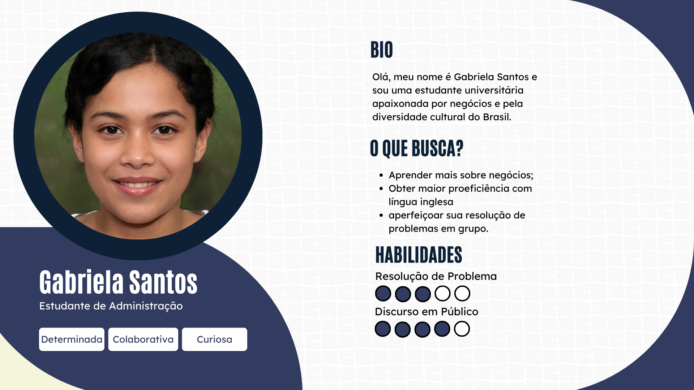<br>
<sup>Fonte: Material produzido pelos autores (2024)</sup>
</div>

&nbsp;&nbsp;&nbsp;&nbsp;A primeira persona é Gabriela Santos, que, sendo uma representação do perfil típico de uma estudante brasileira de administração, é apaixonada tanto pelo âmbito de negócios quanto pela diversidade cultural do Brasil. Determinada, colaborativa e curiosa, Gabriela é uma das futuras jogadoras da simulação de negócios internacional promovida pela Zuyd, trazendo consigo um espírito de busca por novos desafios e aprendizados. Como uma estudante de negócios em formação, ela percebe na simulação proposta uma oportunidade única para expandir seus horizontes em relação à comunicação intercultural, nunca experimentada nesse nível de proximidade por ela, bem como aprofundar seus conhecimentos na área por meio das análises simuladas no jogo. Sua participação, por isso, reflete não apenas seus interesses pessoais de aprender e se desenvolver enquanto acadêmica, mas também interesses coletivos, tanto da sua universidade quanto do próprio Brasil, no que diz respeito a formar conexões interculturais por meio de uma comunicação efetiva.

&nbsp;&nbsp;&nbsp;&nbsp;Outra oportunidade que Gabriela busca nessa experiência é a de aprimorar sua proficiência na língua inglesa por meio do exercício da comunicação em um ambiente globalizado. Apesar de tudo, a estudante espera enfrentar alguns desafios no que diz respeito a competências técnicas, uma vez que tem em mente seu potencial de melhoria principalmente na esfera da resolução de problemas. Também espera estabelecer uma comunicação nítida e confiante durante as dinâmicas que ocorrerem na equipe, de modo a manter sólida a relação entre os jogadores que forem designados a trabalhar aliados a ela. Em geral, espera também contribuir para o próprio ambiente da simulação em si, bem como representar seu país no que diz respeito às conexões interculturais que poderão ser formadas.

<div align="center">
<sub>Figura 6 - Persona Friedrich Weber</sub><br>
<br>
<sup>Fonte: Material produzido pelos autores (2024)</sup>
</div>

&nbsp;&nbsp;&nbsp;&nbsp;Friedrich Weber, 20 anos, um estudante alemão de administração de negócios na Hochschule Bonn-Rhein-Sieg (H-BRS), é sonhador, objetivo e comunicativo. Friedrich é um dos futuros participantes da simulação de negócios internacional promovida pela Zuyd, trazendo consigo uma grande determinação e um forte desejo de que as decisões promovidas por ele, no cenário do jogo, possam trazer os melhores resultados possíveis. Como um estudante comprometido com sua formação acadêmica e profissional, ele enxerga uma oportunidade única na simulação para aplicar seus conhecimentos teóricos em um ambiente prático e desafiador. Sua participação reflete não apenas sua busca por experiências de alto valor profissional, mas também seu desejo de evolução contínua e de estabelecer conexões significativas com colegas e profissionais do ramo.

&nbsp;&nbsp;&nbsp;&nbsp;Friedrich está preparado para enfrentar os desafios técnicos e interpessoais que a simulação possa apresentar, bem como confiante em suas habilidades de organização de projeto e gerenciamento de pessoas. Ele espera não apenas contribuir para o sucesso de sua equipe, mas também aproveitar ao máximo a oportunidade de aprender com seus colegas e expandir sua rede de contatos no mundo dos negócios. Sua participação na simulação não apenas representa seu compromisso com a excelência acadêmica, mas também sua determinação em alcançar seus objetivos profissionais e estabelecer-se como um líder no campo da administração de negócios.

<div align="center">
<sub>Figura 7 - Persona Olivia Huamaní</sub><br>
<br>
<sup>Fonte: Material produzido pelos autores (2024)</sup>
</div>

&nbsp;&nbsp;&nbsp;&nbsp;Olivia Huamaní é professora de Gestão de Negócios Internacionais na Universidad César Vallejo (UCV), Peru, e futura tutora na simulação de negócios internacional promovida pela Zuyd. Criativa, empenhada e sociável, Olivia traz consigo uma paixão por conhecer novas pessoas e culturas, enriquecendo assim sua experiência acadêmica e profissional. Como uma educadora comprometida com a excelência e a inovação, ela vê na oportunidade de atuar como tutora na simulação uma chance única de não apenas compartilhar seus conhecimentos e experiências, mas também de aprender com seus alunos e colegas de todo o mundo.

&nbsp;&nbsp;&nbsp;&nbsp;Olivia busca, acima de tudo, encontrar estudantes com um espírito de inovação na área de negócios e ambientes que valorizem novas ideias e conexões culturais. Com habilidades excepcionais em gestão de equipe e projetos, bem como comunicação eficaz, ela está preparada para guiar e apoiar suas equipes durante todo o processo da simulação. Além disso, sua vasta experiência na área de empreendedorismo, com foco no internacional, a qualifica como uma mentora capaz de oferecer ideias valiosas e orientação estratégica para seus alunos. A participação de Olivia como tutora não apenas enriquece o desenvolvimento do projeto, mas também ressalta a importância de envolver não apenas os alunos, mas também os educadores, no processo de aprendizagem intercultural e colaborativa.

&nbsp;&nbsp;&nbsp;&nbsp;Por meio da análise exposta, é possível perceber que foi dedicado um esforço significativo para compreender as necessidades e expectativas dos estudantes participantes da simulação de negócios. A condução de uma entrevista qualitativa no campus do Inteli, bem como a criação de proto personas (personas criadas inicialmente em um projeto com o objetivo de servir de guia para formular próximos meios de entender a real dor do cliente) foram ações necessárias para um melhor entendimento acerca da proposta do projeto. A criação de personas detalhadas, como Gabriela Santos, Friedrich Weber e Olivia Huamaní, permitiu capturar uma ampla gama de perfis e experiências, enriquecendo assim a compreensão do público-alvo. Desde a pesquisa inicial até a apresentação das personas, cada etapa foi previamente planejada e, somente após, executada.

&nbsp;&nbsp;&nbsp;&nbsp;A criação das personas representou uma abordagem estratégica para solucionar o desafio de compreender verdadeiramente as necessidades dos estudantes participantes da simulação. Ao identificar perfis específicos e suas respectivas motivações, habilidades e aspirações, foi possível criar uma representação mais precisa e detalhada do público-alvo. Isso permite uma orientação mais precisa no desenvolvimento da solução, garantindo que o website de suporte ao aprendizado intercultural atenda às necessidades e expectativas dos estudantes de forma eficaz. Com essa abordagem centrada no usuário, espera-se que a solução proposta contribua significativamente para o sucesso da simulação, promovendo o engajamento dos estudantes e facilitando a formação de conexões interculturais significativas entre os participantes.

### A Entrevista

&nbsp;&nbsp;&nbsp;&nbsp;A entrevista foi conduzida para entender melhor os pensamentos dos participantes sobre o jogo. Este processo focou principalmente em entender os problemas e dores que os entrevistados experimentaram, pois esse conhecimento se mostrou muito importante no desenvolvimento de uma solução. Isso possibilitou uma melhor visão sobre o que o jogo realmente é, a partir das perspectivas dos participantes, o perfil geral dos participantes, bem como as opiniões dos participantes sobre seu grupo, diferenças culturais e os problemas que tiveram durante o jogo. Para entender isso e outras questões, a melhor forma encontrada foi o desenvolvimento e aplicação de uma pesquisa, especificamente do tipo entrevista qualitativa. Esta entrevista foi realizada no campus universitário com 2 (dois) estudantes que já haviam participado da simulação como jogadores. Portanto, a entrevista consistiu em algumas perguntas principais, todas sobre a visão dos participantes sobre o contexto da simulação. A seguir, essas perguntas serão apresentadas, bem como as respostas gerais a elas.

#### Como o jogo realmente funciona?

&nbsp;&nbsp;&nbsp;&nbsp;De acordo com os entrevistados, o jogo consiste em uma simulação de casos reais de negócios, na qual um grupo de participantes está no controle de um negócio e é capaz de tomar decisões em diferentes áreas de gestão dessa organização (como marketing, produção ou recursos humanos). Para isso, a simulação oferece uma plataforma digital com uma grande diversidade de ferramentas de análise, tornando possível tomar decisões com base em uma análise empresarial dos dados fornecidos. Portanto, os jogadores têm que tomar uma decisão para cada área diferente do negócio em uma rodada. Quando a rodada termina, os resultados são relatados aos grupos para que possam perceber o quão bem-sucedidas foram suas decisões. O grupo com o maior lucro vence a rodada. O jogo consiste em 8 rodadas. Em todos os momentos, o foco do jogo é simular um ambiente real, principalmente na área de negócios. Na prática, a simulação basicamente consiste na análise de uma grande quantidade de dados usando as ferramentas fornecidas para isso e nas decisões tomadas a partir dessas análises.

#### Quem é o público-alvo da simulação?

&nbsp;&nbsp;&nbsp;&nbsp;Estudantes universitários internacionais que têm carreiras voltadas para a área de negócios são o público que a simulação abrange, de acordo com os entrevistados. No entanto, qual curso ou mesmo o número de cursos que uma pessoa possui não parece ser uma limitação para jogar a simulação. Um entrevistado disse, "um dos meus colegas de equipe já tinha até 2 diplomas". É possível ver que, nesse aspecto, a simulação é muito inclusiva e cobre um grande grupo de pessoas como público-alvo.

#### Qual foi sua motivação para participar da simulação?

&nbsp;&nbsp;&nbsp;&nbsp;Os entrevistados relataram que sua principal motivação para participar do jogo foi a possibilidade de melhorar seus conhecimentos nas áreas de negócios e finanças, bem como suas habilidades de comunicação em inglês. No entanto, segundo eles, alguns mal-entendidos durante o jogo relacionados à comunicação entre os membros da equipe e explicações sobre a mecânica do jogo acabaram frustrando-os e impedindo esse aprendizado. Ambos os entrevistados também mencionaram sentir-se confusos durante as explicações sobre como o jogo funcionava, bem como no primeiro contato com o jogo.

#### Quais foram os maiores problemas que você experimentou durante a simulação?

&nbsp;&nbsp;&nbsp;&nbsp;A proficiência em inglês foi destacada como o maior desafio durante o jogo, levando pessoas com níveis mais baixos de inglês a se sentirem envergonhadas e desmotivadas a participar plenamente, mesmo que tivessem como objetivo melhorar suas habilidades linguísticas. Além disso, as experiências dentro do jogo variam muito de pessoa para pessoa, principalmente devido à dinâmica e qualidade dos relacionamentos entre os colegas de equipe. Portanto, os entrevistados não observaram padrões significativos de comportamento ligados à nacionalidade ou cultura; os comportamentos mais impactantes eram específicos de cada indivíduo. Por causa disso, a falta de engajamento de alguns jogadores afetou negativamente o desempenho de toda a equipe.

&nbsp;&nbsp;&nbsp;&nbsp;Os diferentes fusos horários dos países dos participantes apresentaram desafios significativos para estabelecer uma colaboração benéfica. Encontrar horários adequados para o trabalho em grupo ou mesmo a disponibilidade parcial da equipe se mostrou extremamente difícil. Ambos os entrevistados citaram as diferenças de fuso horário como o principal obstáculo para o jogo alcançar seu propósito pretendido. Um dos entrevistados chegou a mencionar ter que "agendar reuniões durante o horário de sono devido aos fusos horários conflitantes". A natureza orientada por dados do jogo requer uma extensa leitura, o que pode ser cansativo, especialmente em um idioma não nativo. Embora o site do jogo ofereça traduções oficiais, elas muitas vezes carecem de precisão, levando a mais mal-entendidos e conflitos na tomada de decisões.

#### Quais foram os principais problemas que você experimentou devido às diferenças culturais durante a simulação?

&nbsp;&nbsp;&nbsp;&nbsp;Embora as diferenças culturais estejam presentes e sejam perceptíveis durante o jogo, elas não são os principais fatores que levam a desvios do seu propósito pretendido. O principal impacto reside nos estilos de comunicação, pois diferentes culturas interpretam nuances de comunicação de maneiras diferentes. Um entrevistado observou que as "culturas encontradas através dos colegas de equipe [...] não incentivavam o mesmo nível de transparência pessoal que a cultura brasileira". Isso resultou em colegas sendo menos abertos sobre si mesmos, dificultando conexões mais profundas dentro da equipe. Outro entrevistado mencionou que a "cultura alemã [com a qual interagiram] priorizava interesses individuais, levando a uma comunicação direta e clara, independentemente da situação", o que às vezes poderia causar mal-entendidos.

#### Quais foram os maiores problemas que você experimentou no suporte fornecido?

&nbsp;&nbsp;&nbsp;&nbsp;Segundo os entrevistados, "a introdução ao jogo é entregue de uma forma que deixa os jogadores confusos e sem uma base sólida para jogar com confiança"; "o vídeo introdutório sobrecarrega os alunos com informações excessivas e não explica efetivamente a mecânica do jogo", essas reuniões introduziram conceitos teóricos que poderiam ser úteis durante o jogo, mas a falta de aplicação prática no momento da introdução diminui seu valor percebido pelos jogadores. Em seguida, quando três rodadas de teste são conduzidas, esperando que os jogadores apliquem o conhecimento adquirido, "esse processo falha devido à suposição de que os jogadores entenderam totalmente a mecânica do jogo teoricamente, o que muitas vezes não é o caso", levando a mais confusão.

&nbsp;&nbsp;&nbsp;&nbsp;Ao acessar a plataforma do jogo, os jogadores têm dificuldade em interpretar a vasta quantidade de dados fornecidos de forma eficaz devido à preparação inadequada. A ausência de exemplos práticos durante a fase de explicação dificulta a compreensão das operações do jogo, adicionando outra camada de dificuldade. A falta de suporte na plataforma para explicar a mecânica do jogo agrava ainda mais o desafio. Uma funcionalidade que permitisse aos jogadores indicar seus horários indisponíveis para o grupo melhoraria significativamente a organização e a coordenação da equipe.

&nbsp;&nbsp;&nbsp;&nbsp;Ao analisar esta pesquisa, é possível entender que a maioria das dificuldades experimentadas pelos participantes são causadas por problemas de comunicação, falta de engajamento individual e suporte ao aprendizado dos jogadores. Portanto, é possível desenvolver uma solução que aborde os três principais tópicos, principalmente envolvendo os participantes na comunicação entre eles. Essa dificuldade de comunicação está frequentemente relacionada, mesmo que indiretamente, às diferenças interculturais entre os participantes. Analisar o caso do ponto de vista dos participantes é muito importante para garantir que o projeto esteja alinhado com suas dores e é por isso que esta entrevista qualitativa e, posteriormente, o desenvolvimento de personas qualitativas são essenciais para as decisões futuras do projeto.

## <a id="c23"></a>2.3. User Stories

&nbsp;&nbsp;&nbsp;&nbsp;As _User Stories_ são elementos fundamentais do desenvolvimento ágil para software, servindo como ponte entre as necessidades técnicas do projeto e as expectativas sobre ele. São descrições concisas sobre cenários de uso do projeto em questão, que pensam na utilização do serviço a partir do ponto de vista do usiário final. Cada User Story pensa em gerar valor e entendimento aos usuários finais por meio de uma tabela simples, detalhando o que precisa ser feito, como precisa ser feito e por quê deve ser feito.

<div align="center">
<sub>Tabela 1 - Tabela User Stories Estudante 1</sub>

| Identificação        | US01                                                                                                   |
| -------------------- | ------------------------------------------------------------------------------------------------------ |
| Persona              | Friedrich                                                                                              |
| User Story           | Como participante, quero editar o meu perfil,<br>para garantir que meus colegas saibam mais sobre mim. |
| Critério de aceite 1 | Fazer login na plataforma                                                                              |
| Critério de aceite 2 | Acessar a Home Page                                                                                    |
| Critério de aceite 3 | Ir até a aba de perfil                                                                                 |
| Critério de aceite 4 | Selecionar a opção de editar a informação desejada                                                     |
| Critério de aceite 5 | Editar as informações conforme os critérios <br>desejados pelo participante                                |

<sup>Fonte: Material produzido pelos autores (2024)</sup>

</div>

<div align="center">
<sub>Tabela 2 - Tabela User Stories Estudante 2</sub>

| Identificação        | US02                                                                                                     |
| -------------------- | -------------------------------------------------------------------------------------------------------- |
| Persona              | Gabriela                                                                                                 |
| User Story           | Como participante, quero avaliar meus pares, para que<br> eu possa expressar<br>a minha visão sobre o grupo. |
| Critério de aceite 1 | Fazer login na plataforma                                                                                |
| Critério de aceite 2 | Acessar a Home Page                                                                                      |
| Critério de aceite 3 | Ir até a aba de avaliações                                                                               |
| Critério de aceite 4 | Selecionar o participante desejado                                                                       |
| Critério de aceite 5 | Adicionar informações de acordo com o critério de avaliação                                              |

<sup>Fonte: Material produzido pelos autores (2024)</sup>

</div>

<div align="center">
<sub>Tabela 3 - Tabela User Stories Estudante 3</sub>

| Identificação        | US03                                                                                                   |
| -------------------- | ------------------------------------------------------------------------------------------------------ |
| Persona              | Friedrich                                                                                              |
| User Story           | Como participante, quero visitar o perfil <br>dos demais membros do meu grupo para conhece-los melhor      |
| Critério de aceite 1 | Fazer login na plataforma                                                                              |
| Critério de aceite 2 | Acessar a Home Page                                                                                    |
| Critério de aceite 3 | Abrir a barra lateral                                                                                  |
| Critério de aceite 4 | Selecionar qual perfil de membro desejo visitar                                                        |

<sup>Fonte: Material produzido pelos autores (2024)</sup>

</div>

<div align="center">
<sub>Tabela 4 - Tabela User Stories Estudante 4</sub>

| Identificação        | US04                                                                                                   |
| -------------------- | ------------------------------------------------------------------------------------------------------ |
| Persona              | Gabriela                                                                                               |
| User Story           | Como participante, quero acessar a aba de grupo<br> com o objetivo de conhecer todos os meus colegas de equipe. |
| Critério de aceite 1 | Fazer login na plataforma                                                                              |
| Critério de aceite 2 | Acessar a Home Page                                                                                    |
| Critério de aceite 3 | Ir até a aba de grupo                                                                                 |

<sup>Fonte: Material produzido pelos autores (2024)</sup>

</div>

<div align="center">
<sub>Tabela 5 - Tabela User Stories Estudante 4</sub>

| Identificação        | US05                                                                                                   |
| -------------------- | ------------------------------------------------------------------------------------------------------ |
| Persona              | Friedrich                                                                                               |
| User Story           | Como participante, quero poder visualizar os feedbacks<br> referentes a avaliações dos demais membros do meu grupo |
| Critério de aceite 1 | Fazer login na plataforma                                                                              |
| Critério de aceite 2 | Acessar a Home Page                                                                                    |
| Critério de aceite 3 | Ir até a pagina de feedbacks                                                                                |
| Critério de aceite 4 | Ver o feedback por texto de cada membro do grupo <br>e os pontos da avaliação                             |

<sup>Fonte: Material produzido pelos autores (2024)</sup>

</div>

<div align="center">
<sub>Tabela 6 - Tabela User Stories Orientadora</sub>

| Identificação        | US06                                                                                                                        |
| -------------------- | ----------------------------------------------------------------------------------------------------------------------------- |
| Persona              | Olivia                                                                                                                        |
| User Story           | Como tutora, quero criar um grupo novo |
| Critério de aceite 1 | Fazer login na plataforma                                                                                                     |
| Critério de aceite 2 | Acessar a Home Page                                                                                                           |
| Critério de aceite 3 | Abrir a Sidebar e Clicar no botão de criar grupo                                                                                                    |
| Critério de aceite 4 | Escolher o tutor e os estudantes desse grupo                                                                                      |
| Critério de aceite 5 | Criar o Grupo                                                                     |

<sup>Fonte: Material produzido pelos autores (2024)</sup>

</div>


&nbsp;&nbsp;&nbsp;&nbsp;Em conclusão, as _User Stories_ desempenham um papel importante em um projeto ao traduzir tarefas completas em ações simples e de fácil compreensão, alinhando os esforços de desenvolvimento com as expectativas dos usuários. Por meio da implementação, elas garantem o entendimento entre os usuários finais e as equipes de desenvolvimento e estabelecem um caminho para uma entrega de valor do produto.


# <a id="c3"></a>3. Projeto da Aplicação Web

&nbsp;&nbsp;&nbsp;&nbsp;O projeto de aplicação web adota uma abordagem centrada no usuário, buscando oferecer uma experiência intuitiva e eficiente. Com base no padrão de design MVC (Model-View-Controller) e no Wireframe desenvolvido, delineamos uma arquitetura e disposição de conteúdo que separa claramente as responsabilidades de representação de dados, interação do usuário e lógica de negócios. Essa estruturação permite uma melhor organização do código e facilita a manutenção e evolução da aplicação ao longo do tempo.

### <a id="c31"></a>3.1. Arquitetura


&nbsp;&nbsp;&nbsp;&nbsp;A estrutura MVC significa Model-View-Controller é um padrão de design comumente usado para desenvolver aplicações Web que divide um aplicativo em três componentes interconectados. Isso é feito para separar as representações internas da informação das formas como a informação é apresentada ao usuário.

<div align="center">
<sub>Figura 8 - Arquitetura MVC</sub><br>
<br>
<sup>Fonte: Material produzido pelos autores (2024)</sup>
</div>

&nbsp;&nbsp;&nbsp;&nbsp;A arquitetura MVC representada na imagem é composta pelos seguintes elementos:

### Cliente
- **Usuário**: A pessoa que interage com o sistema através de um navegador.
- **Navegador**: Software utilizado pelo usuário para acessar o sistema, com ícones representando navegadores conhecidos como Google Chrome, Mozilla Firefox, Opera, Apple Safari e Microsoft Edge.

### Servidor
&nbsp;&nbsp;&nbsp;&nbsp;O servidor está estruturado em três componentes principais do MVC:

#### Views
&nbsp;&nbsp;&nbsp;&nbsp;As Views são a interface com o usuário, onde a saída do aplicativo é representada. Eles são renderizados pelo framework Sails.js e incluem:
- **Homepage**: A página inicial do site.
- **navbar**: A barra de navegação do site.
- **profiles**: Perfis dos usuários.
- **group_members**: Membros do grupo.
- **game_info**: Informações sobre jogos.
- **game_indicators**: Indicadores dos jogos.
- **logo**: O logotipo do aplicativo.
- **Feedback**: Página de feedback com os seguintes elementos:
  - **form_questions**: O formulário de perguntas de feedback.
  - **submit**: Botão para enviar feedback.
  - **my_feedbacks**: Feedbacks enviados pelo usuário.
  - **logo**: O logotipo do aplicativo repetido.

#### Controllers
&nbsp;&nbsp;&nbsp;&nbsp;Os Controllers gerenciam a lógica do aplicativo e processam a entrada do usuário, encaminhando para o modelo ou visão adequados. Eles incluem:

- **Admin Controller**: Valida se o usuário atual é um Administrador e retorna os universos disponíveis na página `pages/admin`, para a qual o usuário administrador é redirecionado.

- **Game Controller**: Dísponível para administradores, permite as funções criar um jogo e visualizar jogos ativos.
  - **Create**: Função assíncrona responsável por criar jogos, exijindo como requisição um `body` que contenha data de início e fim do jogo.
  - **Show**: Função assíncrona responsável por mostrar jogos atualmente disponíveis.

- **Universe Controller**: Esse *controller* permite a criação e visualização de universos dentro de um jogo.
  - **Create**: Função assíncrona responsável por criar universos, exijindo como requisição um `body` que contenha um jogo.
  - **Show**: Função assíncrona responsável por mostrar universos anteriormente criados.

- **Group Controller**: Dísponível para administradores, tem como funções a criação e visualização dos grupos de cada universo do jogo.
  - **Create**: Função assíncrona responsável por criar grupos, exijindo como requisição um `body` que contenha um nome, um universo do jogo, um tutor e pelo menos 1 estudante.
  - **Show**: Função assíncrona responsável por mostrar grupos existentes no universo.

- **User Controller**: Tem como funções a criação dos usuários, *login* dos usuários, visualizar usuário ativo e atualizar foto do usuário ativo.
  - **signup**: Função assíncrona responsável por criar usuários, exijindo como requisição um `body` que contenha (obrigatoriamente) uma *e-mail*, uma senha e o "tipo" do usuário (podendo ser admin, tutor ou estudante) e, além disso, (opcionalmente) nome, gênero, uma descrição "sobre mim" do usuário, data de aniversário, país de origem, uma descrição do país de origem, escolaridade e uma universidade.
  - **Show**: Função assíncrona responsável por mostrar jogos atualmente disponíveis.

- **Feedback Controller**: Tem como funções a renderização da página de feedback e a criação de novos feedbacks. Essa função exige que o usuário esteja logado para acessar a página de feedback.
  - **create**: Função assíncrona responsável por renderizar a página de feedback e criar novos feedbacks. Se a requisição for um POST, a função extrai os detalhes do feedback do corpo da requisição, valida os campos necessários e verifica se o destinatário do feedback existe. Em seguida, busca o jogo e a rodada atuais usando helpers, cria um novo feedback e redireciona o usuário para a página de feedback. Se a requisição não for um POST, a função busca os detalhes do usuário logado, os membros do grupo ao qual ele pertence e todos os feedbacks recebidos, renderizando a página de feedback com essas informações.

- **HomepageController**: Tem como funções principais a renderização da visão geral da homepage e a atualização do medidor de felicidade dos usuários.

  - **overview**: Função assíncrona responsável por renderizar a página inicial do usuário. Verifica se o usuário está logado e, em caso positivo, busca os dados do usuário, mensagens, grupo do estudante e detalhes do tutor e membros do grupo. A função também calcula a hora do usuário com base no fuso horário e ajusta a exibição de mensagens e informações do grupo.

  - **happinessMeter**: Função assíncrona responsável por atualizar o nível de felicidade do usuário. Verifica se o usuário está logado e valida o valor de felicidade recebido na requisição. Em seguida, atualiza o valor do medidor de felicidade no banco de dados e retorna uma mensagem de sucesso ou um erro em caso de falha.

- **MessageController**: Tem como funções principais a criação de novas mensagens e a listagem de todas as mensagens.

  - **create**: Função assíncrona responsável por criar uma nova mensagem. Verifica se o usuário está autenticado e se o conteúdo da mensagem foi fornecido. Em caso afirmativo, cria e salva a nova mensagem no banco de dados, retornando a mensagem criada como resposta. Caso contrário, retorna um erro de autenticação ou de conteúdo obrigatório.

  - **list**: Função assíncrona responsável por listar todas as mensagens. Busca todas as mensagens no banco de dados, populando as informações do usuário associado a cada mensagem. Em seguida, renderiza a página inicial com as mensagens recuperadas. Se ocorrer algum erro, retorna uma resposta de erro.

- **QuestionController**: Tem como funções principais a manipulação de perguntas de diferentes tipos, como tomada de decisão e colaboração, além de calcular e atualizar o tipo de perfil do usuário com base nas respostas.

  - **personalType**: Função assíncrona que gerencia perguntas relacionadas à tomada de decisão. Em requisições GET, busca e renderiza perguntas desse tipo. Em requisições POST, salva as respostas fornecidas pelos usuários no banco de dados e redireciona para uma página de resultados.

  - **externalType**: Função assíncrona que gerencia perguntas de colaboração. Verifica se o usuário está logado e pertence a um grupo. Em requisições GET, busca e renderiza perguntas de colaboração juntamente com os membros do grupo. Em requisições POST, salva as respostas fornecidas pelos usuários, incluindo o ID do usuário destinatário, e redireciona para a página do usuário.

  - **profileResult**: Função assíncrona que calcula o tipo de perfil do usuário com base nas respostas das perguntas de tomada de decisão. Atualiza o campo personalProfileType do usuário no banco de dados e renderiza a página de resultados da autoavaliação.

#### Models
&nbsp;&nbsp;&nbsp;&nbsp;Os Models representam a estrutura de dados do aplicativo e a lógica de negócios relacionada a esses dados. Eles se comunicam com o Servidor Banco de Dados. Os modelos incluem:
- **User**: Campos como Id, userType, fullName, emailAddress, password, birthday, countryPov, aboutMe, profileType, happinessMeter, gender, lastSeenAt, photo, messages, educationId, groups, questionAnswers e studentsTeams.
  - **id**: Chave primária e identificador exclusivo de cada usuário (tipo: numeral).
  - **userType**: Indicador do tipo de usuário, tendo como possíveis refenciais "student", "tutor" ou "admin" (tipo: string).
  - **fullName**: Nome completo do usuário (tipo: string).
  - **emailAddress**: E-mail do usuário (tipo: string).
  - **password**: Senha de acesso do usuário (tipo: string).
  - **birthday**: Data de aniversário do usuário (tipo: data).
  - **countryPov**: Descrição pessoal do país do (tipo: string).
  - **aboutMe**: Descrição pessoal sobre o próprio usuário (tipo: string).
  - **ProfileType**: indicador sobre o tipo de usuário, podendo ser diretor, analista, etc (tipo: string).
  - **happinessMeter**: medidor usado para que o usuário possa indicar sua felicidade (tipo: numeral).
  - **gender**: gênero do usuário, selecionado pelo próprio (tipo: string).
  - **lastSeenAt**: indicador do último acesso do usuário (tipo: data).
  - **photo**: foto do usuário (tipo: string)
  - **messages**: texto do usuário que aparece em sua tela de perfil e na tela inicial dos membros  do grupo (tipo: string).
  - **educationId**: identificador da universidade na qual o usuário estuda ou trabalha (tipo: numeral).
  - **groups**: medidor usado para que o usuário possa indicar sua felicidade (tipo: numeral).
  - **questionAnswers**: respostas do usuários para as perguntas respondidas ao longo do jogo (tipo: string).
  - **studentsTeams**: indicador do grupo do usuário (tipo: numeral).

- **Game**: Campos como startDate, endDate, universes e rounds.
  - **id**: Chave primária e identificador exclusivo de cada jogo (tipo: numeral).
  - **startDate**: data de início do jogo (tipo: data).
  - **endDate**: data de finalização do jogo (tipo: data).
  - **universes**: indicador do grupo do usuário (tipo: numeral).
  - **rounds**: indicador do grupo do usuário (tipo: numeral).

- **Universe**: Campos como gameId e groups.
  - **id**: Chave primária e identificador exclusivo de cada universo (tipo: numeral).
  - **gameId**: identificador estrangeiro do jogo (tipo: numeral).
  - **groups**: identificador estrangeiro dos grupos que pertencem ao universo (tipo: numeral).

- **studentsTeam**: Campos como gameId e groups.
  - **id**: Chave primária e identificador exclusivo de cada studentsTeam (tipo: numeral).
  - **groupId**: identificador estrangeiro do universo ao qual o grupo pertence (tipo: numeral).
  - **userId**: identificador estrangeiro dos usuários ao quae pertencem ao grupo (tipo: numeral).

- **Group**: Campos como gameId e groups.
  - **id**: Chave primária e identificador exclusivo de cada grupo (tipo: numeral).
  - **universeId**: identificador estrangeiro do universo ao qual o grupo pertence (tipo: numeral).
  - **tutorId**: identificador estrangeiro dos grupos que pertencem ao universo (tipo: numeral).
  - **studentsId**: identificador estrangeiro dos estudantes que pertencem ao grupo (tipo: numeral).

- **Round**: Campos como gameId e groups.
  - **id**: Chave primária e identificador exclusivo de cada round (tipo: numeral).
  - **gameId**: identificador estrangeiro do jogo ao qual o round pertence (tipo: numeral).
  - **startDate**: indicador do início do round (tipo: timedate).
  - **endDate**: indicador do final do round (tipo: timedate).
  - **roundNumber**: indicador do número do round (tipo: numeral).
  - **explanation**: explicações sobre os eventos do round e seu funcionamento (tipo: numeral).

- **Country**: Campos como name, svgIcon, users e universities.
  - **id**: Chave primária e identificador exclusivo de cada país (tipo: numeral).
  - **name**: Nome do país (tipo: string).
  - **svgIcon**: Ícone SVG do país (tipo: string).
  - **users**: Identificador estrangeiro dos usuários que pertencem ao país (tipo: numeral).
  - **universities**: Identificador estrangeiro das universidades que pertencem ao país (tipo: numeral).

- **Education**: Campos como name, educationLevel, universityId e users.
  - **id**: Chave primária e identificador exclusivo de cada educação (tipo: numeral).
  - **name**: Nome do curso ou nível educacional (tipo: string).
  - **educationLevel**: Nível da educação (tipo: string).
  - **universityId**: Identificador estrangeiro da universidade a que pertence (tipo: numeral).
  - **users**: Identificador estrangeiro dos usuários que possuem essa educação (tipo: numeral).

- **Feedback**: Campos como fromUserId, toUserId, roundId, content e date.
  - **id**: Chave primária e identificador exclusivo de cada feedback (tipo: numeral).
  - **fromUserId**: Identificador estrangeiro do usuário que deu o feedback (tipo: numeral).
  - **toUserId**: Identificador estrangeiro do usuário que recebeu o feedback (tipo: numeral).
  - **roundId**: Identificador estrangeiro da rodada à qual o feedback pertence (tipo: numeral).
  - **content**: Conteúdo do feedback (tipo: string).
  - **date**: Data do feedback (tipo: timestamp).

- **Message**: Campos como content, date e userId.
  - **id**: Chave primária e identificador exclusivo de cada mensagem (tipo: numeral).
  - **content**: Conteúdo da mensagem (tipo: string).
  - **date**: Data de criação da mensagem (tipo: timestamp).
  - **userId**: Identificador estrangeiro do usuário que criou a mensagem (tipo: numeral).

- **Question**: Campos como questionText, alternatives, questionType e questionAnswers.
  - **id**: Chave primária e identificador exclusivo de cada questão (tipo: numeral).
  - **questionText**: Texto da questão (tipo: string).
  - **alternatives**: Alternativas da questão (tipo: json).
  - **questionType**: Tipo da questão (tipo: string).
  - **questionAnswers**: Identificador estrangeiro das respostas à questão (tipo: numeral).

- **QuestionAnswer**: Campos como userId, questionAnswer, date e questionId.
  - **id**: Chave primária e identificador exclusivo de cada resposta de questão (tipo: numeral).
  - **userId**: Identificador estrangeiro do usuário que respondeu a questão (tipo: numeral).
  - **toUserId**: Identificador estrangeiro do usuário que recebeu a questão respondida (tipo: numeral).
  - **questionAnswer**: Resposta à questão (tipo: string).
  - **date**: Data da resposta (tipo: timestamp).
  - **questionId**: Identificador estrangeiro da questão que foi respondida (tipo: numeral).

- **Timezone**: Campos como name e users.
  - **id**: Chave primária e identificador exclusivo de cada fuso horário (tipo: numeral).
  - **name**: Nome do fuso horário (tipo: string).
  - **users**: Identificador estrangeiro dos usuários que pertencem ao fuso horário (tipo: numeral).

- **University**: Campos como name, countryId e educations.
  - **id**: Chave primária e identificador exclusivo de cada universidade (tipo: numeral).
  - **name**: Nome da universidade (tipo: string).
  - **countryId**: Identificador estrangeiro do país a que pertence a universidade (tipo: numeral).
  - **educations**: Identificador estrangeiro das educações oferecidas pela universidade (tipo: numeral).

### Servidor Banco de Dados
- **Render**: É o serviço de hospedagem utilizado para armazenar os dados vindos dos models em um banco de dados.
- **DBeaver**: Programa para visualizar e manipular o banco de dados. Pode-se conectar com o banco hospedado no Render.

&nbsp;&nbsp;&nbsp;&nbsp;Em resumo, a arquitetura MVC adotada para o projeto C³ - Code Connecting Cultures garante uma clara separação de responsabilidades entre os componentes de Model, View e Controller, permitindo um desenvolvimento mais organizado e eficiente. Ao segmentar a aplicação em partes distintas, facilita-se a manutenção, a escalabilidade e a adição de novas funcionalidades. Essa abordagem estruturada não apenas melhora a experiência do desenvolvedor, mas também proporciona uma interface de usuário mais responsiva e intuitiva, essencial para promover a colaboração intercultural e o aprendizado entre estudantes internacionais


## <a id="c32"></a>3.2. Wireframes


&nbsp;&nbsp;&nbsp;&nbsp;O Wireframe é um esboço utilizado para estruturar e validar as ideias de um site. Ele serve como uma representação visual inicial, permitindo a visualização da disposição dos elementos e da navegação, fornecendo, assim, um caminho para o design final. Dessa forma, segue abaixo o wireframe do nosso projeto.

<div align="center">
<sub>Figura 9 - Wireframe</sub><br>
<br>
<sup>Fonte: Material produzido pelos autores (2024)</sup>
</div>

&nbsp;&nbsp;&nbsp;&nbsp;Além disso, desenvolvemos um *UserFlow*, que representa a sequência de etapas que um usuário percorre para concluir uma tarefa, alcançar um objetivo ou executar uma ação desejada. Este *UserFlow* foi elaborado a partir das personas criadas anteriormente.

<div align="center">
<sub>Figura 10 - *UserFlow* Estudante 1</sub><br>
<br>
<sup>Fonte: Material produzido pelos autores (2024)</sup>
</div>

<div align="center">
<sub>Figura 11 - *UserFlow* Estudante 2</sub><br>
<br>
<sup>Fonte: Material produzido pelos autores (2024)</sup>
</div>

<div align="center">
<sub>Figura 12 - *UserFlow* Orientador</sub><br>
<br>
<sup>Fonte: Material produzido pelos autores (2024)</sup>
</div>

&nbsp;&nbsp;&nbsp;&nbsp;Em resumo, o uso do wireframe e do *UserFlow* são passos essenciais no processo de desenvolvimento de um site. Enquanto o wireframe proporciona uma visão inicial da disposição dos elementos e da navegação, o UserFlow oferece uma representação da sequência de etapas que os usuários seguirão. A partir dessas ferramentas, podemos construir uma base sólida para a construção do projeto final.

## <a id="c33"></a>3.3. Guia de estilos

&nbsp;&nbsp;&nbsp;&nbsp;As *Style Guides* da Interface do Usuário (UI) são um componente essencial para a coesão visual e funcional para um projeto de aplicação Web. Elas estabelecem as diretrizes visuais que guiam o design e estabelecem os elementos visuais e interativos do projeto. Essas guias são criadas para assegurar que os aspectos da interface do usuário sejam consistentes ao longo de toda a aplicação, esteticamente agradáveis e alinhados com a identidade visual do projeto.

<strong>*Consulte sempre que necessário o guia de estilos ao aplicar modificações, para garantir sempre a coesão estética e a unidade visual ao longo do projeto.*</strong>

### <a id="c331"></a>3.3.1 Cores

&nbsp;&nbsp;&nbsp;&nbsp;As cores são componentes essenciais para criação de uma experiência de usuário coesa e visualmente atrativa. Nesse guia de estilo, as cores foram categorizadas em três grupos principais para garantir consistência visual e comunicar os significados de maneira eficiente e coesa através de todo o desenvolvimento.

<div align="center">
<sub>Figura 13 - Style Guide de Cores</sub><br>
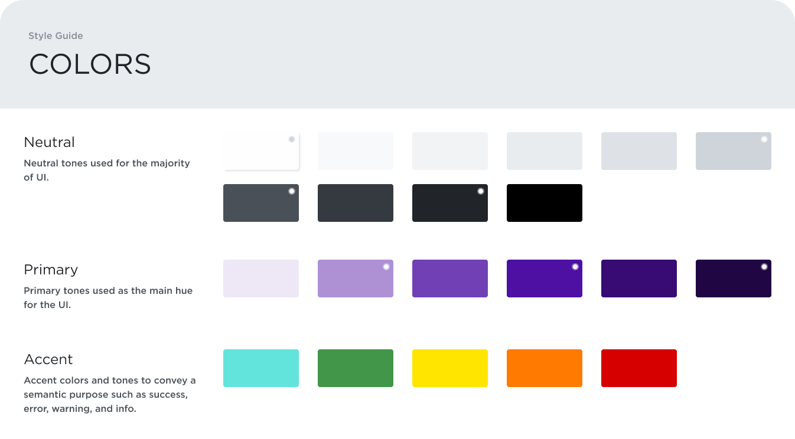<br>
<sup>Fonte: Material produzido pelos autores (2024)</sup>
</div>

&nbsp;&nbsp;&nbsp;&nbsp;<strong>Neutras:</strong> Os tons neutros são usados para preenchimento ao longo do projeto. Eles oferecem um fundo discreto que não atrapalha, permitindo que os elementos mais principais se destaquem. Estes tons são essenciais para criar uma hierarquia visual clara e manter o equilíbrio ao longo do design.

&nbsp;&nbsp;&nbsp;&nbsp;<strong>Primárias:</strong> Os tons primários são as cores principais usadas como a tonalidade dominante da interface. Não só reforçam a identidade visual do projeto, como também orientam os usuários através das funções mais importantes do aplicativo. A escolha pelos tons de roxo foi feita para relembrar a instituição dos autores, além de ser uma cor que traz alta imersão para o usuário, não fatiga os olhos durante o uso da plataforma e é uma cor convidativa para os participantes do projeto.

&nbsp;&nbsp;&nbsp;&nbsp;<strong>De Destaque:</strong> As cores de destaque têm um propósito didático e são utilizadas para indicar condições ou ações, como sucesso, erro, alerta e destaque. Essas cores são projetadas para capturar a atenção do usuário de maneira intuitiva e fornecer feedback visual sobre suas ações dentro da plataforma.

### <a id="c332"></a>3.3.2 Tipografia

&nbsp;&nbsp;&nbsp;&nbsp;A tipografia é essencial no design das interfaces do usuário, e desempenham um papel vital na estética visual e na funcionalidade e do projeto. Neste guia de estilo, as especificações de tipografia detalham a clareza, a coerência e a eficiência da comunicação através do design.

A escolha tipográfica foi feita para garantir alta legibilidade e harmonia visual ao longo de toda a aplicação. A padronização da tipografia não só reforça a identidade da marca, mas cria uma experiência de usuário consistente e imersiva. Estão destacados todos os estilos de cabeçalho até os textos mais sutis, cada um com seu peso, tamanho e espaçamento específicos para servir propósitos distintos dentro do projeto.

<div align="center">
<sub>Figura 14 - Style Guide de Tipografia</sub><br>
<br>
<sup>Fonte: Material produzido pelos autores (2024)</sup>
</div>

<strong>Cabeçalhos (H1, H2, H3, H4, H5, H6):</strong> Estabelecem uma hierarquia visual clara e direcionam a atenção do usuário e se destacam pelo tamanho e peso da tipografia.

<strong>Corpos de Texto (Body 1, Body 2):</strong> Garantem que o conteúdo principal seja fácil de ler e acessível.

<strong>Legendas e Botões:</strong> Fornecem informações adicionais e orientações interativas de forma concisa e eficaz.

&nbsp;&nbsp;&nbsp;&nbsp;Assim, a fonte *Arial* foi escolhida, pela sua facilidade de leitura em telas, por ser uma *fonte não-serifada*, o que garante que o usuário não fique fatigado ao usar a plataforma por longos períodos.


### <a id="c333"></a>3.3.3 Iconografia e imagens

&nbsp;&nbsp;&nbsp;&nbsp;Os ícones são elementos visuais essenciais na interface do usuário, funcionando como elementos de comunicação visual rápida e eficiente para guiar os usuários por toda a plataforma, pode meio de ações e conteúdos com clareza e simplicidade. Neste guia de estilo, os ícones foram pensados para serem intuitivos e funcionais, garantindo que os usuários possam navegar por toda a interface com simplicidade e facilidade.

Ícones universais, como *checks* para confirmação, lixeiras para deletar, lupas para pesquisa e logos de redes sociais servem para ações comuns ao longo da plataforma. Os ícones de medidor de temperamento servem para que o usuário possa descrever com simplicidade as emoções ao longo da usabilidade.

<div align="center">
<sub>Figura 15 - Style Guide de Iconografia</sub><br>
<br>
<sup>Fonte: Material produzido pelos autores (2024)</sup>
</div>

&nbsp;&nbsp;&nbsp;&nbsp;O conjunto de ícones foi escolhido para ser esteticamente alinhado com a identidade visual do projeto, mantendo a consistência em todos os pontos de contato digitais. Eles são simples, mas eficientes, escolhidos para serem reconhecidos de forma rápida e eficaz, melhorando a experiência geral do usuário e mantendo uma consistência estética de linhas simples e traços finos de toda a interface do usuário.

&nbsp;&nbsp;&nbsp;&nbsp;Em conclusão, a criação e a adesão a um guia de estilos são de grande importância para garantir a consistência e a coesão visual de um projeto de aplicação web. As diretrizes apresentadas para cores, tipografia e iconografia estabelecem um padrão que facilita a usabilidade e colabora com a experiência do usuário. Este guia garante que todos os elementos visuais sejam harmoniosos e esteticamente alinhados com a identidade visual do projeto, possibilitando uma interface intuitiva e simplista.

## <a id="c34"></a>3.4 Protótipo de alta fidelidade

&nbsp;&nbsp;&nbsp;&nbsp;O protótipo de alta fidelidade é uma representação interativa do produto, para validar o design e as interações da aplicação web. O protótipo simula a experiência do usuário, incluindo elementos visuais, funcionalidades e fluxos de interação, permitindo que designers e desenvolvedores testem e refinem o produto antes da implementação final.Para ilustar nosso protótipo, usamos o programa Figma, segue <a href="https://www.figma.com/design/ZDhf55nIFs7WBXO4YkY5HS/Site?node-id=723-1216&t=qyGLyKdR01BETRiN-1">aqui o link</a> para visualização total.

&nbsp;&nbsp;&nbsp;&nbsp;Ademais, segue abaixo as Userflows com o prótipo de alta fidelidade:

<div align="center">
<sub>Figura 16 - UserFlow do Protótipo de alta fidelidade da UserStory1</sub><br>
<br>
<sup>Fonte: Material produzido pelos autores (2024)</sup>
</div>

<div align="center">
<sub>Figura 17 - UserFlow do Protótipo de alta fidelidade da UserStory2</sub><br>
<br>
<sup>Fonte: Material produzido pelos autores (2024)</sup>
</div>

<div align="center">
<sub>Figura 18 - UserFlow do Protótipo de alta fidelidade da UserStory3</sub><br>
<br>
<sup>Fonte: Material produzido pelos autores (2024)</sup>
</div>

<div align="center">
<sub>Figura 19 - UserFlow do Protótipo de alta fidelidade da UserStory4</sub><br>
<br>
<sup>Fonte: Material produzido pelos autores (2024)</sup>
</div>

<div align="center">
<sub>Figura 20 - UserFlow do Protótipo de alta fidelidade da UserStory5</sub><br>
<br>
<sup>Fonte: Material produzido pelos autores (2024)</sup>
</div>

<div align="center">
<sub>Figura 21 - UserFlow do Protótipo de alta fidelidade da UserStory6</sub><br>
<br>
<sup>Fonte: Material produzido pelos autores (2024)</sup>
</div>


&nbsp;&nbsp;&nbsp;&nbsp;Assim, ao analisar todas as possíveis rotas dentro do site, obtém-se o seguinte fluxograma:
<div align="center">
<sub>Figura 22 - Fluxograma Protótipo de alta fidelidade</sub><br>
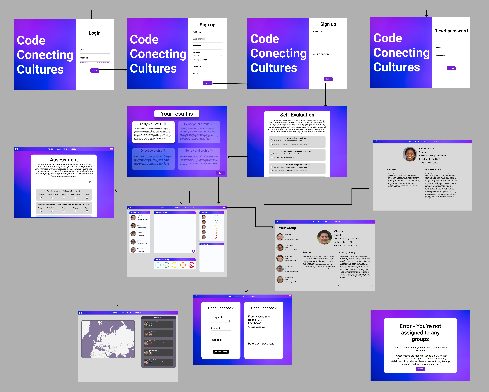<br>
<sup>Fonte: Material produzido pelos autores (2024)</sup>
</div>

&nbsp;&nbsp;&nbsp;&nbsp;Por fim, fica claro que em todo o site haverá uma navbar, proporcionando ao usuário acesso rápido e fácil à homepage, às seções de avaliações e feedbacks, à área do seu grupo e ao seu perfil pessoal. Além disso, será possível acessar os perfis dos colegas de equipe clicando em seus nomes, tanto na sidebar da homepage quanto na seção de grupo. Em relação à visão do tutor, ao abrir a página do grupo, o tutor primeiro seleciona qual grupo deseja acessar e, em seguida, é redirecionado para a página desejada.

## <a id="c35"></a>3.5. Modelagem do banco de dados

### <a id="c351"></a>3.5.1. Modelo relacional

&nbsp;&nbsp;&nbsp;&nbsp;O modelo relacional de banco de dados foi feito no site `kitt.lewagon.com/db` organiza as informações de forma que se relacionem de acordo com o propósito do projeto. O diagrama apresenta as tabelas como entidades que possuem uma lista de atributos, estabelecendo relações entre elas por meio de linhas. Segue abaixo a representação da modelagem relacional do banco de dados utlizado no projeto.

<div align="center">
<sub>Figura 23 - Modelo Relacional do Banco de Dados</sub><br>
<br>
<sup>Fonte: Material produzido pelos autores (2024)</sup>
</div>

- **Legenda das cores utilizadas**:
  - **amarelo**: numeral
  - **verde**: data
  - **vermelho**: string

&nbsp;&nbsp;&nbsp;&nbsp; Como observável, o modelo relacional apresenta em sua estrutura um modo simples de visualizar as relações entre as tabelas e as chaves primárias e estrangeira de cada uma delas. Os detalhes das tabelas e seus respectivos atributos, incluindo as chaves primárias e estrangeiras estão representados na sessão 3.1 - Arquitetura.

### Tabela: `User`

- **id** (INTEGER, PRIMARY KEY)
- **name** (TEXT)
- **email** (TEXT)
- **password** (TEXT)
- **education_id** (INTEGER, FOREIGN KEY references `Education(id)`)
- **birthday** (DATE)
- **country_id** (INTEGER, FOREIGN KEY references `Country(id)`)
- **gender** (TEXT)

### Tabela: `Education`

- **id** (INTEGER, PRIMARY KEY)
- **name** (VARCHAR)
- **education_level** (INTEGER)
- **university_id** (INTEGER, FOREIGN KEY references `University(id)`)

### Tabela: `University`

- **id** (INTEGER, PRIMARY KEY)
- **name** (VARCHAR)
- **country_id** (INTEGER, FOREIGN KEY references `Country(id)`)

### Tabela: `Country`

- **id** (INTEGER, PRIMARY KEY)
- **name** (VARCHAR)
- **svg_icon** (TEXT)

### Tabela: `Group`

- **id** (INTEGER, PRIMARY KEY)
- **name** (TEXT)
- **tutor_id** (INTEGER, FOREIGN KEY references `User(id)`)
- **game_id** (INTEGER, FOREIGN KEY references `Game(id)`)

### Tabela: `Game`

- **id** (INTEGER, PRIMARY KEY)
- **start_date** (DATE)
- **end_date** (DATE)

### Tabela: `Round`

- **id** (INTEGER, PRIMARY KEY)
- **game_id** (INTEGER, FOREIGN KEY references `Game(id)`)
- **start_date** (DATE)
- **end_date** (INTEGER)
- **round_number** (INTEGER)
- **explanation** (TEXT)

### Tabela: `Question`

- **id** (INTEGER, PRIMARY KEY)
- **question_text** (INTEGER)
- **alternatives** (VARCHAR)
- **question_type** (VARCHAR)

### Tabela: `QuestionAnswer`

- **id** (INTEGER, PRIMARY KEY)
- **user_id** (INTEGER, FOREIGN KEY references `User(id)`)
- **to_user_id** (INTEGER, FOREIGN KEY references `User(id)`)
- **question_answer** (TEXT)
- **period** (INTEGER)
- **date** (DATE)
- **question_id** (INTEGER, FOREIGN KEY references `Question(id)`)

### Tabela: `Student`

- **id** (INTEGER, PRIMARY KEY)
- **user_id** (INTEGER, FOREIGN KEY references `User(id)`)
- **country_pov** (VARCHAR)
- **profile_type** (TEXT)
- **happiness_meter** (INTEGER)

### Tabela: `Tutor`

- **id** (INTEGER, PRIMARY KEY)
- **user_id** (INTEGER, FOREIGN KEY references `User(id)`)

### Tabela: `StudentsTeam`

- **id** (INTEGER, PRIMARY KEY)
- **group_id** (INTEGER, FOREIGN KEY references `Group(id)`)
- **student_id** (INTEGER, FOREIGN KEY references `User(id)`)

### Tabela: `Message`

- **id** (INTEGER, PRIMARY KEY)
- **content** (TEXT)
- **user_id** (INTEGER, FOREIGN KEY references `User(id)`)
- **group_id** (INTEGER, FOREIGN KEY references `Group(id)`)
- **date** (DATE)

## Relacionamentos

- A tabela `User` é central no esquema, conectando-se com `Group`, `QuestionAnswer`, `Student`, `Tutor`, e `Message` através de chaves estrangeiras.
- `Education` conecta-se a `User` e indiretamente a `University`.
- `University` conecta-se a `Education` e também está ligada a `Country`.
- `Game` conecta-se a `Group` e `Round`.
- `Question` e `QuestionAnswer` ligam questões às respostas dos usuários.
- `StudentsTeam` conecta `Group` e `Student`, estabelecendo uma relação entre os estudantes e seus respectivos grupos.

As linhas desempenham o papel de conectar as tabelas, relacionando informações e atributos. Por exemplo, a tabela "User" se relaciona com a tabela "Group" através do atributo "group_id", indicando que todos os usuários pertencem a um grupo. Essa estrutura facilita o entendimento e a visualização do processo interno de dados, auxiliando na implementação de um banco de dados para um projeto ou servindo como material de referência para entender o fluxo de informações.

### Criação do Banco de Dados Físico

```sql
-- Creating Country table
CREATE TABLE Country (
    id SERIAL PRIMARY KEY,
    name VARCHAR,
    svg_icon TEXT
);

-- Creating University table
CREATE TABLE University (
    id SERIAL PRIMARY KEY,
    name VARCHAR,
    country_id INTEGER,
    FOREIGN KEY (country_id) REFERENCES Country(id)
);

-- Creating Education table
CREATE TABLE Education (
    id SERIAL PRIMARY KEY,
    name VARCHAR,
    education_level INTEGER,
    university_id INTEGER,
    FOREIGN KEY (university_id) REFERENCES University(id)
);

-- Creating Timezone table
CREATE TABLE Timezone (
    id SERIAL PRIMARY KEY,
    name VARCHAR
);

-- Creating Users table
CREATE TABLE Users (
    id SERIAL PRIMARY KEY,
    user_type VARCHAR,
    name TEXT,
    email TEXT,
    password TEXT,
    education_id INTEGER,
    birthday DATE,
    country_id INTEGER,
    gender TEXT,
    happiness_meter INTEGER,
    profile_type TEXT,
    country_pov TEXT,
    about_me TEXT,
    last_seen_at TIMESTAMP,
    photo TEXT,
    timezone_id INTEGER,
    FOREIGN KEY (education_id) REFERENCES Education(id),
    FOREIGN KEY (country_id) REFERENCES Country(id),
    FOREIGN KEY (timezone_id) REFERENCES Timezone(id)
);

-- Creating Game table
CREATE TABLE Game (
    id SERIAL PRIMARY KEY,
    start_date TIMESTAMP,
    end_date TIMESTAMP
);

-- Creating Universe table
CREATE TABLE Universe (
    id SERIAL PRIMARY KEY,
    game_id INTEGER,
    color TEXT,
    FOREIGN KEY (game_id) REFERENCES Game(id)
);

-- Creating Group table
CREATE TABLE Groups (
    id SERIAL PRIMARY KEY,
    name TEXT,
    tutor_id INTEGER,
    universe_id INTEGER,
    FOREIGN KEY (tutor_id) REFERENCES Users(id),
    FOREIGN KEY (universe_id) REFERENCES Universe(id)
);

-- Creating StudentsTeam table
CREATE TABLE StudentsTeam (
    id SERIAL PRIMARY KEY,
    group_id INTEGER,
    user_id INTEGER,
    FOREIGN KEY (group_id) REFERENCES Groups(id),
    FOREIGN KEY (user_id) REFERENCES Users(id)
);

-- Creating Question table
CREATE TABLE Question (
    id SERIAL PRIMARY KEY,
    question_text TEXT,
    alternatives VARCHAR,
    question_type VARCHAR
);

-- Creating QuestionAnswer table
CREATE TABLE QuestionAnswer (
    id SERIAL PRIMARY KEY,
    student_id INTEGER,
    question_answer CHAR,
    period INTEGER,
    date TIMESTAMP,
    question_id INTEGER,
    FOREIGN KEY (student_id) REFERENCES Users(id),
    FOREIGN KEY (question_id) REFERENCES Question(id)
);

-- Creating Round table
CREATE TABLE Round (
    id SERIAL PRIMARY KEY,
    game_id INTEGER,
    start_date TIMESTAMP,
    end_date TIMESTAMP,
    round_number INTEGER,
    explanation TEXT,
    FOREIGN KEY (game_id) REFERENCES Game(id)
);

-- Creating Message table
CREATE TABLE Message (
    id SERIAL PRIMARY KEY,
    content TEXT,
    user_id INTEGER,
    date TIMESTAMP,
    FOREIGN KEY (user_id) REFERENCES Users(id)
);

-- Creating Feedback table
CREATE TABLE Feedback (
    id SERIAL PRIMARY KEY,
    from_user_id INTEGER,
    to_user_id INTEGER,
    round_id INTEGER,
    content TEXT,
    date TIMESTAMP,
    FOREIGN KEY (from_user_id) REFERENCES Users(id),
    FOREIGN KEY (to_user_id) REFERENCES Users(id),
    FOREIGN KEY (round_id) REFERENCES Round(id)
);


```

&nbsp;&nbsp;&nbsp;&nbsp;Dessa forma, o banco de dados relacional consegue estabelecer conexões com todas as informações necessárias para que o website possa interagir com os usuários e com o Cesim Game de forma simultânea.

### <a id="c352"></a>3.5.2. Consultas SQL e lógica proposicional

&nbsp;&nbsp;&nbsp;&nbsp;A aplicação web desenvolvida frequentemente precisa se comunicar com seu banco de dados relacional. Nessa comunicação, a necessidade de consultas de dados é notável, pois muitas vezes é necessário comparar novos dados com dados já presentes no banco de dados. As consultas SQL desempenham um papel crucial nesse processo, permitindo a recuperação, inserção, atualização e exclusão de dados de forma eficiente. Ao construir consultas SQL precisas, a aplicação garante que pode acessar e manipular as informações necessárias para manter a integridade e funcionalidade do sistema. Essa interação constante com o banco de dados fundamenta a natureza dinâmica da aplicação web, permitindo que ela responda às entradas do usuário e execute operações de dados complexas de forma transparente.

&nbsp;&nbsp;&nbsp;&nbsp;Compreender os princípios por trás das consultas SQL pode ser grandemente aprimorado ao estabelecer paralelos com a lógica proposicional, um ramo da lógica matemática. A lógica proposicional envolve o estudo de proposições e suas relações lógicas, que podem ser diretamente relacionadas à forma como as consultas SQL são estruturadas. Assim como as proposições na lógica podem ser combinadas e manipuladas para formar conclusões lógicas, as consultas SQL utilizam várias cláusulas e condições para filtrar, unir e transformar conjuntos de dados. Ao aplicar os princípios da lógica proposicional, é possível compreender melhor a formulação das consultas SQL, garantindo que sejam precisas e eficientes. Essa abordagem matemática fornece uma base sólida para compreender a lógica subjacente da recuperação e manipulação de dados em bancos de dados relacionais.

<br>

<div align = "center">
<sub>Tabela 7 - Checagem de Email no UserController</sub>
</div>

#1 | UserController
--- | ---
**Expressão SQL** | SELECT * FROM users WHERE emailAdress = `email`;
**Proposições Lógicas** | $A$: Existe um *e-mail* que é o mesmo que p *e-mail* fornecido (emailAdress = `email`)
**Expressão lógica proposicional** | $A$
**Tabela Verdade** | Não se aplica

<div align="center">
<sup>Fonte: Material produzido pelos autores (2024)</sup>
</div>

<br>

&nbsp;&nbsp;&nbsp;&nbsp;A consulta SQL "SELECT * FROM users WHERE emailAdress = `email`;" é usada para verificar se um endereço de e-mail fornecido existe na tabela de usuários do banco de dados. Isso é essencial para uma aplicação web, pois garante que operações como registro de usuário, login e verificação de e-mail possam ser realizadas com precisão e segurança. Ao consultar o banco de dados para um determinado endereço de e-mail, a aplicação pode validar as entradas do usuário, evitar registros duplicados e manter a integridade dos dados do usuário.

&nbsp;&nbsp;&nbsp;&nbsp;Na lógica proposicional, esta consulta SQL pode ser representada pela proposição $A$, que afirma que "há um e-mail que é igual ao e-mail fornecido" (emailAdress = `email`). Essa proposição simplifica a operação lógica em um formato claro e compreensível. Se $A$ for verdadeira, significa que o e-mail existe no banco de dados; se for falsa, o e-mail não existe. Embora uma tabela de verdade não seja aplicável neste caso devido à simplicidade da proposição, entender a consulta através da lógica proposicional ajuda a compreender sua função: ela verifica uma condição e retorna um resultado com base no valor lógico dessa condição.

<br>

<div align = "center">
<sub>Tabela 8 - Checagem de ID no UserController</sub>
</div>

#2 | UserController
--- | ---
**Expressão SQL** | SELECT * FROM users WHERE id = `userId`;
**Proposições Lógicas** | $A$: Existe um ID de usuário que é o mesmo que o ID fornecido (id = `userId`)
**Expressão lógica proposicional** | $A$
**Tabela Verdade** | Não se aplica

<div align="center">
<sup>Fonte: Material produzido pelos autores (2024)</sup>
</div>

<br>

&nbsp;&nbsp;&nbsp;&nbsp;A consulta SQL "SELECT * FROM users WHERE id = `userId`;" é usada para verificar se um ID de usuário fornecido existe na tabela de usuários do banco de dados. Isso é essencial para uma aplicação web, pois garante que operações como autenticação de usuário, atualizações de perfil e recuperação de dados específicos do usuário possam ser realizadas com precisão e segurança. Ao consultar o banco de dados para um ID de usuário específico, a aplicação pode validar identidades de usuário, gerenciar sessões de usuário e manter a integridade dos dados do usuário.

&nbsp;&nbsp;&nbsp;&nbsp;Na lógica proposicional, esta consulta SQL pode ser representada pela proposição $A$, que afirma que "existe um ID de usuário que é o mesmo que o ID de usuário fornecido" (id = `userId`). Essa proposição simplifica a operação lógica em um formato claro e compreensível. Se $A$ for verdadeira, significa que o ID de usuário existe no banco de dados; se for falsa, o ID de usuário não existe. Embora uma tabela de verdade não seja aplicável neste caso devido à simplicidade da proposição, entender a consulta através da lógica proposicional ajuda a compreender sua função: ela verifica uma condição e retorna um resultado com base no valor lógico dessa condição.

<br>

<div align = "center">
<sub>Tabela 9 - Checagem de tipo de usuário no GroupController</sub>
</div>

#3 | GroupController
--- | ---
**Expressão SQL** | SELECT * FROM users WHERE id = `req.session.userId` AND type = 'admin';
**Proposições Lógicas** | $A$: Existe um ID de usuário que é o mesmo que o ID fornecido (id = `req.session.userId`) <br> $B$: O tipo de usuário é 'admin' (type = admin)
**Expressão lógica proposicional** | $A \land B$
**Tabela Verdade** | <table> <thead> <tr> <th>$A$</th> <th>$B$</th> <th>$A \land B$</th> </tr> </thead> <tbody> <tr> <th>F</th> <th>F</th> <th>F</th> </tr> <tr> <th>F</th> <th>V</th> <th>F</th> </tr> <tr> <th>V</th> <th>F</th> <th>F</th> </tr> <tr> <th>V</th> <th>V</th> <th>V</th> </tr> </tbody> </table>

<div align="center">
<sup>Fonte: Material produzido pelos autores (2024)</sup>
</div>

<br>

&nbsp;&nbsp;&nbsp;&nbsp;A consulta SQL "SELECT * FROM users WHERE id = `req.session.userId` AND type = 'admin';" é usada para verificar se um usuário com um ID de usuário específico é um administrador. Isso é essencial para uma aplicação web, pois garante que apenas usuários com privilégios administrativos possam acessar ou modificar determinados recursos ou realizar ações restritas a administradores. Ao consultar o banco de dados para um ID de usuário específico e verificar se seu tipo é 'admin', a aplicação pode impor controle de acesso baseado em funções, aumentando a segurança e mantendo mecanismos de autorização adequados.

&nbsp;&nbsp;&nbsp;&nbsp;Na lógica proposicional, esta consulta SQL pode ser representada por duas proposições: $A$, que afirma "existe um ID de usuário que é o mesmo que o ID de usuário fornecido" (id = 'req.session.userId'), e $B$, que afirma "o tipo de usuário é 'admin'" (type = 'admin'). A expressão combinada de lógica proposicional é $A \land B$, significando que ambas as condições devem ser verdadeiras para que a consulta retorne um resultado. Esta tabela ilustra que a condição combinada $A \land B$ é verdadeira apenas quando tanto $A$ quanto $B$ são verdadeiras, garantindo que o usuário seja identificado pelo ID de usuário fornecido e tenha o tipo 'admin'. Esta abordagem lógica destaca a necessidade de precisão nas consultas SQL para impor controles de acesso específicos dentro da aplicação web.

<br>

<div align="center">
<sub>Tabela 10 - Checagem de Jogo no AdminController</sub>
</div>

#4 | AdminController
--- | ---
**Expressão SQL** | SELECT * FROM Game;
**Proposições Lógicas** | $A$: Existe um jogo na tabela de jogos;
**Expressão lógica proposicional** | $A$
**Tabela Verdade** | Não se aplica

<div align="center">
<sup>Fonte: Material produzido pelos autores (2024)<sup>
</div>

<br>

&nbsp;&nbsp;&nbsp;&nbsp;A consulta SQL "SELECT * FROM Game;" é usada para recuperar todas as entradas da tabela Game no banco de dados. Isso é essencial para uma aplicação web, pois permite que os administradores visualizem, gerenciem e, potencialmente, editem informações sobre os jogos disponíveis. Ao consultar o banco de dados para todos os jogos, a aplicação pode fornecer aos administradores uma visão geral completa do inventário de jogos, permitindo que eles tomem decisões informadas sobre a disponibilidade dos jogos, atualizações e outras tarefas administrativas relevantes.

&nbsp;&nbsp;&nbsp;&nbsp;Na lógica proposicional, esta consulta SQL pode ser representada pela proposição $A$, que afirma que "existe um jogo na tabela de jogos". Essa proposição simplifica a operação lógica em um formato claro e compreensível. Se $A$ for verdadeira, significa que a tabela de jogos contém pelo menos uma entrada de jogo; se for falsa, a tabela de jogos está vazia. Embora uma tabela de verdade não seja aplicável neste caso devido à simplicidade da proposição, entender a consulta através da lógica proposicional ajuda a compreender sua função: ela verifica uma condição e retorna um resultado com base no valor lógico dessa condição.

<br>

<div align="center">
<sub>Tabela 11 - Checagem de ID no helper is-admin</sub>
</div>

#5 | is-admin
--- | ---
**Expressão SQL** | SELECT * FROM users WHERE id = `inputs.req.session.userId` LIMIT 1;
**Proposições Lógicas** | $A$: Existe pelo menos um registro de usuário que corresponde ao ID mencionado (id = `inputs.req.session.userId`)
**Expressão lógica proposicional** | $A$
**Tabela Verdade** | Não se aplica

<div align="center">
<sup>Fonte: Material produzido pelos autores (2024)</sup>
</div>

<br>

&nbsp;&nbsp;&nbsp;&nbsp;A consulta SQL "SELECT * FROM users WHERE id = `inputs.req.session.userId` LIMIT 1;" é usada para verificar se um usuário com um ID específico existe no banco de dados. Isso é essencial para uma aplicação web, pois garante que operações como autenticação de usuário, gerenciamento de perfil e acesso a dados específicos do usuário possam ser realizadas com precisão e segurança. Ao consultar o banco de dados para um ID de usuário específico, a aplicação pode validar identidades de usuário, gerenciar sessões de usuário e garantir a integridade dos dados.

&nbsp;&nbsp;&nbsp;&nbsp;Na lógica proposicional, esta consulta SQL pode ser representada pela proposição $A$, que afirma que "existe pelo menos um registro de usuário que corresponde ao ID mencionado" (id = `inputs.req.session.userId`). Essa proposição simplifica a operação lógica em um formato claro e compreensível. Se $A$ for verdadeira, significa que o ID de usuário existe no banco de dados; se for falsa, o ID de usuário não existe. Embora uma tabela de verdade não seja aplicável neste caso devido à simplicidade da proposição, entender a consulta através da lógica proposicional ajuda a compreender sua função: ela verifica uma condição e retorna um resultado com base no valor lógico dessa condição.

<br>

<div align = "center">
<sub>Tabela 12 - Verificação de ID no Feedback Controller</sub>
</div>

#6 | FeedbackController
--- | ---
**Expressão SQL** | SELECT * FROM User WHERE id = `toUserId` LIMIT 1;
**Proposições Lógicas** | $A$: Pelo menos um registro de usuário tem o mesmo ID mencionado (id = `toUserId`)
**Expressão lógica proposicional** | $A$
**Tabela Verdade** | Não se aplica

<div align="center">
<sup>Fonte: Material produzido pelos autores (2024)</sup>
</div>

<br>

&nbsp;&nbsp;&nbsp;&nbsp;A consulta SQL "SELECT * FROM User WHERE id = `toUserId` LIMIT 1;" é usada para verificar se um usuário com um ID específico existe no banco de dados. Isso é essencial para uma aplicação web, pois garante que operações como envio de feedback, atualizações de perfil de usuário e recuperação de dados específicos do usuário possam ser realizadas com precisão e segurança. Ao consultar o banco de dados para um ID de usuário específico, a aplicação pode validar identidades de usuários, garantir que o destinatário do feedback exista e manter a integridade dos dados do usuário.

&nbsp;&nbsp;&nbsp;&nbsp;Na lógica proposicional, esta consulta SQL pode ser representada pela proposição $A$, que afirma que "pelo menos um registro de usuário tem o mesmo ID mencionado" (id = `toUserId`). Essa proposição simplifica a operação lógica em um formato claro e compreensível. Se $A$ for verdadeira, significa que o ID do usuário existe no banco de dados; se for falsa, o ID do usuário não existe. Embora uma tabela de verdade não seja aplicável neste caso devido à simplicidade da proposição, entender a consulta através da lógica proposicional ajuda a compreender sua função: ela verifica uma condição e retorna um resultado com base no valor lógico dessa condição.

<br>

<div align = "center">
<sub>Tabela 13 - Criação de Feedback no Feedback Controller</sub>
</div>

#7 | FeedbackController
--- | ---
**Expressão SQL** | INSERT INTO Feedback (fromUserId, toUserId, roundId, content, date) VALUES (`fromUserId`, `toUserId`, `currentRound.id`, `content`, `date`);
**Proposições Lógicas** | $A$: Um novo registro de Feedback deve ser criado com os valores mencionados (`fromUserId`, `toUserId`, `currentRound.id`, `content` e `date`)
**Expressão lógica proposicional** | $A$
**Tabela Verdade** | Não se aplica

<div align="center">
<sup>Fonte: Material produzido pelos autores (2024)</sup>
</div>

<br>

&nbsp;&nbsp;&nbsp;&nbsp;A consulta SQL "INSERT INTO Feedback (fromUserId, toUserId, roundId, content, date) VALUES (`fromUserId`, `toUserId`, `currentRound.id`, `content`, `date`);" é usada para criar um novo registro na tabela Feedback, armazenando informações sobre o feedback fornecido. Isso é essencial para uma aplicação web, pois permite que os usuários forneçam feedback, que pode ser usado para vários propósitos, como melhorar a experiência do usuário, obter insights ou facilitar a comunicação. Ao inserir os dados relevantes na tabela Feedback, a aplicação garante que o feedback seja registrado, acessível e possa ser processado conforme necessário.

&nbsp;&nbsp;&nbsp;&nbsp;Na lógica proposicional, esta consulta SQL pode ser representada pela proposição $A$, que afirma que "um novo registro de Feedback deve ser criado com os valores mencionados" (`fromUserId`, `toUserId`, `currentRound.id`, `content` e `date`). Essa proposição simplifica a operação lógica em um formato claro e compreensível. Se $A$ for verdadeira, significa que uma nova entrada de Feedback é criada no banco de dados; se for falsa, o processo de criação falha. Embora uma tabela de verdade não seja aplicável neste caso devido à simplicidade da proposição, entender a consulta através da lógica proposicional ajuda a compreender sua função: ela executa uma ação com base no valor lógico da condição.

<br>

<div align = "center">
<sub>Tabela 14 - Verificação da Equipe do Estudante no Feedback Controller</sub>
</div>

#8 | FeedbackController
--- | ---
**Expressão SQL** | SELECT * FROM StudentsTeam WHERE userId = `loggedInUser.id` LIMIT 1;
**Proposições Lógicas** | $A$: Pelo menos um registro na StudentsTeam tem o mesmo ID de usuário que o fornecido (userId = `loggedInUser.id`)
**Expressão lógica proposicional** | $A$
**Tabela Verdade** | Não se aplica

<div align="center">
<sup>Fonte: Material produzido pelos autores (2024)</sup>
</div>

<br>

&nbsp;&nbsp;&nbsp;&nbsp;A consulta SQL "SELECT * FROM StudentsTeam WHERE userId = `loggedInUser.id` LIMIT 1;" é usada para verificar se um usuário com um ID específico está associado a uma equipe na tabela StudentsTeam. Isso é essencial para uma aplicação web, pois garante que operações como visualização de informações da equipe, submissão de tarefas e acesso a recursos específicos da equipe possam ser realizadas apenas por usuários que fazem parte de uma equipe. Ao consultar o banco de dados para um ID de usuário específico, a aplicação pode validar o acesso do usuário às funcionalidades relacionadas à equipe, manter a integridade dos dados da equipe e prevenir acessos não autorizados.

&nbsp;&nbsp;&nbsp;&nbsp;Na lógica proposicional, esta consulta SQL pode ser representada pela proposição $A$, que afirma que "pelo menos um registro na StudentsTeam tem o mesmo ID de usuário que o fornecido" (userId = `loggedInUser.id`). Essa proposição simplifica a operação lógica em um formato claro e compreensível. Se $A$ for verdadeira, significa que o ID do usuário está associado a uma equipe no banco de dados; se for falsa, o usuário não faz parte de nenhuma equipe. Embora uma tabela de verdade não seja aplicável neste caso devido à simplicidade da proposição, entender a consulta através da lógica proposicional ajuda a compreender sua função: ela verifica uma condição e retorna um resultado com base no valor lógico dessa condição.

<br>

<div align = "center">
<sub>Tabela 15 - Verificação do ID do Grupo no Feedback Controller</sub>
</div>

#9 | FeedbackController
--- | ---
**Expressão SQL** | SELECT * FROM Group WHERE id = `studentGroup.groupId`;
**Proposições Lógicas** | $A$: Pelo menos um registro no Group tem o mesmo ID fornecido (id = `studentGroup.groupId`)
**Expressão lógica proposicional** | $A$
**Tabela Verdade** | Não se aplica

<div align="center">
<sup>Fonte: Material produzido pelos autores (2024)</sup>
</div>

<br>

&nbsp;&nbsp;&nbsp;&nbsp;A consulta SQL "SELECT * FROM Group WHERE id = `studentGroup.groupId`;" é usada para verificar se um grupo com um ID específico existe no banco de dados. Isso é essencial para uma aplicação web, pois garante que operações como acessar informações relacionadas ao grupo, gerenciar membros do grupo e recuperar recursos específicos do grupo possam ser realizadas com precisão e segurança. Ao consultar o banco de dados para um ID de grupo específico, a aplicação pode validar as identidades dos grupos, manter a integridade dos dados do grupo e prevenir acessos não autorizados.

&nbsp;&nbsp;&nbsp;&nbsp;Na lógica proposicional, esta consulta SQL pode ser representada pela proposição $A$, que afirma que "pelo menos um registro no Group tem o mesmo ID fornecido" (id = `studentGroup.groupId`). Essa proposição simplifica a operação lógica em um formato claro e compreensível. Se $A$ for verdadeira, significa que o ID do grupo existe no banco de dados; se for falsa, o ID do grupo não existe. Embora uma tabela de verdade não seja aplicável neste caso devido à simplicidade da proposição, entender a consulta através da lógica proposicional ajuda a compreender sua função: ela verifica uma condição e retorna um resultado com base no valor lógico dessa condição.

<br>

<div align = "center">
<sub>Tabela 16 - Verificação do ID no Feedback Controller</sub>
</div>

#10 | FeedbackController
--- | ---
**Expressão SQL** | SELECT * FROM StudentsTeam WHERE groupId = `group.id`;
**Proposições Lógicas** | $A$: Um registro em StudentsTeam tem o mesmo ID de grupo que o fornecido (groupId = `group.id`)
**Expressão lógica proposicional** | $A$
**Tabela Verdade** | Não se aplica

<div align="center">
<sup>Fonte: Material produzido pelos autores (2024)</sup>
</div>

<br>

&nbsp;&nbsp;&nbsp;&nbsp;A consulta SQL "SELECT * FROM StudentsTeam WHERE groupId = `group.id`;" é usada para verificar se um grupo com um ID específico tem algum aluno associado na tabela StudentsTeam. Isso é essencial para uma aplicação web, pois garante que operações como gerenciamento de membros do grupo, acesso a informações da equipe e recuperação de dados específicos do grupo possam ser realizadas com precisão e segurança. Ao consultar o banco de dados para um ID de grupo específico, a aplicação pode validar a membresia do grupo, manter a integridade dos dados da equipe e prevenir acessos não autorizados.

&nbsp;&nbsp;&nbsp;&nbsp;Na lógica proposicional, esta consulta SQL pode ser representada pela proposição $A$, que afirma que "um registro em StudentsTeam tem o mesmo ID de grupo que o fornecido" (groupId = `group.id`). Essa proposição simplifica a operação lógica em um formato claro e compreensível. Se $A$ for verdadeira, significa que o ID do grupo tem pelo menos um aluno associado no banco de dados; se for falsa, o grupo não tem alunos associados. Embora uma tabela de verdade não seja aplicável neste caso devido à simplicidade da proposição, entender a consulta através da lógica proposicional ajuda a compreender sua função: ela verifica uma condição e retorna um resultado com base no valor lógico dessa condição.

<br>

<div align = "center">
<sub>Tabela 17 - Verificação do ID do Usuário no Feedback Controller</sub>
</div>

#11 | FeedbackController
--- | ---
**Expressão SQL** | SELECT * FROM User WHERE id IN (`id1`, `id2`, ..., `idN`);
**Proposições Lógicas** | $A$: Existem registros que correspondem aos IDs de usuários mencionados (id IN (`id1`, `id2`, ..., `idN`))
**Expressão lógica proposicional** | $A$
**Tabela Verdade** | Não se aplica

<div align="center">
<sup>Fonte: Material produzido pelos autores (2024)</sup>
</div>

<br>

&nbsp;&nbsp;&nbsp;&nbsp;A consulta SQL "SELECT * FROM User WHERE id IN (`id1`, `id2`, ..., `idN`);" é usada para verificar se usuários com IDs específicos existem no banco de dados. Isso é essencial para uma aplicação web, pois garante que operações como envio de feedback, atualizações de perfil de usuário e recuperação de dados específicos do usuário possam ser realizadas com precisão e segurança. Ao consultar o banco de dados para uma lista de IDs de usuário, a aplicação pode validar as identidades dos usuários, garantir que os destinatários do feedback existam e manter a integridade dos dados dos usuários.

&nbsp;&nbsp;&nbsp;&nbsp;Na lógica proposicional, esta consulta SQL pode ser representada pela proposição $A$, que afirma que "existem registros que correspondem aos IDs de usuários mencionados" (id IN (`id1`, `id2`, ..., `idN`)). Essa proposição simplifica a operação lógica em um formato claro e compreensível. Se $A$ for verdadeira, significa que pelo menos um dos IDs de usuário existe no banco de dados; se for falsa, nenhum dos IDs de usuário existe. Embora uma tabela de verdade não seja aplicável neste caso devido à simplicidade da proposição, entender a consulta através da lógica proposicional ajuda a compreender sua função: ela verifica uma condição e retorna um resultado com base no valor lógico dessa condição.

<br>

<div align = "center">
<sub>Tabela 18 - Verificação do ID no Feedback Controller</sub>
</div>

#12 | FeedbackController
--- | ---
**Expressão SQL** | SELECT * FROM Feedback WHERE toUserId = `req.session.userId`;
**Proposições Lógicas** | $A$: Existe um registro que corresponde ao ID do usuário que receberá o feedback mencionado (toUserId = `req.session.userId`)
**Expressão lógica proposicional** | $A$
**Tabela Verdade** | Não se aplica

<div align="center">
<sup>Fonte: Material produzido pelos autores (2024)</sup>
</div>

<br>

&nbsp;&nbsp;&nbsp;&nbsp;A consulta SQL "SELECT * FROM Feedback WHERE toUserId = `req.session.userId`;" é usada para recuperar todas as entradas de feedback direcionadas a um usuário específico com o ID armazenado em `req.session.userId`. Isso é essencial para uma aplicação web, pois permite que os usuários vejam o feedback que receberam, possibilitando que monitorem comentários relacionados ao seu desempenho, projetos ou outros aspectos relevantes. Ao consultar o banco de dados para entradas de feedback com base no ID de um usuário, a aplicação garante que os usuários vejam apenas o feedback destinado a eles, mantendo a privacidade do usuário e prevenindo o acesso a informações não relacionadas.

&nbsp;&nbsp;&nbsp;&nbsp;Na lógica proposicional, esta consulta SQL pode ser representada pela proposição $A$, que afirma que "existe um registro que corresponde ao ID do usuário que receberá o feedback mencionado" (toUserId = `req.session.userId`). Essa proposição simplifica a operação lógica em um formato claro e compreensível. Se $A$ for verdadeira, significa que existem entradas de feedback direcionadas ao usuário no banco de dados; se for falsa, não há feedback para o usuário. Embora uma tabela de verdade não seja aplicável neste caso devido à simplicidade da proposição, entender a consulta através da lógica proposicional ajuda a compreender sua função: ela verifica uma condição e retorna um resultado com base no valor lógico dessa condição.

<br>

<div align = "center">
<sub>Tabela 19 - Verificação do ID do Usuário no Feedback Controller</sub>
</div>

#13 | FeedbackController
--- | ---
**Expressão SQL** | SELECT * FROM User WHERE id IN (`fromUserId1`, `fromUserId2`, ..., `fromUserIdN`) OR (`toUserId1`, `toUserId2`, ..., `toUserIdN`);
**Proposições Lógicas** | $A$: Existem registros que correspondem aos IDs de usuários mencionados (id IN (`fromUserId1`, `fromUserId2`, ..., `fromUserIdN`)) <br>  $B$: Existem registros que correspondem aos IDs de usuários mencionados (id IN (`toUserId1`, `toUserId2`, ..., `toUserIdN`))
**Expressão lógica proposicional** | $A \lor B$
**Tabela Verdade** | <table> <thead> <tr> <th>$A$</th> <th>$B$</th> <th>$A \lor B$</th> </tr> </thead> <tbody> <tr> <th>F</th> <th>F</th> <th>F</th> </tr> <tr> <th>F</th> <th>T</th> <th>T</th> </tr> <tr> <th>T</th> <th>F</th> <th>T</th> </tr> <tr> <th>T</th> <th>T</th> <th>T</th> </tr> </tbody> </table>

<div align="center">
<sup>Fonte: Material produzido pelos autores (2024)</sup>
</div>

<br>

&nbsp;&nbsp;&nbsp;&nbsp;A consulta SQL "SELECT * FROM User WHERE id IN (`fromUserId1`, `fromUserId2`, ..., `fromUserIdN`) OR (`toUserId1`, `toUserId2`, ..., `toUserIdN`);" é usada para verificar se quaisquer usuários com IDs de duas listas separadas existem no banco de dados. Isso é essencial para uma aplicação web, pois garante que operações como acessar perfis de usuários, enviar mensagens ou visualizar feedback possam ser realizadas com precisão e segurança. Ao consultar o banco de dados para uma lista de IDs de usuário tanto da lista 'fromUserId' quanto da lista 'toUserId', a aplicação pode validar as identidades dos usuários, garantir que os usuários envolvidos existam e manter a integridade dos dados dos usuários.

&nbsp;&nbsp;&nbsp;&nbsp;Na lógica proposicional, esta consulta SQL pode ser representada por duas proposições: $A$, que afirma "existem registros que correspondem aos IDs de usuários mencionados" (id IN (`fromUserId1`, `fromUserId2`, ..., `fromUserIdN`)), e $B$, que afirma "existem registros que correspondem aos IDs de usuários mencionados" (id IN (`toUserId1`, `toUserId2`, ..., `toUserIdN`)). A expressão lógica proposicional combinada é $A \lor B$, significando que pelo menos uma das condições deve ser verdadeira para que a consulta retorne um resultado. Isso significa que a consulta retornará um resultado se houver pelo menos um usuário no banco de dados cujo ID esteja presente na lista `fromUserId` ou na lista `toUserId`. Esta abordagem lógica destaca a flexibilidade das consultas SQL para lidar com múltiplas condições e retornar resultados com base nos valores lógicos dessas condições, garantindo uma gestão eficiente e precisa dos dados dos usuários dentro da aplicação web.

<br>

<div align = "center">
<sub>Tabela 20 - Verificação de Timestamp do Jogo no Helper de Jogo Atual</sub>
</div>

#14 | find-current-game
--- | ---
**Expressão SQL** | SELECT * FROM Game WHERE startDate <= `currentDateTime` AND endDate >= `currentDateTime` LIMIT 1;
**Proposições Lógicas** | $A$: Existe um registro que tem uma data de início menor ou igual a `currentDateTime` (startDate <= `currentDateTime`) <br>  $B$: Existe um registro que tem uma data de término maior ou igual a `currentDateTime` (endDate >= `currentDateTime`)
**Expressão lógica proposicional** | $A \land B$
**Tabela Verdade** | <table> <thead> <tr> <th>$A$</th> <th>$B$</th> <th>$A \land B$</th> </tr> </thead> <tbody> <tr> <th>F</th> <th>F</th> <th>F</th> </tr> <tr> <th>F</th> <th>T</th> <th>F</th> </tr> <tr> <th>T</th> <th>F</th> <th>F</th> </tr> <tr> <th>T</th> <th>T</th> <th>T</th> </tr> </tbody> </table>

<div align="center">
<sup>Fonte: Material produzido pelos autores (2024)</sup>
</div>

<br>

&nbsp;&nbsp;&nbsp;&nbsp;A consulta SQL "SELECT * FROM Game WHERE startDate <= `currentDateTime` AND endDate >= `currentDateTime` LIMIT 1;" é usada para encontrar o jogo atualmente ativo na tabela Game com base nas datas de início e término. Isso é essencial para uma aplicação web, pois permite que os usuários participem do jogo que está ocorrendo no momento, evitando o acesso a jogos passados ou futuros. Ao consultar o banco de dados por jogos com datas de início menores ou iguais à data e hora atual e datas de término maiores ou iguais à data e hora atual, a aplicação pode garantir que os usuários estejam jogando o jogo correto.

&nbsp;&nbsp;&nbsp;&nbsp;Na lógica proposicional, esta consulta SQL pode ser representada por duas proposições: $A$, que afirma "existe um registro que tem uma data de início menor ou igual a `currentDateTime`" (startDate <= `currentDateTime`), e $B$, que afirma "existe um registro que tem uma data de término maior ou igual a `currentDateTime`" (endDate >= `currentDateTime`). A expressão lógica proposicional combinada é $A \land B$, significando que ambas as condições devem ser verdadeiras para que a consulta retorne um resultado. Isso garante que o jogo selecionado esteja dentro de seu período ativo. Esta abordagem lógica destaca a precisão necessária para garantir que o jogo correto seja exibido com base no tempo, melhorando a experiência do usuário e mantendo a integridade dos dados do jogo.

<br>

<div align = "center">
<sub>Tabela 21 - Verificação de Timestamp do Jogo no Helper de Encontrar Rodada Atual</sub>
</div>

#15 | find-current-round
--- | ---
**Expressão SQL** | SELECT * FROM Round WHERE game = `inputs.gameId` AND startDate <= `currentDateTime` AND endDate >= `currentDateTime` LIMIT 1;
**Proposições Lógicas** | $A$: Existe um registro de Rodada que tem um ID de jogo que corresponde ao mencionado (game = `inputs.gameId`) <br>  $B$: Existe um registro de Rodada que tem uma data de início menor ou igual a `currentDateTime` (startDate <= `currentDateTime`) <br> $C$: Existe um registro de Rodada que tem uma data de término maior ou igual a `currentDateTime` (endDate >= `currentDateTime`)
**Expressão lógica proposicional** | $A \land B \land C$
**Tabela Verdade** | <table> <thead> <tr> <th>$A$</th> <th>$B$</th> <th>$C$</th> <th>$A \land B \land C$</th> </tr> </thead> <tbody> <tr> <th>F</th> <th>F</th> <th>F</th> <th>F</th> </tr> <tr> <th>T</th> <th>F</th> <th>F</th> <th>F</th> </tr> <tr> <th>F</th> <th>T</th> <th>F</th> <th>F</th> </tr> <tr> <th>F</th> <th>F</th> <th>T</th> <th>F</th> </tr> <tr> <th>T</th> <th>T</th> <th>F</th> <th>F</th> </tr> <tr> <th>F</th> <th>T</th> <th>T</th> <th>F</th> </tr> <tr> <th>T</th> <th>F</th> <th>T</th> <th>F</th> </tr> <tr> <th>T</th> <th>T</th> <th>T</th> <th>T</th> </tr> </tbody> </table>

<div align="center">
<sup>Fonte: Material produzido pelos autores (2024)</sup>
</div>

<br>

&nbsp;&nbsp;&nbsp;A consulta SQL "SELECT * FROM Round WHERE game = `inputs.gameId` AND startDate <= `currentDateTime` AND endDate >= `currentDateTime` LIMIT 1;" é usada para encontrar a rodada atual associada a um jogo específico, com base no ID do jogo e nas datas de início e término da rodada. Isso é essencial para uma aplicação web, pois permite que os usuários participem da rodada atual de um jogo, evitando o acesso a rodadas passadas ou futuras. Ao consultar o banco de dados por rodadas com um ID de jogo correspondente e datas de início menores ou iguais à data e hora atual, e datas de término maiores ou iguais à data e hora atual, a aplicação garante que os usuários estejam interagindo com a rodada correta.

&nbsp;&nbsp;&nbsp;Na lógica proposicional, esta consulta SQL pode ser representada por três proposições: $A$, que afirma "Existe um registro de Rodada que tem um ID de jogo que corresponde ao mencionado" (game = `inputs.gameId`), $B$, que afirma "Existe um registro de Rodada que tem uma data de início menor ou igual a `currentDateTime`" (startDate <= `currentDateTime`), e $C$, que afirma "Existe um registro de Rodada que tem uma data de término maior ou igual a `currentDateTime`" (endDate >= `currentDateTime`). A expressão lógica proposicional combinada é $A \land B \land C$, o que significa que todas as três condições devem ser verdadeiras para que a consulta retorne um resultado. Isso garante que a rodada selecionada esteja associada ao jogo correto e esteja dentro de seu período ativo. Esta abordagem lógica destaca a importância da precisão na seleção da rodada apropriada, melhorando a experiência do usuário e mantendo a integridade dos dados do jogo.

<br>

<div align = "center">
<sub>Tabela 22 - Encontrar Rodada Atual Auxiliar Verificação do Último Jogo</sub>
</div>

#16 | find-current-round
--- | ---
**Expressão SQL** | SELECT * FROM Round WHERE game = `inputs.gameId` AND endDate < `currentDateTime` ORDER BY endDate DESC LIMIT 1;
**Proposições Lógicas** | $A$: Existe um registro de Rodada que tem um ID de jogo que corresponde ao mencionado (game = `inputs.gameId`) <br>  $B$: Existe um registro de Rodada que tem uma data de término menor que `currentDateTime` (endDate < `currentDateTime`)
**Expressão lógica proposicional** | $A \land B$
**Tabela Verdade** | <table> <thead> <tr> <th>$A$</th> <th>$B$</th> <th>$A \land B$</th> </tr> </thead> <tbody> <tr> <th>F</th> <th>F</th> <th>F</th> </tr> <tr> <th>F</th> <th>T</th> <th>F</th> </tr> <tr> <th>T</th> <th>F</th> <th>F</th> </tr> <tr> <th>T</th> <th>T</th> <th>T</th> </tr> </tbody> </table>

<div align="center">
<sup>Fonte: Material produzido pelos autores (2024)</sup>
</div>

<br>

&nbsp;&nbsp;&nbsp;A consulta SQL "SELECT * FROM Round WHERE game = `inputs.gameId` AND endDate < `currentDateTime` ORDER BY endDate DESC LIMIT 1;" é usada para encontrar a rodada mais recente que foi concluída para um jogo específico, identificado por `inputs.gameId`. Isso é essencial para uma aplicação web, pois permite que os usuários visualizem informações sobre rodadas passadas, facilitando análises, revisão de desempenho anterior ou acesso a dados de jogo arquivados. Ao consultar o banco de dados por rodadas com um ID de jogo correspondente e datas de término anteriores à hora atual, a aplicação garante que apenas rodadas concluídas sejam recuperadas, mantendo a integridade dos dados e evitando o acesso a rodadas não concluídas.

&nbsp;&nbsp;&nbsp;Na lógica proposicional, esta consulta SQL pode ser representada por duas proposições: $A$, que afirma "Existe um registro de Rodada que tem um ID de jogo que corresponde ao mencionado" (game = `inputs.gameId`), e $B$, que afirma "Existe um registro de Rodada que tem uma data de término menor que `currentDateTime`" (endDate < `currentDateTime`). A expressão lógica proposicional combinada é $A \land B$, o que significa que ambas as condições devem ser verdadeiras para que a consulta retorne um resultado. Isso garante que a rodada selecionada esteja associada ao jogo correto e tenha sido concluída antes da hora atual. O `ORDER BY endDate DESC LIMIT 1` garante que a consulta retorne a rodada concluída mais recente para o jogo fornecido. Esta abordagem lógica enfatiza a precisão necessária para garantir a recuperação da rodada correta, melhorando a experiência do usuário e mantendo a integridade dos dados do jogo.

<br>

<div align = "center">
<sub>Tabela 23 - Verificação de Jogos Existentes no Controlador de Jogos</sub>
</div>

#17 | GameController
--- | ---
**Expressão SQL** | SELECT * FROM Game WHERE (startDate <= `endDate` AND endDate >= `startDate`);
**Proposições Lógicas** | $A$: Existe um registro de Jogo que tem uma data de início menor ou igual à data final mencionada (`startDate <= endDate`) <br>  $B$: Existe um registro de Jogo que tem uma data de término maior ou igual à data de início mencionada (`endDate >= startDate`)
**Expressão lógica proposicional** | $A \land B$
**Tabela Verdade** | <table> <thead> <tr> <th>$A$</th> <th>$B$</th> <th>$A \land B$</th> </tr> </thead> <tbody> <tr> <th>F</th> <th>F</th> <th>F</th> </tr> <tr> <th>F</th> <th>T</th> <th>F</th> </tr> <tr> <th>T</th> <th>F</th> <th>F</th> </tr> <tr> <th>T</th> <th>T</th> <th>T</th> </tr> </tbody> </table>

<div align="center">
<sup>Fonte: Material produzido pelos autores (2024)</sup>
</div>

<br>

&nbsp;&nbsp;&nbsp;A consulta SQL "SELECT * FROM Game WHERE (startDate <= `endDate` AND endDate >= `startDate`);" é usada para verificar jogos com intervalos de tempo sobrepostos, onde a data de início é menor ou igual à data de término e a data de término é maior ou igual à data de início. Isso é essencial para uma aplicação web para evitar conflitos de agendamento, garantindo que dois ou mais jogos não ocorram durante o mesmo período. Ao consultar o banco de dados por jogos que atendem a essas condições, a aplicação pode identificar possíveis problemas de agendamento, permitindo ajustes ou impedindo a criação de eventos de jogo sobrepostos.

&nbsp;&nbsp;&nbsp;Na lógica proposicional, esta consulta SQL pode ser representada por duas proposições: $A$, que afirma "Existe um registro de Jogo que tem uma data de início menor ou igual à data final mencionada" (`startDate <= endDate`), e $B$, que afirma "Existe um registro de Jogo que tem uma data de término maior ou igual à data de início mencionada" (`endDate >= startDate`). A expressão lógica proposicional combinada é $A \land B$, o que significa que ambas as condições devem ser verdadeiras para que a consulta retorne um resultado. Isso garante que o jogo selecionado se sobreponha ao intervalo de tempo especificado. Esta abordagem lógica destaca a importância de validar o agendamento de jogos para evitar conflitos e manter um calendário de jogos consistente.

<br>

<div align = "center">
<sub>Tabela 24 - Controlador de Jogos Criação de Jogo</sub>
</div>

#18 | GameController
--- | ---
**Expressão SQL** | INSERT INTO Game (startDate, endDate) VALUES (`startDate`, `endDate`);
**Proposições Lógicas** | $A$: Um novo registro de Jogo deve ser criado com os valores mencionados (`startDate` e `endDate`)
**Expressão lógica proposicional** | $A$
**Tabela Verdade** | Não Aplicável

<div align="center">
<sup>Fonte: Material produzido pelos autores (2024)</sup>
</div>

<br>

&nbsp;&nbsp;&nbsp;A consulta SQL "INSERT INTO Game (startDate, endDate) VALUES (`startDate`, `endDate`);" é utilizada para criar uma nova entrada na tabela Game com as datas de início e fim fornecidas. Isso é essencial para uma aplicação web gerenciar e agendar jogos. Ao inserir os dados relevantes na tabela Game, a aplicação garante que as informações do jogo sejam registradas, acessíveis e possam ser processadas conforme necessário.

&nbsp;&nbsp;&nbsp;Na lógica proposicional, esta consulta SQL pode ser representada pela proposição $A$, que afirma que "um novo registro de Jogo deve ser criado com os valores mencionados" (`startDate` e `endDate`). Esta proposição simplifica a operação lógica em um formato claro e compreensível. Se $A$ for verdadeira, significa que uma nova entrada de Jogo é criada no banco de dados; se for falsa, o processo de criação falha. Embora uma tabela verdade não seja aplicável neste caso devido à simplicidade da proposição, entender a consulta através da lógica proposicional ajuda a compreender sua função: ela realiza uma ação com base no valor verdade da condição.

<br>

<div align="center">
<sub>Tabela 25 - Controlador de Jogos Verificação do Último Jogo</sub>
</div>

#19 | GameController
--- | ---
**Expressão SQL** | SELECT * FROM Game WHERE id = `LAST_INSERT_ID()`;
**Proposições Lógicas** | $A$: Existe um registro de ID de Jogo que é o mesmo que o último ID inserido (`id = `LAST_INSERT_ID()`)
**Expressão lógica proposicional** | $A$
**Tabela Verdade** | Não Aplicável

<div align="center">
<sup>Fonte: Material produzido pelos autores (2024)</sup>
</div>

<br>

&nbsp;&nbsp;&nbsp;A consulta SQL "SELECT * FROM Game WHERE id = `LAST_INSERT_ID()`;" é usada para recuperar as informações da entrada de jogo mais recentemente criada na tabela Game. Isso é essencial para uma aplicação web acessar e utilizar dados da entrada de jogo recém-inserida, permitindo diversas operações como exibição de detalhes do jogo, atualização de informações do jogo ou atribuição a outras entidades do banco de dados. Ao consultar o banco de dados para obter a entrada com o ID gerado pela função `LAST_INSERT_ID()`, a aplicação garante que os dados recuperados sejam do jogo recém-criado.

&nbsp;&nbsp;&nbsp;Na lógica proposicional, esta consulta SQL pode ser representada pela proposição $A$, que afirma que "existe um registro de ID de Jogo que é o mesmo que o último ID inserido" (id = `LAST_INSERT_ID()`). Esta proposição simplifica a operação lógica em um formato claro e compreensível. Se $A$ for verdadeira, significa que a entrada de jogo recuperada é a mais recentemente inserida no banco de dados; se for falsa, o processo de recuperação falha ou retorna uma entrada incorreta. Embora uma tabela verdade não seja aplicável neste caso devido à simplicidade da proposição, entender a consulta através da lógica proposicional ajuda a compreender sua função: ela verifica uma condição e retorna um resultado com base no valor verdade dessa condição.

<br>

<div align="center">
<sub>Tabela 26 - Controlador de Jogos Criação de Rodada</sub>
</div>

#20 | GameController
--- | ---
**Expressão SQL** | INSERT INTO Round (game, startDate, endDate, explanation, roundNumber) VALUES (`newGame.id`, `roundStartDates[i]`, `roundEndDates[i]`, `explanations[i]`, `roundNumbers[i]`);
**Proposições Lógicas** | $A$: Deve ser criado um novo registro de Rodada com os valores mencionados (`newGame.id`, `roundStartDates[i]`, `roundEndDates[i]`, `explanations[i]` e `roundNumbers[i]`)
**Expressão lógica proposicional** | $A$
**Tabela Verdade** | Não Aplicável

<div align="center">
<sup>Fonte: Material produzido pelos autores (2024)</sup>
</div>

<br>

&nbsp;&nbsp;&nbsp;A consulta SQL "INSERT INTO Round (game, startDate, endDate, explanation, roundNumber) VALUES (`newGame.id`, `roundStartDates[i]`, `roundEndDates[i]`, `explanations[i]`, `roundNumbers[i]`);" é usada para criar uma nova entrada de rodada na tabela Round, associando-a a um jogo recém-criado e especificando sua data de início, data de término, explicação e número da rodada. Isso é essencial para uma aplicação web gerenciar e estruturar o progresso do jogo. Ao inserir os dados relevantes na tabela Round, a aplicação garante que as informações da rodada sejam registradas, acessíveis e possam ser processadas conforme necessário.

&nbsp;&nbsp;&nbsp;Na lógica proposicional, esta consulta SQL pode ser representada pela proposição $A$, que afirma que "deve ser criado um novo registro de Rodada com os valores mencionados" (`newGame.id`, `roundStartDates[i]`, `roundEndDates[i]`, `explanations[i]` e `roundNumbers[i]`). Esta proposição simplifica a operação lógica em um formato claro e compreensível. Se $A$ for verdadeira, significa que uma nova entrada de Rodada é criada no banco de dados; se for falsa, o processo de criação falha. Embora uma tabela verdade não seja aplicável neste caso devido à simplicidade da proposição, entender a consulta através da lógica proposicional ajuda a compreender sua função: ela executa uma ação com base no valor verdadeiro da condição.

<br>

<div align="center">
<sub>Tabela 27 - Controlador de Jogos Verificação do ID do Jogo</sub>
</div>

#21 | GameController
--- | ---
**Expressão SQL** | SELECT * FROM Game WHERE id = `req.params.id` LIMIT 1;
**Proposições Lógicas** | $A$: Existe um registro de ID de Jogo que é o mesmo que o ID do jogo atual (id = `req.params.id`)
**Expressão lógica proposicional** | $A$
**Tabela Verdade** | Não Aplicável

<div align="center">
<sup>Fonte: Material produzido pelos autores (2024)</sup>
</div>

<br>

&nbsp;&nbsp;&nbsp;A consulta SQL "SELECT * FROM Game WHERE id = `req.params.id` LIMIT 1;" é utilizada para verificar se um jogo com um ID específico existe no banco de dados. Isso é essencial para uma aplicação web, pois garante que operações como acesso às informações do jogo, gerenciamento de detalhes do jogo e recuperação de recursos específicos do jogo possam ser realizadas de forma precisa e segura. Ao consultar o banco de dados pelo ID específico do jogo, a aplicação pode validar a identidade do jogo, manter a integridade dos dados do jogo e prevenir acesso não autorizado.

&nbsp;&nbsp;&nbsp;Na lógica proposicional, esta consulta SQL pode ser representada pela proposição $A$, que afirma que "existe um registro de ID de Jogo que é o mesmo que o ID do jogo atual" (id = `req.params.id`). Esta proposição simplifica a operação lógica em um formato claro e compreensível. Se $A$ for verdadeira, significa que o ID do jogo existe no banco de dados; se for falsa, o ID do jogo não existe. Embora uma tabela verdade não seja aplicável neste caso devido à simplicidade da proposição, entender a consulta através da lógica proposicional ajuda a compreender sua função: ela verifica uma condição e retorna um resultado com base no valor verdadeiro dessa condição.

<br>

<div align="center">
<sub>Tabela 28 - Controlador de Jogos Verificação do ID do Jogo no Universo</sub>
</div>

#22 | GameController
--- | ---
**Expressão SQL** | SELECT * FROM Universe WHERE game = `req.params.id`;
**Proposições Lógicas** | $A$: Existe um registro de ID de Jogo no Universo que é o mesmo que o ID do jogo atual (game = `req.params.id`)
**Expressão lógica proposicional** | $A$
**Tabela Verdade** | Não Aplicável

<div align="center">
<sup>Fonte: Material produzido pelos autores (2024)</sup>
</div>

<br>

&nbsp;&nbsp;&nbsp;A consulta SQL "SELECT * FROM Universe WHERE game = `req.params.id`;" é utilizada para verificar se um jogo com um ID específico está associado a um universo na tabela Universe. Isso é essencial para uma aplicação web, pois garante que operações como acesso às informações relacionadas ao universo, gerenciamento de detalhes do universo e recuperação de recursos específicos do universo possam ser realizadas de forma precisa e segura. Ao consultar o banco de dados pelo ID específico do jogo, a aplicação pode validar os relacionamentos entre jogo e universo, manter a integridade dos dados do universo e prevenir acesso não autorizado.

&nbsp;&nbsp;&nbsp;Na lógica proposicional, esta consulta SQL pode ser representada pela proposição $A$, que afirma que "existe um registro de ID de Jogo no Universo que é o mesmo que o ID do jogo atual" (game = `req.params.id`). Esta proposição simplifica a operação lógica em um formato claro e compreensível. Se $A$ for verdadeira, significa que o ID do jogo está associado a um universo no banco de dados; se for falsa, o ID do jogo não está associado a nenhum universo. Embora uma tabela verdade não seja aplicável neste caso devido à simplicidade da proposição, entender a consulta através da lógica proposicional ajuda a compreender sua função: ela verifica uma condição e retorna um resultado com base no valor verdadeiro dessa condição.

<br>

<div align="center">
<sub>Tabela 29 - Controlador de Grupos Criação de Grupo</sub>
</div>

#23 | GroupController
--- | ---
**Expressão SQL** | INSERT INTO `Group` (name, tutorId, universeId) VALUES (`name`, `tutorId`, `universeId`);
**Proposições Lógicas** | $A$: Um novo registro de Grupo deve ser criado com os valores mencionados (`name`, `tutorId` e `universeId`)
**Expressão lógica proposicional** | $A$
**Tabela Verdade** | Não Aplicável

<div align="center">
<sup>Fonte: Material produzido pelos autores (2024)</sup>
</div>

<br>

&nbsp;&nbsp;&nbsp;A query SQL "INSERT INTO `Group` (name, tutorId, universeId) VALUES (`name`, `tutorId`, `universeId`);" é utilizada para criar uma nova entrada na tabela Group com o nome, ID do tutor e ID do universo fornecidos. Isso é essencial para uma aplicação web, pois permite a criação de novos grupos, permitindo que os usuários colaborem e participem de atividades específicas dentro de um contexto definido. Ao inserir os dados relevantes na tabela Group, a aplicação garante que as informações do grupo sejam registradas, acessíveis e possam ser processadas conforme necessário.

&nbsp;&nbsp;&nbsp;Na lógica proposicional, esta query SQL pode ser representada pela proposição $A$, que afirma que "um novo registro de Grupo deve ser criado com os valores mencionados" (`name`, `tutorId` e `universeId`). Esta proposição simplifica a operação lógica em um formato claro e compreensível. Se $A$ for verdadeira, significa que uma nova entrada de Grupo é criada no banco de dados; se for falsa, o processo de criação falha. Embora uma tabela verdade não seja aplicável neste caso devido à simplicidade da proposição, entender a query através da lógica proposicional ajuda a compreender sua função: ela executa uma ação com base no valor verdadeiro da condição.

<br>

<div align="center">
<sub>Tabela 30 - Controlador de Grupos Criação de Equipe de Estudantes</sub>
</div>

#24 | GroupController
--- | ---
**Expressão SQL** | INSERT INTO StudentsTeam (groupId, userId) VALUES (`groupId`, `userId`);
**Proposições Lógicas** | $A$: Um novo registro de StudentsTeam deve ser criado com os valores mencionados (`groupId` e `userId`)
**Expressão lógica proposicional** | $A$
**Tabela Verdade** | Não Aplicável

<div align="center">
<sup>Fonte: Material produzido pelos autores (2024)</sup>
</div>

<br>

&nbsp;&nbsp;&nbsp;A query SQL "INSERT INTO StudentsTeam (groupId, userId) VALUES (`groupId`, `userId`);" é utilizada para criar uma nova entrada na tabela StudentsTeam, associando um estudante a um grupo específico. Isso é essencial para uma aplicação web, pois permite a gestão da adesão a grupos, permitindo que os usuários entrem e saiam de grupos e facilitando o acesso a recursos relacionados ao grupo. Ao inserir os dados relevantes na tabela StudentsTeam, a aplicação garante que as informações de adesão ao grupo sejam registradas, acessíveis e possam ser processadas conforme necessário.

&nbsp;&nbsp;&nbsp;Na lógica proposicional, esta query SQL pode ser representada pela proposição $A$, que afirma que "um novo registro de StudentsTeam deve ser criado com os valores mencionados" (`groupId` e `userId`). Esta proposição simplifica a operação lógica em um formato claro e compreensível. Se $A$ for verdadeira, significa que uma nova entrada de StudentsTeam é criada no banco de dados; se for falsa, o processo de criação falha. Embora uma tabela verdade não seja aplicável neste caso devido à simplicidade da proposição, entender a query através da lógica proposicional ajuda a compreender sua função: ela executa uma ação com base no valor verdadeiro da condição.

<br>

<div align="center">
<sub>Tabela 31 - Controlador de Grupos Verificação de ID do Universo</sub>
</div>

#25 | GroupController
--- | ---
**Expressão SQL** | SELECT * FROM Universe WHERE id = `universeId`;
**Proposições Lógicas** | $A$: Existe um registro de ID de universo em Group que é o mesmo que o ID mencionado (id = `universeId`)
**Expressão lógica proposicional** | $A$
**Tabela Verdade** | Não Aplicável

<div align="center">
<sup>Fonte: Material produzido pelos autores (2024)</sup>
</div>

<br>

&nbsp;&nbsp;&nbsp;A consulta SQL "SELECT * FROM Universe WHERE id = `universeId`;" é utilizada para verificar se um universo com um ID específico existe no banco de dados. Isso é essencial para uma aplicação web, pois garante que operações como acesso a informações relacionadas ao universo, gestão de detalhes do universo e recuperação de recursos específicos do universo possam ser realizadas de forma precisa e segura. Ao consultar o banco de dados por um ID de universo específico, a aplicação pode validar identidades de universo, manter a integridade dos dados do universo e evitar acesso não autorizado.

&nbsp;&nbsp;&nbsp;Na lógica proposicional, esta consulta SQL pode ser representada pela proposição $A$, que afirma que "existe um registro de ID de universo em Group que é o mesmo que o ID mencionado" (id = `universeId`). Esta proposição simplifica a operação lógica em um formato claro e compreensível. Se $A$ for verdadeira, significa que o ID do universo existe no banco de dados; se for falsa, o ID do universo não existe. Embora uma tabela verdade não seja aplicável neste caso devido à simplicidade da proposição, entender a consulta através da lógica proposicional ajuda a compreender sua função: ela verifica uma condição e retorna um resultado com base no valor verdadeiro dessa condição.

<br>

<div align="center">
<sub>Tabela 32 - Controlador de Grupos Verificação do Tipo de Usuário</sub>
</div>

#26 | GroupController
--- | ---
**Expressão SQL** | SELECT * FROM User WHERE userType = `'tutor'` OR `'student'`;
**Proposições Lógicas** | $A$: Existe um registro de usuário em Grupo cujo tipo é igual a `'tutor'` (userType = `'tutor'`) <br> $B$: Existe um registro de usuário em Grupo cujo tipo é igual a `'student'` (userType = `'student'`)
**Expressão lógica proposicional** | $A \lor B$
**Tabela Verdade** | <table> <thead> <tr> <th>$A$</th> <th>$B$</th> <th>$A \lor B$</th> </tr> </thead> <tbody> <tr> <th>F</th> <th>F</th> <th>F</th> </tr> <tr> <th>F</th> <th>T</th> <th>T</th> </tr> <tr> <th>T</th> <th>F</th> <th>T</th> </tr> <tr> <th>T</th> <th>T</th> <th>T</th> </tr> </tbody> </table>

<div align="center">
<sup>Fonte: Material produzido pelos autores (2024)</sup>
</div>

<br>

&nbsp;&nbsp;&nbsp;A consulta SQL "SELECT * FROM User WHERE userType = `'tutor'` OR `'student'`;" é usada para verificar se um usuário com o tipo "tutor" ou "student" existe no banco de dados. Isso é essencial para uma aplicação web, pois permite a criação de grupos com tutores, estudantes, ou ambos. Ao consultar o banco de dados por usuários com esses tipos específicos, a aplicação pode garantir que apenas usuários elegíveis possam fazer parte de um grupo. Isso ajuda a manter a integridade dos dados do grupo e evitar acesso não autorizado.

&nbsp;&nbsp;&nbsp;Na lógica proposicional, esta consulta SQL pode ser representada por duas proposições: $A$, que afirma "existe um registro de usuário em Grupo cujo tipo é igual a `'tutor'`" (userType = `'tutor'`), e $B$, que afirma "existe um registro de usuário em Grupo cujo tipo é igual a `'student'`" (userType = `'student'`). A expressão lógica proposicional combinada é $A \lor B$, significando que pelo menos uma das condições deve ser verdadeira para que a consulta retorne um resultado. Isso implica que a consulta retornará um resultado se houver pelo menos um usuário no banco de dados cujo userType seja `'tutor'` ou `'student'`. Esta abordagem lógica destaca a flexibilidade das consultas SQL para lidar com múltiplas condições e retornar resultados com base nos valores verdade das condições, garantindo uma gestão eficiente e precisa dos dados de usuário dentro da aplicação web.

<br>

<div align="center">
<sub>Tabela 33 - Controlador de Grupos Verificação do ID do País</sub>
</div>

#27 | GroupController
--- | ---
**Expressão SQL** | SELECT * FROM Country WHERE id = `countryId`;
**Proposições Lógicas** | $A$: Existe um registro em Country que possui o mesmo ID do país mencionado (id = `countryId`)
**Expressão lógica proposicional** | $A$
**Tabela Verdade** | Not Applicable

<div align="center">
<sup>Fonte: Material produzido pelos autores (2024)</sup>
</div>

<br>

&nbsp;&nbsp;&nbsp;A consulta SQL "SELECT * FROM Country WHERE id = `countryId`;" é usada para verificar se um país com um ID específico existe no banco de dados. Isso é essencial para uma aplicação web, pois garante que operações como acesso a informações relacionadas ao país, gerenciamento de detalhes do país e recuperação de recursos específicos do país possam ser realizadas com precisão e segurança. Ao consultar o banco de dados por um ID específico de país, a aplicação pode validar a identidade dos países, manter a integridade dos dados do país e evitar acesso não autorizado.

&nbsp;&nbsp;&nbsp;Na lógica proposicional, esta consulta SQL pode ser representada pela proposição $A$, que afirma que "existe um registro em Country que possui o mesmo ID do país mencionado" (id = `countryId`). Esta proposição simplifica a operação lógica em um formato claro e compreensível. Se $A$ for verdadeira, significa que o ID do país existe no banco de dados; se for falsa, o ID do país não existe. Embora uma tabela verdade não seja aplicável neste caso devido à simplicidade da proposição, entender a consulta por meio da lógica proposicional ajuda a compreender sua função: ela verifica uma condição e retorna um resultado com base no valor verdade dessa condição.

<br>

<div align="center">
<sub>Tabela 34 - Controlador de Grupos Verificação do ID do Fuso Horário</sub>
</div>

#28 | GroupController
--- | ---
**Expressão SQL** | SELECT * FROM Timezone WHERE id = `timezoneId`;
**Proposições Lógicas** | $A$: Existe um registro em Timezone que possui o mesmo ID do fuso horário mencionado (id = `timezoneId`)
**Expressão lógica proposicional** | $A$
**Tabela Verdade** | Not Applicable

<div align="center">
<sup>Fonte: Material produzido pelos autores (2024)</sup>
</div>

<br>

&nbsp;&nbsp;&nbsp;&nbsp;A consulta SQL "SELECT * FROM Timezone WHERE id = `timezoneId`;" é usada para verificar se um fuso horário com um ID específico existe no banco de dados. Isso é essencial para uma aplicação web, pois garante que operações como acesso a informações relacionadas ao fuso horário, gerenciamento de detalhes do fuso horário e recuperação de recursos específicos do fuso horário possam ser realizadas com precisão e segurança. Ao consultar o banco de dados por um ID específico de fuso horário, a aplicação pode validar a identidade dos fusos horários, manter a integridade dos dados do fuso horário e evitar acesso não autorizado.

&nbsp;&nbsp;&nbsp;&nbsp;Na lógica proposicional, esta consulta SQL pode ser representada pela proposição $A$, que afirma que "existe um registro em Timezone que possui o mesmo ID do fuso horário mencionado" (id = `timezoneId`). Esta proposição simplifica a operação lógica em um formato claro e compreensível. Se $A$ for verdadeira, significa que o ID do fuso horário existe no banco de dados; se for falsa, o ID do fuso horário não existe. Embora uma tabela verdade não seja aplicável neste caso devido à simplicidade da proposição, entender a consulta por meio da lógica proposicional ajuda a compreender sua função: ela verifica uma condição e retorna um resultado com base no valor verdade dessa condição.

<br>

&nbsp;&nbsp;&nbsp;&nbsp;Em conclusão, a integração de consultas SQL no back-end de aplicações web desempenha um papel fundamental em garantir uma comunicação eficiente com bancos de dados relacionais. Essas consultas possibilitam a recuperação, inserção, atualização e exclusão de dados, facilitando assim funcionalidades essenciais como autenticação de usuário, validação de dados e controle de acesso. Ao empregar os princípios da lógica proposicional, os desenvolvedores podem articular a lógica por trás das consultas SQL de maneira clara e sistemática, aprimorando sua compreensão das operações de dados subjacentes. A lógica proposicional oferece uma abordagem estruturada para formular condições e expressões lógicas, orientando a construção de consultas SQL precisas que refletem com precisão os requisitos da aplicação web. Através dessa combinação de consultas SQL e lógica proposicional, os desenvolvedores podem construir aplicações web robustas e seguras que gerenciam eficazmente os dados e respondem dinamicamente às interações do usuário.

## <a id="c36"></a>3.6. WebAPI e endpoints

&nbsp;&nbsp;&nbsp;&nbsp;Endpoints são as rotas ou URLs específicas em uma aplicação web através das quais diferentes funcionalidades e serviços são acessados. No contexto do site, endpoints atuam como pontes de comunicação entre o cliente (como o navegador web de um usuário) e o servidor, permitindo que os usuários interajam com várias funcionalidades, como recuperar dados, enviar formulários e gerenciar conteúdo. Cada endpoint é projetado para lidar com solicitações específicas, garantindo que os recursos certos sejam entregues de maneira eficiente e segura, desempenhando assim um papel crucial na operação contínua e na experiência do usuário da aplicação web.

&nbsp;&nbsp;&nbsp;&nbsp;Em uma aplicação web desenvolvida com o padrão arquitetural MVC (Model-View-Controller) e usando Sails.js, endpoints são integrais ao funcionamento do aplicativo. Quando um usuário interage com o site, ele envia solicitações para endpoints específicos, que são definidos nas rotas da aplicação. Essas rotas direcionam as solicitações para o controlador apropriado, que processa a solicitação interagindo com o modelo - a parte da aplicação que lida com dados e lógica de negócios. O controlador então envia os dados necessários para a visão, que gera a resposta HTML ou JSON que é enviada de volta ao navegador do usuário. Esse fluxo contínuo garante que as ações do usuário sejam eficientemente traduzidas nos resultados desejados no site.

&nbsp;&nbsp;&nbsp;&nbsp;O [Documento de Endpoints](endpoints.md) criado fornece uma visão abrangente de todos os endpoints utilizados pela aplicação web desenvolvida, que usa o padrão arquitetural MVC. Ele serve como uma referência técnica, detalhando a URL de cada endpoint, o tipo de solicitação HTTP que ele lida (GET, POST, PUT, DELETE) e as ações correspondentes do controlador. Além disso, o documento descreve os parâmetros de entrada e as respostas esperadas para cada endpoint, facilitando uma compreensão clara de como os dados são transmitidos e processados dentro da aplicação. Esta documentação é destinada a desenvolvedores e partes interessadas técnicas, oferecendo um guia detalhado sobre a estrutura e funcionalidade da API da aplicação web, garantindo assim uma integração e manutenção consistentes e eficientes.

# <a id="c4"></a>4. Desenvolvimento da Aplicação Web

## <a id="c41"></a>4.1. Primeira versão da aplicação web

&nbsp;&nbsp;&nbsp;&nbsp; Para a primeira versão web, o foco foi atender a pelo menos uma das user stories propostas para o projeto. Durante a sprint, no entanto, ajustamos o guia de estilos e o visual geral do site, tornando-o mais minimalista e fácil de entender para o usuário.

&nbsp;&nbsp;&nbsp;&nbsp; Com esse enfoque, a primeira página criada foi a tela de login, que agora apresenta poucas informações, reduzindo a poluição visual em comparação ao primeiro mockup desenvolvido. Na imagem X, é possível ver a versão atual da tela de login.

<div align="center">
<sub>Figura 24 - Print página de login</sub><br>
<br>
<sup>Fonte: Material produzido pelos autores (2024)</sup>
</div>

&nbsp;&nbsp;&nbsp;&nbsp; Seguindo o mesmo estilo visual da tela de login, optamos por simplificar a navegação e a utilização do site para o usuário. Mantivemos as informações alocadas de forma consistente nas páginas de cadastro, o que facilita a experiência do usuário ao registrar-se no site. A uniformidade no design ajuda a criar uma interface intuitiva, melhorando a usabilidade geral do sistema.

<div align="center">
<sub>Figura 25 - Print primeira página de cadastro</sub><br>
<br>
<sup>Fonte: Material produzido pelos autores (2024)</sup>
</div>

<div align="center">
<sub>Figura 26 - Print segunda página de cadastro</sub><br>
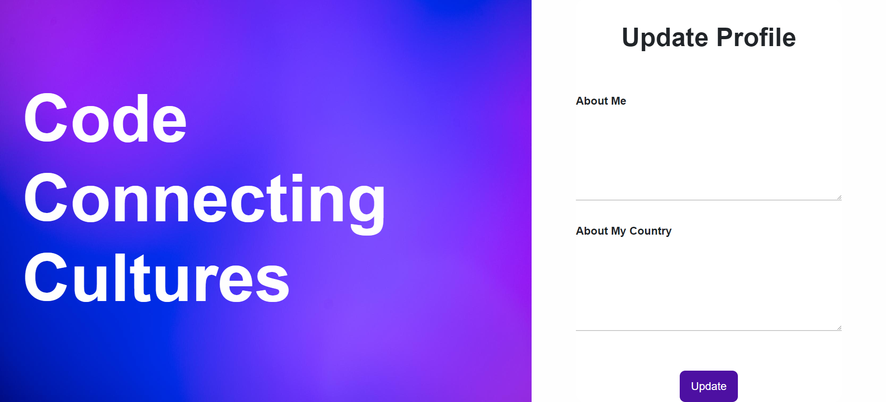<br>
<sup>Fonte: Material produzido pelos autores (2024)</sup>
</div>

&nbsp;&nbsp;&nbsp;&nbsp; Iniciamos também o desenvolvimento de uma homepage com diversas informações essenciais para o usuário. Esta página inclui detalhes como o grupo ao qual o usuário pertence, um quadro de mensagens, um indicador de humor do time e um campo para o usuário registrar como está se sentindo.

&nbsp;&nbsp;&nbsp;&nbsp; É importante ressaltar que a página ainda está em uma fase inicial, com HTML e CSS rudimentares, necessitando de diversas melhorias e implementações para alcançar o nível desejado de funcionalidade e estética. Planejamos aprimorar o design, adicionar interatividade e garantir que a homepage ofereça uma experiência de usuário agradável e eficiente.

<div align="center">
<sub>Figura 27 - Print home page rudimentar</sub><br>
<br>
<sup>Fonte: Material produzido pelos autores (2024)</sup>
</div>

&nbsp;&nbsp;&nbsp;&nbsp; Uma das grandes funcionalidades implementadas nesta sprint foi o admin dashboard. Esta ferramenta permite a criação e gerenciamento de jogos, universos e grupos, oferecendo um controle centralizado para administradores. Apenas usuários com privilégios de administrador podem acessar essa página, garantindo uma gestão segura e eficiente dos elementos do jogo.

&nbsp;&nbsp;&nbsp;&nbsp; O admin dashboard facilita a manipulação de grupos e universos, permitindo aos administradores configurar e organizar esses elementos de forma intuitiva. Além disso, implementamos medidas de segurança para garantir que apenas administradores autorizados possam fazer alterações, protegendo a integridade do sistema. Essa funcionalidade é fundamental para manter a estrutura do jogo organizada e eficiente, proporcionando uma melhor experiência tanto para os administradores quanto para os usuários finais.

<div align="center">
<sub>Figura 28 - Print admin dashbord - Criar games</sub><br>
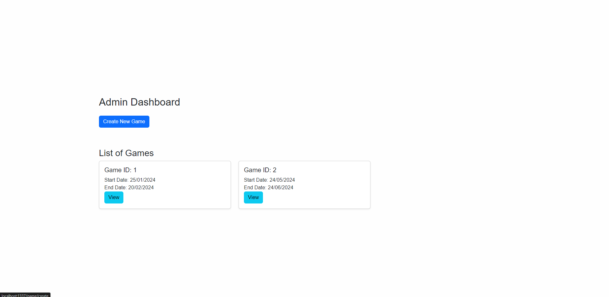<br>
<sup>Fonte: Material produzido pelos autores (2024)</sup>
</div>

<div align="center">
<sub>Figura 29 - Print admin dashbord - Criar Universos e Rounds </sub><br>
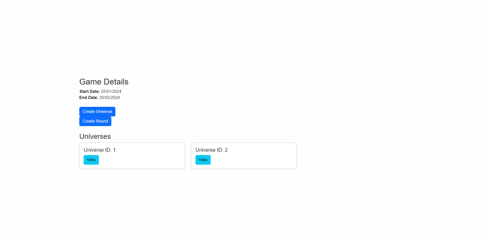<br>
<sup>Fonte: Material produzido pelos autores (2024)</sup>
</div>

<div align="center">
<sub>Figura 30 - Print admin dashbord - Criar Grupos </sub><br>
<br>
<sup>Fonte: Material produzido pelos autores (2024)</sup>
</div>

&nbsp;&nbsp;&nbsp;&nbsp; Para que todas essas telas funcionassem perfeitamente, o primeiro passo foi a criação de todos os models e controllers necessários para interagir com o banco de dados. Essa base sólida permitiu que o front-end integrasse todas as funcionalidades de maneira eficiente para o usuário final. Ademais, nesta sprint tivemos também uma alteração na modelagem do nosso banco de dados, adicionando e excluindo algumas tabelas. Foram criadas as tabelas "Round", "Timezone", "Feedback" e "Universe". As tabelas "Student" e "Tutor" foram removidas, e agora o tipo de usuário é indicado em uma nova coluna chamada "type" na tabela "User".

&nbsp;&nbsp;&nbsp;&nbsp; A criação dos models e controllers garantiu que os dados fossem manipulados de forma consistente e segura, permitindo uma comunicação fluida entre o back-end e o front-end. Como resultado, o front-end pôde oferecer uma experiência rica e interativa, com funcionalidades como a tela de login, homepage, e admin dashboard, funcionando perfeitamente. Essa integração robusta é essencial para proporcionar uma navegação intuitiva e um uso eficiente das diversas funcionalidades do sistema.

## <a id="c42"></a>4.2. Segunda versão da aplicação web

&nbsp;&nbsp;&nbsp;&nbsp; A segunda versão da aplicação web cumpre o papel de MVP (Produto Mínimo Viável), com quase todas as funcionalidades solicitadas prontas para uso. Restam apenas pequenas implementações visuais para aprimorar a experiência do usuário. Durante a sprint, o foco principal foi no front-end, com poucas adições necessárias no back-end.

&nbsp;&nbsp;&nbsp;&nbsp; O escopo foi essencial para orientar os principais objetivos e definir nossas prioridades, que incluíam polir o tratamento de dados e melhorar a interface visual do usuário, além de delimitar nossas tarefas de acordo com o tempo previsto da sprint.

&nbsp;&nbsp;&nbsp;&nbsp; Com esse objetivo, foi necessário um polimento visual na área de feedback, além da junção das funções de enviar e receber (listar) feedbacks, facilitando e tornando mais intuitivas as funcionalidades dentro da aplicação. Como é possível ver na imagem X, à esquerda há a funcionalidade de enviar feedbacks, e à direita, o usuário consegue visualizar todos os feedbacks que foram endereçados a ele.

<div align="center">
<sub>Figura 31 - Print Feedback Page </sub><br>
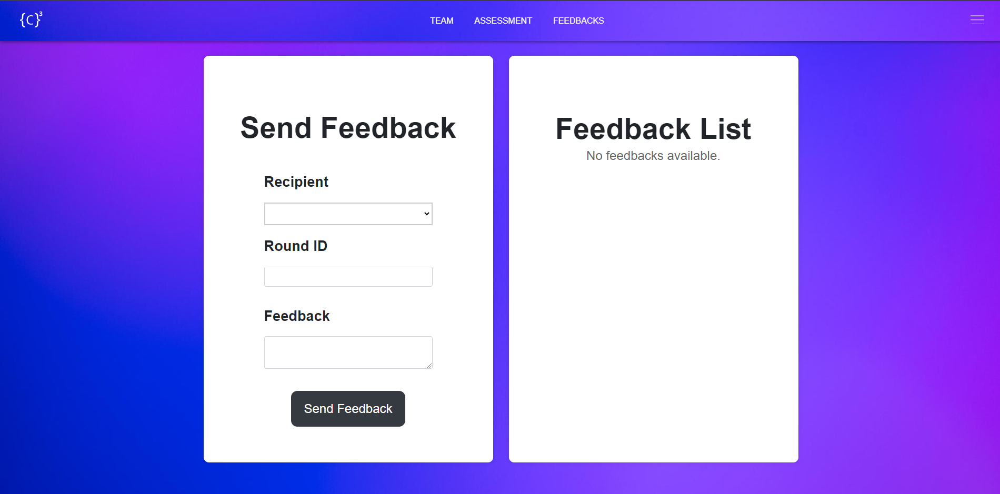<br>
<sup>Fonte: Material produzido pelos autores (2024)</sup>
</div>


&nbsp;&nbsp;&nbsp;&nbsp; Um dos tópicos que exigiu grande parte do tempo da sprint foi o desenvolvimento de testes das funcionalidades da aplicação web. O grupo optou por realizar testes dos controllers, verificando, por exemplo, se o usuário realmente consegue criar e enviar mensagens para seus companheiros, além de mostrá-las na home page, como é possível ver na imagem X.

&nbsp;&nbsp;&nbsp;&nbsp; Na sprint, o foco em relação à home page foi ligar o back-end ao front-end, onde todas as informações necessárias já são mostradas, porém ainda de maneira rudimentar, necessitando ainda de um polimento visual.

<div align="center">
<sub>Figura 32 - Print Home Page rudimentar - v2.0 </sub><br>
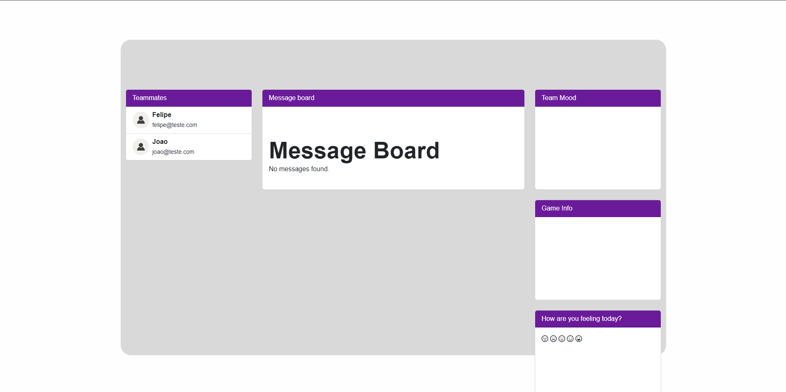<br>
<sup>Fonte: Material produzido pelos autores (2024)</sup>
</div>

&nbsp;&nbsp;&nbsp;&nbsp; Para que o MVP fosse cumprido, foi necessário um grande esforço para que os questionários fossem aplicados no website, tanto no back-end com suas lógicas de funcionamento quanto no front-end, dentro do período da sprint. Para as lógicas de funcionamento do back-end, foi necessária a criação de um controller e um model, com enfoque em garantir o bom funcionamento dos questionários: QuestionController e QuestionAnswer.

&nbsp;&nbsp;&nbsp;&nbsp; Os questionários têm o objetivo de atribuir um tipo de perfil para cada um dos membros, exigindo a criação de uma tela para informar o perfil atribuído por meio do questionário de autoavaliação.

<div align="center">
<sub>Figura 33 - Print Self Evaluation Page </sub><br>
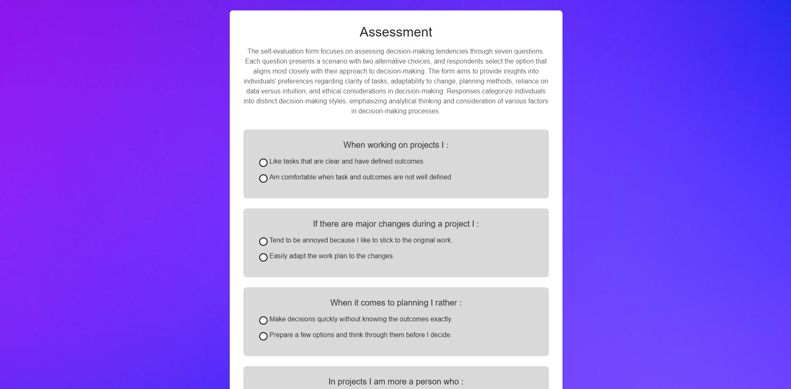<br>
<sup>Fonte: Material produzido pelos autores (2024)</sup>
</div>

<div align="center">
<sub>Figura 34 - Print Self Evaluation Page Results</sub><br>
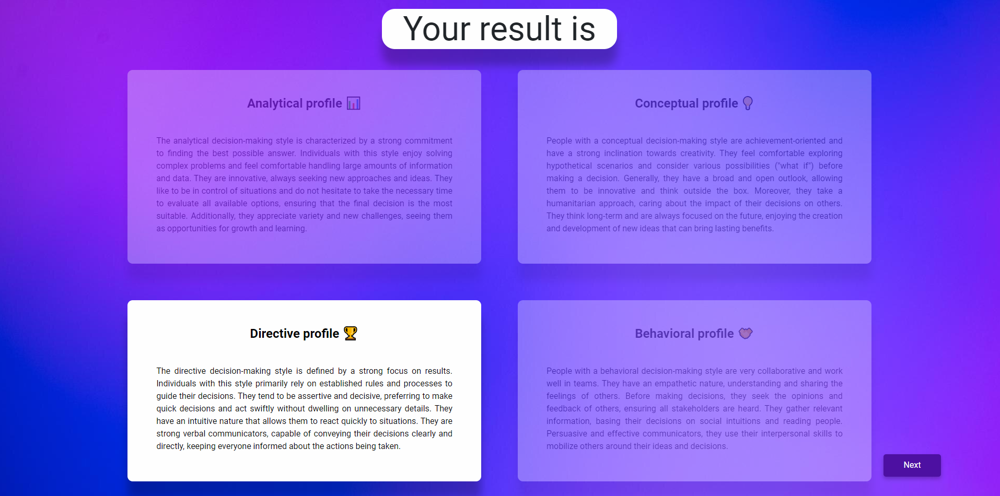<br>
<sup>Fonte: Material produzido pelos autores (2024)</sup>
</div>

&nbsp;&nbsp;&nbsp;&nbsp; País de residência e Horário Local foram outras duas funcionalidades implementadas na sprint, permitindo que todos os usuários vejam seu país de residência e horário local tanto na página da equipe quanto no perfil de cada um.

&nbsp;&nbsp;&nbsp;&nbsp; A team page foi completamente reformulada, permitindo visualizar um mapa com pins indicando o local de residência de todos os membros do grupo, além de cards que representam cada um dos membros.

<div align="center">
<sub>Figura 35 - Print Team Page</sub><br>
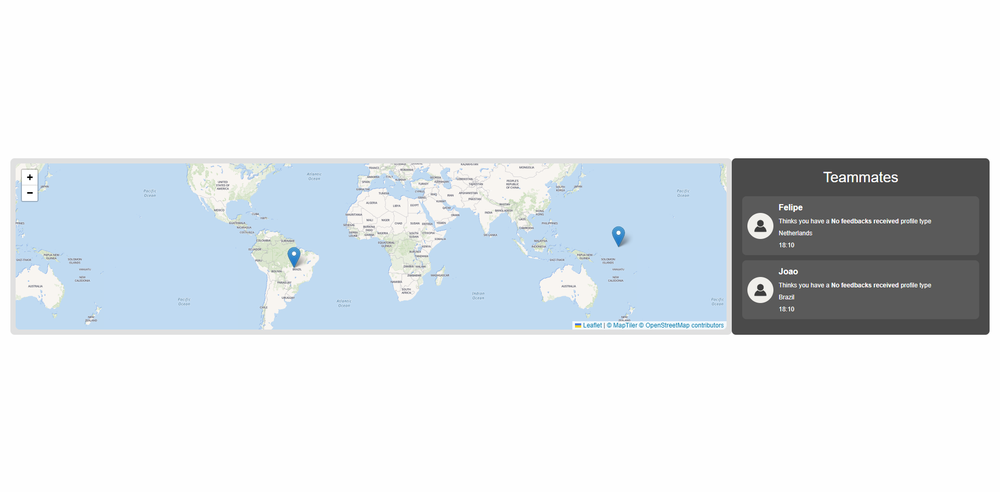<br>
<sup>Fonte: Material produzido pelos autores (2024)</sup>
</div>

&nbsp;&nbsp;&nbsp;&nbsp; Concluindo, a segunda versão da aplicação web atingiu com sucesso a maioria dos objetivos estabelecidos, focando em melhorias visuais e integração de funcionalidades essenciais. Com esforços concentrados em testes, desenvolvimento de questionários e refinamento da interface, a aplicação está próxima de oferecer uma experiência completa e intuitiva para o usuário.


## <a id="c43"></a>4.3. Versão final da aplicação web

&nbsp;&nbsp;&nbsp;&nbsp; Após cinco sprints, entregamos um resultado extremamente satisfatório, atendendo a todos os requisitos para que o website atingisse a condição de MVP, além de incluir diversas funcionalidades adicionais. Na última sprint, focamos em melhorias visuais e automatizações para facilitar o uso da aplicação web durante o jogo.

&nbsp;&nbsp;&nbsp;&nbsp; Grande parte do esforço implementado na sprint foi direcionado para a homepage, onde adicionamos diversas funcionalidades e realizamos melhorias visuais. A homepage agora inclui representações visuais dos membros do time, um medidor de felicidade, informações automáticas sobre o round atual do jogo e uma área para criação de mensagens que todos os membros do time podem visualizar, facilitando a comunicação, especialmente para avisos importantes.

<div align="center">
<sub>Figura 36 - Print Team Page versão final</sub><br>
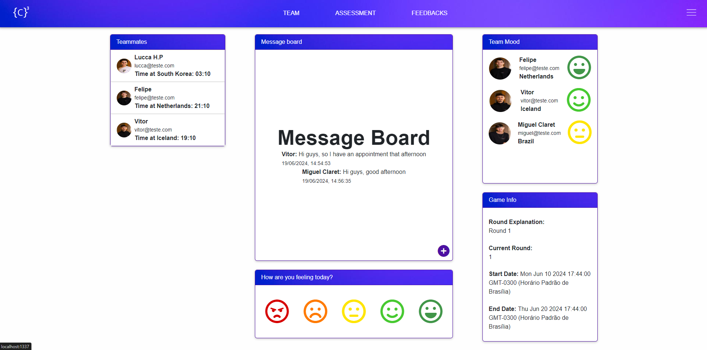<br>
<sup>Fonte: Material produzido pelos autores (2024)</sup>
</div>


&nbsp;&nbsp;&nbsp;&nbsp; Uma das principais funcionalidades implementadas e aprimoradas durante a última sprint foi o dashboard administrativo. Este permite que usuários administradores possam criar jogos e gerenciar todas as regras, incluindo a quantidade e duração dos rounds, a criação de universos dentro do jogo, a criação de grupos e a atribuição de usuários a esses grupos.

<div align="center">
<sub>Figura 37 - Print Admin Dashboard Lista de Games</sub><br>
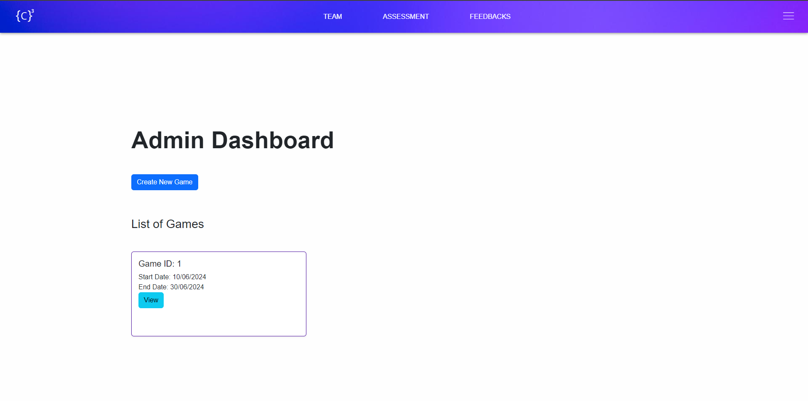<br>
<sup>Fonte: Material produzido pelos autores (2024)</sup>
</div>

<div align="center">
<sub>Figura 38 - Print Admin Dashboard Criação de Games e Rounds</sub><br>
<br>
<sup>Fonte: Material produzido pelos autores (2024)</sup>
</div>

<div align="center">
<sub>Figura 39 - Print Admin Dashboard Lista de Universos</sub><br>
<br>
<sup>Fonte: Material produzido pelos autores (2024)</sup>
</div>

<div align="center">
<sub>Figura 40 - Print Admin Dashboard Lista de Times em um Universo</sub><br>
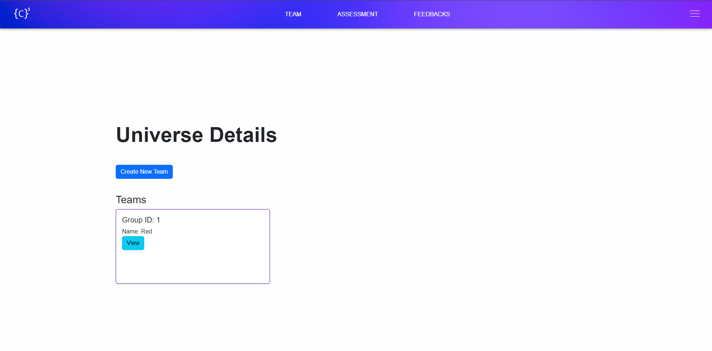<br>
<sup>Fonte: Material produzido pelos autores (2024)</sup>
</div>

<div align="center">
<sub>Figura 41 - Print Admin Dashboard Criação de Times</sub><br>
<br>
<sup>Fonte: Material produzido pelos autores (2024)</sup>
</div>


&nbsp;&nbsp;&nbsp;&nbsp; A team page foi reformulada com automatizações referentes à localização de cada membro da equipe no mapa e ao fuso horário de cada um. O mapa agora mostra automaticamente o país em que cada membro reside, junto com suas fotos de perfil, facilitando a visualização.


<div align="center">
<sub>Figura 42 - Print Team page versão Final</sub><br>
<br>
<sup>Fonte: Material produzido pelos autores (2024)</sup>
</div>

&nbsp;&nbsp;&nbsp;&nbsp; A função de troca de senha, que era uma das pendências das últimas sprints, foi desenvolvida durante a sprint cinco. Agora, o usuário pode trocar sua senha apenas informando seu email. Como mostrado na imagem X, o usuário insere seu email e, logo abaixo, define a nova senha.


<div align="center">
<sub>Figura 43 - Print Página Esqueci a senha</sub><br>
<br>
<sup>Fonte: Material produzido pelos autores (2024)</sup>
</div>

&nbsp;&nbsp;&nbsp;&nbsp; Feedback sempre foi um dos requisitos para que a aplicação atingisse o status de MVP, porém melhorias foram feitas para que pudessemos entregar mais do que o esperado, como por exemplo a automatização de rounds quando o usuário vai criar um novo feedback para algum dos seus membros de equipe. A imagem X mostra o container de criação de feedback na esquerda da tela, já com a automatização de round.

<div align="center">
<sub>Figura 44 - Print Página de Feedback</sub><br>
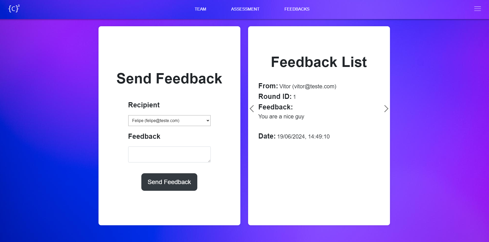<br>
<sup>Fonte: Material produzido pelos autores (2024)</sup>
</div>


&nbsp;&nbsp;&nbsp;&nbsp; Melhorias foram implementadas na sidebar, de forma a abranger outras rotas, como é o caso de um novo ícone para o dashboard administrativo, onde apenas o usuário do tipo administrador poderá visualizar e acessar essa rota. Além de uma facilitação para a criação de grupos, onde há um botão na sidebar que leva o administrador diretamente para a página de criação de grupo.


<div align="center">
<sub>Figura 45 - Print Sidebar aberta</sub><br>
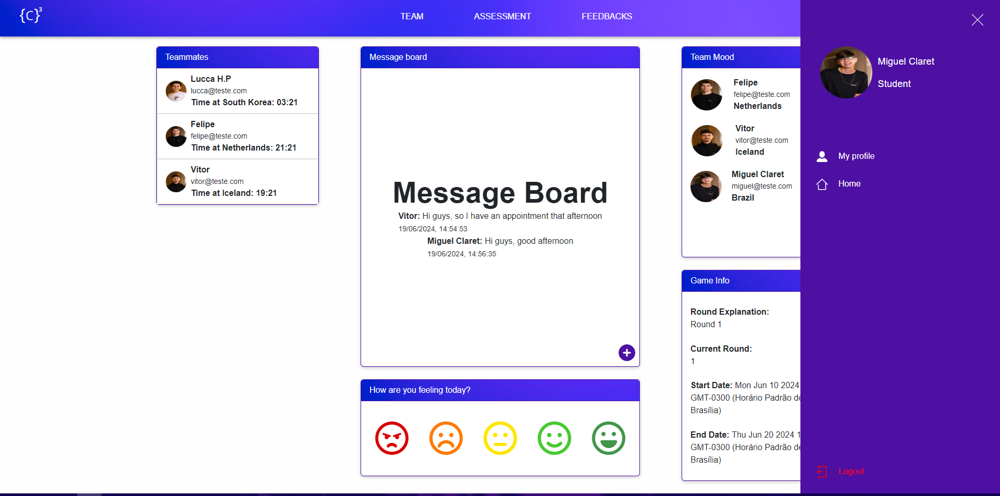<br>
<sup>Fonte: Material produzido pelos autores (2024)</sup>
</div>

&nbsp;&nbsp;&nbsp;&nbsp; Nossos principais diferenciais baseiam-se em três pilares principais: um mapa automatizado na página do time, a exibição dos fusos horários de todos os membros do grupo e uma lógica própria para o resultado do questionário de perfil externo. Para que essas funções fossem desenvolvidas e apresentadas no projeto, foi necessário que o back-end pudesse suportá-las, utilizando um banco de dados externo e a integração de uma API para a implementação do mapa.

&nbsp;&nbsp;&nbsp;&nbsp; Já pensando no futuro do projeto, traçamos as principais funcionalidades que podem ser desenvolvidas como possíveis próximos passos. Entre elas, destacam-se: a gamificação das avaliações, com o objetivo de engajar os usuários, a implementação de um sistema de recuperação de senha com mailer, adicionando uma camada importante de segurança à aplicação web, o aprimoramento da identidade visual do website, a criação de uma visão própria para tutores e a melhoria do dashboard do administrador.


# <a id="c5"></a>5. Testes

## <a id="c51"></a>5.1. Relatório de testes automatizados

#### Introdução

Esta documentação detalha os testes automatizados realizados na aplicação Sails.js. Testar o software é um processo essencial no desenvolvimento de sistemas para garantir que o código funcione como esperado. Eles envolvem rodar a aplicação com a intenção de encontrar erros, verificar funcionalidades e validar que os requisitos estão sendo atendidos. Os testes usam a biblioteca `supertest` para simular requisições HTTP e a biblioteca `assert` para verificar os resultados. Abaixo, descrevemos cada um dos testes implementados.

Por propósitos de estética e organização deste documento, o código desenvolvido para os testes foi movido para [esse documento](others/tests-pt.md), no qual é possível analisar de modo mais tecnico como os mesmos foram desenvolvidos e aplicados.

### Configuração inicial

Antes de cada conjunto de testes, um `supertest.agent` é configurado, o qual será usado para simular requisições HTTP na aplicação.

### Testes do `HomepageController`

#### 1. Redirecionar para o login se o usuário não estiver logado.

**Descrição**: Verifica se a aplicação redireciona para a página de login quando um usuário não autenticado tenta acessar a página inicial.<br>
**Status**: Teste aprovado.

**Tratamento de Erros**:
- Lida com erros de autenticação.
- Verifica se o redirecionamento para a página de login ocorre com status 302.

#### 2. Exibição da página de visão geral se o usuário estiver logado

**Descrição**: Verifica se a página de visão geral é exibida corretamente quando um usuário autenticado acessa a página inicial.<br>
**Status**: Teste aprovado.

**Tratamento de Erros**:
- Lida com erros de autenticação.
- Verifica se a página de visão geral carrega com sucesso com status 200.

### Testes do `#happinessMeter`

#### 1. Exibir a página de visão geral se o usuário estiver logado

**Descrição**: Verifica se a página de visão geral é exibida quando o usuário está logado.<br>
**Status**: Teste aprovado.

**Tratamento de Erros**:
- Lida com erros de autenticação.
- Verifica se a página de visão geral carrega com sucesso com status 200.

#### 2. Solicitação inválida retornada para valor de felicidade inválido

**Descrição**: Verifica se a aplicação retorna um erro de Solicitação Inválida (400) ao enviar um valor de felicidade inválido.<br>
**Status**: Teste aprovado.

**Tratamento de Erros**:
- Lida com erros de valor de felicidade inválido.
- Verifica se a aplicação retorna um erro 400 para entrada inválida.

### Testes do `AdminController`

#### 1. Mostrar painel de administração

**Descrição**: Verifica se o painel de administração é exibido corretamente quando acessado por um usuário logado.<br>
**Status**: Teste aprovado.

**Tratamento de Erros**:
- Lida com erros de autenticação.
- Verifica se o painel carrega corretamente com status 200.

### Testes do `GameController`

#### 1. Acessar a Página de Criação de Jogos

**Descrição**: Verifica se a página de criação de jogos é exibida corretamente quando acessada por um usuário logado.<br>
**Status**: Teste aprovado.

**Tratamento de Erros**:
- Lida com erros de autenticação.
- Verifica se a página carrega corretamente com status 200.

### Testes do `RoundController`

#### 1. Mostrar Página de Criação de Rodadas

**Descrição**: Verifica se a página de criação de rodadas é exibida corretamente quando acessada por um usuário logado.<br>
**Status**: Teste aprovado.

**Tratamento de Erros**:
- Lida com erros de autenticação.
- Verifica se a página carrega corretamente com status 200.

### Testes do `UserController`

#### 1. Fazer login no site como administrador

**Descrição**: Verifica se um administrador pode fazer login com sucesso.<br>
**Status**: Teste aprovado.

**Tratamento de Erros**:
- Verifica redirecionamentos de login com status 302.

### Testes do `MessageController`

#### 1. Criar uma mensagem com sucesso

**Descrição**: Verifica se uma mensagem é criada com sucesso.<br>
**Status**: Teste aprovado.

**Tratamento de Erros**:
- Retorna 401 se o usuário não estiver autenticado.
- Retorna 400 se o conteúdo da mensagem estiver ausente.
- Retorna 500 para erros de banco de dados.

### Considerações Finais

Estes testes cobrem cenários importantes de acesso e funcionalidade, garantindo que a aplicação se comporte corretamente tanto para usuários autenticados quanto para usuários não autenticados.

## <a id="c52"></a>5.2. Testes de usabilidade

&nbsp;&nbsp;&nbsp;&nbsp;Os Testes de Usabilidade consiste em um processo para avaliar a facilidade de uso e eficiência de um sistema ou produto, com o objetivo de identificar problemas de usabilidade e entender como os usuário interagem com o produto. Os testes são desenvolvidos nas seguintes etapas:
  1. Planejamento: onde é definido os objetivos, público-alvo e os cenários do teste
  2. Recrutamento dos participantes: Encontrar um grupo de usuários que representem o público-alvo
  3. Criação das tarefas: Estabelecer uma série de tarefas que os participantes devem realizar durante os teste
  4. Execução do teste: Os participantes realizam as tarefas elaboradas anteriormentes enquanto são observados pelos aplicadores, que além de conduzirem o teste também anotam tudo que tester fez durante o teste
  5. Relatório: Um relatório é elaborado com os dados coletados no teste
  6. Iteração: Baseado no relatório é criado recomendações para melhorar a usabilidade do produto, assim o produto é revisado e melhorado.

1. Planejamento: onde são definidos os objetivos, público-alvo e os cenários do teste.
2. Recrutamento dos participantes: encontrar um grupo de usuários que representem o público-alvo.
3. Criação das tarefas: estabelecer uma série de tarefas que os participantes devem realizar durante os testes.
4. Execução do teste: os participantes realizam as tarefas elaboradas anteriormente enquanto são observados pelos aplicadores, que, além de conduzirem o teste, também anotam tudo que o usuário fez durante o teste.
5. Relatório: um relatório é elaborado com os dados coletados no teste.
6. Iteração: com base no relatório, são criadas recomendações para melhorar a usabilidade do produto, assim o produto é revisado e melhorado.

&nbsp;&nbsp;&nbsp;&nbsp;Assim, seguindo essas etapas, estruturamos nosso teste de usabilidade.

### O Teste

&nbsp;&nbsp;&nbsp;&nbsp;O nosso teste de usabilidade ocorreu no dia 13 de junho de 2024, no período da manhã, das 11h às 12h, no horário de Brasília, durante a aula de UX com a professora Bruna Mayer.

&nbsp;&nbsp;&nbsp;&nbsp;O grupo de testers foi composto por alunos do Inteli, Instituto de Tecnologia e Liderança. Dos cinco alunos que testaram, dois estão no módulo 6 e três no módulo 2. Dentre esses cinco, eram quatro homens e uma mulher, sendo quatro de 19 anos e um de 21 anos. Todos eram utilizadores frequentes de aplicações web, logo já sabiam um pouco sobre como mexer em um site. A escolha do grupo foi feita com base no fato de que o público-alvo do site são estudantes universitários com interesse na área de negócios, identificando nesses alunos do Inteli seu interesse nessa área.

&nbsp;&nbsp;&nbsp;&nbsp;Durante a aplicação do teste, os usuários tiveram que realizar as seguintes tarefas:
1. Fazer cadastro no site:
   - Clicar no botão para criar perfil.
   - Preencher o cadastro com os dados pessoais:
     - Nome completo
     - E-mail
     - Data de aniversário
     - Gênero
     - País
     - Fuso horário
     - Uma descrição sobre a pessoa
     - Uma descrição sobre o país da pessoa
   - Clicar no botão para enviar essas informações.
   - Preencher o questionário individual.
   - Visualizar o resultado do questionário.
2. Enviar feedback para um membro do grupo:
   - Clicar no botão para entrar na aba de enviar feedbacks.
   - Selecionar para quem vai ser o feedback.
   - Escrever o feedback.
   - Clicar no botão para enviar o feedback.
3. Preencher a avaliação de pares para algum membro do grupo:
   - Clicar no botão para entrar na aba de avaliação de pares.
   - Selecionar quem o usuário irá avaliar.
   - Preencher o questionário.
   - Clicar no botão para enviar a avaliação.

&nbsp;&nbsp;&nbsp;&nbsp;Enquanto os *testers* realizavam as tarefas, uma pessoa anotava tudo que o usuário estava fazendo e, depois, colocava essas anotações na tabela de tabulação de teste de usabilidade, disponibilizada pela professora de UX. Nesse contexto, segue abaixo os registros e conclusões dos testes.

### <a id="c521"></a>5.2.1 Registros de testes e melhorias

&nbsp;&nbsp;&nbsp;&nbsp; Os registros dos testes foram documentados em tabelas, organizadas por tarefas. Cada tarefa foi dividida em etapas específicas, necessárias para cumprir a tarefa com êxito. A seguir, apresentamos as tabelas que contêm os dados coletados durante os testes, incluindo as observações feitas em cada etapa:

<div align="center">
<sub>Figura 46 - Tabela Tarefa 1</sub><br>
<br>
<sup>Fonte: Material produzido pelos autores (2024)</sup>
</div>

<div align="center">
<sub>Figura 47 - Tabela Tarefa 2</sub><br>
<br>
<sup>Fonte: Material produzido pelos autores (2024)</sup>
</div>

<div align="center">
<sub>Figura 48 - Tabela Tarefa 3</sub><br>
<br>
<sup>Fonte: Material produzido pelos autores (2024)</sup>
</div>

&nbsp;&nbsp;&nbsp;&nbsp; Desse modo, analisando os resultados foram gerados os seguintes gráficos para cada tarefa:

<div align="center">
<sub>Figura 49 - Gráfico Tarefa 1</sub><br>
<br>
<sup>Fonte: Material produzido pelos autores (2024)</sup>
</div>

<div align="center">
<sub>Figura 50 - Gráfico Tarefa 2</sub><br>
<br>
<sup>Fonte: Material produzido pelos autores (2024)</sup>
</div>

<div align="center">
<sub>Figura 51 - Gráfico Tarefa 3</sub><br>
<br>
<sup>Fonte: Material produzido pelos autores (2024)</sup>
</div>

&nbsp;&nbsp;&nbsp;&nbsp;Dessa forma, com base nos gráficos e nas tabelas, concluimos que a melhoria que a aplicação web precisa é baseada no tratamento de erros, como no preenchimento das informações pessoais no cadastro, pois caso esteja faltando umas das informações, o usuário é direcionado para um *json*, ou o preenchimento dos questionários, caso umas das questões não seja respondida o site quebra, e muitos outros erros. Para o atual momento do projeto, focamos somente naqueles que impactam bastante o uso da aplicação, ou seja, os erros com preenchimento de cadastro e avaliações, deixando os outros erros como trabalhos futuros.

&nbsp;&nbsp;&nbsp;&nbsp;Assim, podemos concluir que os testes de usabilidade forneceram insights sobre o desempenho e a eficiência do produto. As observações detalhadas em cada etapa das tarefas permitiram identificar pontos fortes e áreas que necessitam de melhorias. Os gráficos facilitam a visualização das tendências e das métricas de desempenho, tornando mais clara a compreensão dos resultados. Essas informações são essenciais para orientar as próximas iterações de desenvolvimento, garantindo que o produto final seja mais intuitivo e eficiente para os usuários. Com as melhorias propostas, espera-se uma melhora significativa na usabilidade geral do sistema, proporcionando uma melhor experiência para o usuário final.

# <a id="c6"></a>6. Conclusões e trabalhos futuros

&nbsp;&nbsp;&nbsp;&nbsp;A seção de conclusão apresentará os resultados do projeto C³ - Code Connecting Cultures, avaliando seus resultados em relação aos objetivos iniciais. Esta avaliação se concentrará na eficácia da plataforma web em abordar diferenças culturais, discrepâncias de fuso horário e barreiras de comunicação entre os estudantes internacionais que participam da simulação de negócios global. A análise destacará os benefícios alcançados, incluindo comunicação aprimorada, melhor compreensão cultural e gestão de tempo aprimorada. Esta avaliação considera quase todos os parâmetros e métricas utilizados até agora, de modo que tudo desenvolvido até este momento contribui para a visão final do projeto.

&nbsp;&nbsp;&nbsp;&nbsp;Além disso, esta seção delineará os próximos passos para o projeto, que podem envolver o refinamento da plataforma com base no feedback dos participantes, a exploração de recursos adicionais para apoiar ainda mais o aprendizado intercultural e a consideração da escalabilidade da solução para aplicações mais amplas. Os insights obtidos a partir desta avaliação orientarão melhorias futuras e potenciais expansões da iniciativa C³.

## Qualidades do Projeto

&nbsp;&nbsp;&nbsp;&nbsp;Compreender os pontos fortes chave do projeto C³ - Code Connecting Cultures é essencial para apreciar sua eficácia na promoção da colaboração intercultural. Esses pontos fortes, em conjunto, contribuem para um ambiente mais inclusivo e harmonioso, fazendo do projeto uma ferramenta vital para os participantes da simulação de negócios internacional.

- **Ênfase na comunicação**

&nbsp;&nbsp;&nbsp;&nbsp;&nbsp;&nbsp;&nbsp;&nbsp;&nbsp;&nbsp;Uma força chave do site é sua forte ênfase na comunicação. Todos os recursos disponíveis no site são projetados para facilitar e incentivar a interação entre os usuários. Ao fornecer ferramentas como auto-descrições de usuários e países, abas de feedback e gerenciamento de fusos horários, a plataforma promove um ambiente onde a comunicação é não apenas necessária, mas também fluida e eficiente. Essa ênfase na comunicação ajuda a preencher as lacunas culturais, permitindo que os participantes compreendam e apreciem melhor os antecedentes e perspectivas uns dos outros. Consequentemente, a plataforma promove uma compreensão intercultural mais profunda, essencial para a colaboração eficaz na simulação de negócios global.

- **Informações sobre diferenças culturais**

&nbsp;&nbsp;&nbsp;&nbsp;&nbsp;&nbsp;&nbsp;&nbsp;&nbsp;&nbsp;Outra força significativa do projeto é a grande quantidade de informações que disponibiliza aos seus usuários. A plataforma permite que os participantes descrevam seus países, oferecendo insights personalizados sobre suas culturas e costumes. Além disso, recursos como mapeamento de localização permitem que os membros da equipe visualizem e compreendam as distâncias geográficas entre eles, fomentando uma maior conscientização sobre os desafios logísticos que podem surgir. Essa riqueza de informações não apenas ajuda a preencher as divisões culturais, mas também ajuda os usuários a desenvolver uma compreensão mais detalhada dos antecedentes de seus colegas e das complexidades da colaboração global. Ao equipar os participantes com informações detalhadas e relevantes, a plataforma melhora sua capacidade de trabalhar juntos de forma eficaz, apesar das diferenças geográficas e culturais.

- **Atenção ao propósito principal do site**

&nbsp;&nbsp;&nbsp;&nbsp;&nbsp;&nbsp;&nbsp;&nbsp;&nbsp;&nbsp;Uma força notável do projeto C³ - Code Connecting Cultures é a incorporação de recursos especificamente desenvolvidos para tornar o processo de compreensão das diferenças culturais o mais eficiente e confortável possível. A plataforma inclui ferramentas personalizadas, como interfaces de usuário intuitivas para auto-descrições, que permitem aos participantes compartilhar facilmente seus antecedentes culturais e práticas. Além disso, mapas interativos e recursos de gerenciamento de fusos horários são projetados para facilitar a coordenação e minimizar confusões. Esses elementos cuidadosamente projetados garantem que os usuários possam navegar pelas nuances culturais e desafios logísticos com facilidade, criando um ambiente de apoio que promove o respeito mútuo e a colaboração. Ao priorizar recursos amigáveis e direcionados, a plataforma efetivamente promove uma atmosfera inclusiva onde a compreensão cultural pode prosperar.

- **Importância dada às principais características do site**

&nbsp;&nbsp;&nbsp;&nbsp;&nbsp;&nbsp;&nbsp;&nbsp;&nbsp;&nbsp;Uma força importante do site é a integração perfeita de suas características em todo o site. Em vez de estarem confinadas a uma página específica, as ferramentas para auto-descrição cultural, mapas interativos e gerenciamento de fusos horários estão acessíveis em todas as principais páginas da plataforma. Esta disponibilidade pervasiva garante que os usuários possam acessar esses recursos a qualquer momento, melhorando sua capacidade de navegar pelas diferenças culturais de forma contínua e sem esforço. Ao incorporar essas características em todo o site, a plataforma apoia uma comunicação consistente e contínua, tornando o processo de entendimento cultural uma parte natural e integral da experiência do usuário. Esta integração abrangente reforça o compromisso da plataforma em promover uma colaboração intercultural eficaz e inclusiva em cada etapa.

## Pontos de Melhoria do Projeto

&nbsp;&nbsp;&nbsp;&nbsp;Reconhecer as fraquezas do projeto C³ - Code Connecting Cultures é crucial para entender as áreas que podem se beneficiar de melhorias na promoção da colaboração intercultural. Embora a plataforma se destaque em facilitar a comunicação e fornecer amplos insights culturais, certos aspectos poderiam ser aprimorados para otimizar o engajamento e a clareza dos usuários.

- **Os usuários podem não se sentir inspirados a usar todos os recursos do site**

&nbsp;&nbsp;&nbsp;&nbsp;&nbsp;&nbsp;&nbsp;&nbsp;&nbsp;&nbsp;Uma fraqueza notável é a ausência de um incentivo convincente para que os usuários forneçam feedback e avaliações aos seus colegas de equipe. Essa falta de ferramentas de engajamento diminui a eficiência do site, pois a participação nos mecanismos de feedback depende fortemente da motivação dos membros da equipe. Estratégias melhoradas para encorajar e incentivar o feedback dos usuários poderiam aumentar a eficácia da plataforma na promoção da colaboração e avaliação de desempenho entre as equipes.

- **A curva de aprendizado poderia ser menor**

&nbsp;&nbsp;&nbsp;&nbsp;&nbsp;&nbsp;&nbsp;&nbsp;&nbsp;&nbsp;Além disso, novos usuários podem enfrentar desafios ao navegar pela plataforma inicialmente. Compreender o fluxo de trabalho — desde a atribuição de equipes até o acesso a páginas específicas e atividades após o login — pode não ser imediatamente claro. Essa confusão inicial pode desencorajar os usuários e dificultar sua integração suave na plataforma, destacando a necessidade de processos de integração mais claros e orientações instrutivas.

- **Poderia haver melhores explicações sobre o funcionamento do site**

&nbsp;&nbsp;&nbsp;&nbsp;&nbsp;&nbsp;&nbsp;&nbsp;&nbsp;&nbsp;Além disso, embora os recursos essenciais do site estejam presentes ao longo da jornada do usuário, eles poderiam se beneficiar de explicações mais claras e maior visibilidade. Melhorar a interface do usuário com prompts intuitivos e visitas guiadas poderia encorajar os usuários a interagir mais ativamente com esses recursos, maximizando assim a utilidade e a satisfação do usuário na plataforma.

## Iterações Baseadas em Testes

&nbsp;&nbsp;&nbsp;&nbsp;O projeto C³ - Code Connecting Cultures passou por várias iterações e melhorias com base em testes rigorosos realizados em nosso campus universitário. Esses processos iterativos foram fundamentais para refinar a funcionalidade da plataforma, a experiência do usuário e a eficácia geral no apoio ao aprendizado e à colaboração intercultural entre estudantes internacionais. Aqui, destacamos as principais melhorias implementadas após extensos testes e feedback dos usuários.

- **Tratamento de erros**

&nbsp;&nbsp;&nbsp;&nbsp;&nbsp;&nbsp;&nbsp;&nbsp;&nbsp;&nbsp;Uma melhoria significativa implementada no projeto C³ é a capacidade aprimorada de tratamento de erros. Através de testes de usuários e feedback, ficou evidente que a gestão de erros precisava de melhorias para proporcionar uma experiência de usuário mais suave. Como resultado, novas páginas de erro foram desenvolvidas e integradas à plataforma. Essas páginas agora redirecionam os usuários para seções apropriadas ou fornecem instruções claras sobre como resolver erros encontrados durante a navegação. Essa melhoria não apenas reduz a frustração do usuário ao abordar problemas comuns de forma eficaz, mas também garante uma interação mais fluida com a plataforma como um todo.

- **Lógica operacional do site**

&nbsp;&nbsp;&nbsp;&nbsp;&nbsp;&nbsp;&nbsp;&nbsp;&nbsp;&nbsp;A lógica operacional do site passou por extensas iterações ao longo do processo de testes, particularmente após as fases de testes lógicos. Essas iterações se concentraram em refinar e otimizar os processos subjacentes que regem as interações dos usuários e as funcionalidades do sistema. Estruturando as operações com flexibilidade em mente, a plataforma agora acomoda mudanças e atualizações futuras de forma mais eficaz. Essa flexibilidade aprimorada garante que o projeto C³ possa se adaptar às necessidades evolutivas dos usuários, avanços tecnológicos e recursos adicionais de maneira harmoniosa. Como resultado dessas melhorias iterativas, a estrutura operacional do site é robusta, confiável e capaz de suportar aprimoramentos contínuos para aumentar a satisfação do usuário e a funcionalidade da plataforma.

## Próximos Passos do Projeto

&nbsp;&nbsp;&nbsp;&nbsp;Olhando para o futuro, o projeto desenvolvido prevê várias etapas e melhorias potenciais visando aumentar ainda mais sua eficácia e experiência do usuário. Com base em seus pontos fortes atuais e abordando as fraquezas identificadas, essas iniciativas futuras buscam expandir as capacidades da plataforma, aumentar o engajamento dos usuários e promover um aprendizado e colaboração intercultural mais profundos entre os estudantes internacionais. Ao focar na inovação e na capacidade de resposta ao feedback dos usuários, o projeto visa evoluir continuamente e atender às necessidades dinâmicas de sua base de usuários diversificada.

- **Melhoria no tratamento de erros**

&nbsp;&nbsp;&nbsp;&nbsp;&nbsp;&nbsp;&nbsp;&nbsp;&nbsp;&nbsp;Um foco primário para a próxima fase do projeto C³ - Code Connecting Cultures será a contínua melhoria do tratamento de erros no site. À medida que novos recursos são introduzidos e funcionalidades existentes são ampliadas, é essencial garantir que os erros associados sejam gerenciados e comunicados de forma eficaz aos usuários. Melhorar o tratamento de erros não só melhora a experiência do usuário ao fornecer feedback e orientação claros, mas também mantém a confiabilidade e a confiabilidade da plataforma. Ao priorizar este aspecto do desenvolvimento, o projeto visa minimizar a frustração dos usuários, facilitar interações mais suaves e manter a integridade da experiência de aprendizado intercultural.

- **Aprimoramento do design do site**

&nbsp;&nbsp;&nbsp;&nbsp;&nbsp;&nbsp;&nbsp;&nbsp;&nbsp;&nbsp;O próximo passo crucial para o avanço do projeto envolve aprimorar o design e o apelo gráfico do site. Embora a interface atual funcione adequadamente, há uma oportunidade reconhecida de elevar sua apresentação visual para melhor captar a atenção e o engajamento do usuário. Ao focar no refinamento da estética do site, incluindo layout, esquema de cores, tipografia e coerência visual geral, o projeto visa criar uma experiência de usuário mais convidativa e atraente. Esta iniciativa de aprimoramento do design não só busca melhorar a atratividade da plataforma, mas também reforçar sua credibilidade e profissionalismo, aumentando, em última análise, a satisfação e a interação do usuário com as ferramentas e recursos de aprendizado intercultural fornecidos.

- **Novo sistema de recuperação de senha**

&nbsp;&nbsp;&nbsp;&nbsp;&nbsp;&nbsp;&nbsp;&nbsp;&nbsp;&nbsp;Outro passo crítico para o projeto do site é a implementação de um recurso de recuperação de senha, que foi inicialmente considerado durante a fase de desenvolvimento, mas adiado devido a restrições de tempo. Este recurso é essencial para melhorar tanto a segurança quanto a conveniência do usuário na plataforma. Permitindo que os usuários recuperem suas senhas de forma independente através de processos de verificação seguros, o site pode melhorar significativamente a acessibilidade e a experiência do usuário. Esta adição não só se alinha com os padrões da indústria para segurança na web, mas também atende a uma necessidade fundamental do usuário, garantindo que os participantes possam gerenciar suas contas e acessar recursos críticos sem barreiras desnecessárias. Avançando, priorizar a implementação do recurso de recuperação de senha fortalecerá ainda mais a funcionalidade e a confiabilidade da plataforma, contribuindo para um ambiente mais seguro e amigável para o aprendizado e a colaboração intercultural.

- **Novos recursos no mapa da página da equipe**

&nbsp;&nbsp;&nbsp;&nbsp;&nbsp;&nbsp;&nbsp;&nbsp;&nbsp;&nbsp;Um passo significativo para o projeto C³ - Code Connecting Cultures envolve enriquecer os recursos disponíveis no mapa da página da equipe. Atualmente exibindo os nomes e posições dos membros da equipe, expandir essa funcionalidade para incluir fotos de perfil, distâncias entre os membros da equipe e o usuário, e outros detalhes relevantes pode melhorar grandemente a colaboração intercultural. Ao visualizar esses elementos adicionais, como antecedentes culturais ou interesses representados através de fotos de perfil, a plataforma pode facilitar uma compreensão e apreciação mais profundas entre os membros da equipe. Este aprimoramento não só promove a inclusividade, mas também apoia a comunicação e coordenação eficazes através de fronteiras geográficas e culturais. Implementar esses recursos na página do mapa da equipe otimizará ainda mais a capacidade da plataforma de mitigar diferenças culturais e fomentar um ambiente coeso e colaborativo para os estudantes internacionais que participam da simulação de negócios global.

- **Melhoria na dinâmica de feedback e avaliação**

&nbsp;&nbsp;&nbsp;&nbsp;&nbsp;&nbsp;&nbsp;&nbsp;&nbsp;&nbsp;Abordar a necessidade de melhorar a compreensão dos usuários sobre a dinâmica de feedback e avaliação representa um passo crucial para o projeto desenvolvido. Muitos novos usuários enfrentam desafios ao navegar sobre como fornecer e interpretar feedback na plataforma. Portanto, melhorar os processos de integração e fornecer informações claras e acessíveis sobre o propósito, processo e benefícios do feedback e das avaliações será fundamental. Esta iniciativa visa capacitar os usuários com o conhecimento e as ferramentas necessárias para se engajarem ativamente em trocas de feedback construtivas, promovendo, em última análise, um ambiente mais colaborativo e de apoio. Ao promover a clareza e a compreensão em torno dessas dinâmicas, o projeto pode aumentar a participação dos usuários, a satisfação e a eficácia geral na facilitação do aprendizado intercultural entre os estudantes internacionais.

- **Análise e iteração com base no ponto de vista dos usuários**

&nbsp;&nbsp;&nbsp;&nbsp;&nbsp;&nbsp;&nbsp;&nbsp;&nbsp;&nbsp;Um passo final essencial para o projeto C³ envolve a iteração contínua com base no feedback e nas experiências dos usuários com o site. Ao monitorar e analisar de perto as interações, preferências e desafios dos usuários, o projeto pode identificar oportunidades de refinamento e aprimoramento. Este processo iterativo visa melhorar continuamente a usabilidade, funcionalidade e satisfação geral do usuário com a plataforma. Implementar melhorias orientadas pelos usuários garante que o site evolua em alinhamento com as necessidades e expectativas dos usuários, aumentando, em última análise, sua eficácia na facilitação do aprendizado e colaboração intercultural entre estudantes internacionais. A análise regular do feedback e os ajustes iterativos serão instrumentais para manter uma abordagem responsiva e centrada no usuário, garantindo que o projeto C³ permaneça um recurso valioso para sua base de usuários diversificada.

&nbsp;&nbsp;&nbsp;&nbsp;O processo de avaliação dos pontos fortes e fracos do site, juntamente com testes iterativos e planejamento para futuras melhorias, destaca seu compromisso com a melhoria contínua e a satisfação do usuário. Aproveitando pontos fortes como ferramentas de comunicação robustas, insights culturais abrangentes e recursos amigáveis ao usuário integrados em toda a plataforma, o projeto estabeleceu uma base sólida para promover o entendimento intercultural e a colaboração entre estudantes internacionais. Abordar as fraquezas identificadas, incluindo o refinamento dos procedimentos de tratamento de erros e a clarificação da dinâmica de feedback do usuário, destaca uma abordagem proativa para melhorar a usabilidade e a funcionalidade.

&nbsp;&nbsp;&nbsp;&nbsp;Avançando, priorizar a implementação de um recurso de recuperação de senha, enriquecer as funcionalidades do mapa da equipe e melhorar a integração dos usuários em relação à dinâmica de feedback aumentará ainda mais as capacidades da plataforma. Iterar com base no feedback dos usuários garante que o projeto C³ permaneça responsivo às necessidades dos usuários, evoluindo para enfrentar os desafios dinâmicos da colaboração global na educação. Essa abordagem abrangente garante que o projeto continue a servir como uma ferramenta valiosa para fomentar a troca cultural e o aprendizado mútuo entre sua base de usuários diversificada.

# <a id="c7"></a>7. Referências


LEAFLET. Leaflet. Utilizado para criação de mapas interativos para dispositivos online. <br>
Disponível em: https://leafletjs.com/.

MAPTILER. MapTiler. Utilizado para fornecer mapas e ferramentas de mapeamento para desenvolvedores. <br>
Disponível em: https://www.maptiler.com/.

OPENAI. Utilizado para suporte na elaboração de referências bibliográficas. <br>
Disponível em: https://www.openai.com/chatgpt/.

ZUYD UNIVERSITY OF APPLIED SCIENCES. Zuyd University. Utilizado para obter informações sobre o parceiro de projeto. <br>
Disponível em: https://www.zuyd.nl/en.

CESIM. Cesim. Utilizado para obter informações sobre as simulações empresariais educacionais. <br>
Disponível em: https://www.cesim.com/.

CANVA. Canva. Utilizado para criar e personalizar templates de design. <br>
Disponível em: https://www.canva.com/.

FIGMA. Figma. Utilizado para fazer wireframes, protótipos e edições. <br>
Disponível em: https://www.figma.com/.

STACK OVERFLOW. Stack Overflow. Utilizado para busca por ajuda na resolução de bugs durante o desenvolvimento. <br>
Disponível em: https://stackoverflow.com/.

GOMES, Marcela. Como tabular e analisar os resultados de um teste de usabilidade. <br>
Disponível em: https://medium.com/testr/como-tabular-e-analisar-os-resultados-de-um-teste-de-usabilidade-7c37e6997fdc.

AELA SCHOOL. Teste de usabilidade: como preparar e conduzir. <br>
Disponível em: https://aelaschool.com/pt/research/teste-de-usabilidade-como-preparar-e-conduzir/.

# <a id="c8"></a>Anexos

[Documentação dos *Endpoints*](others/endpoints.md)

[Documentação de Testes Automatizados](others/tests-pt.md)